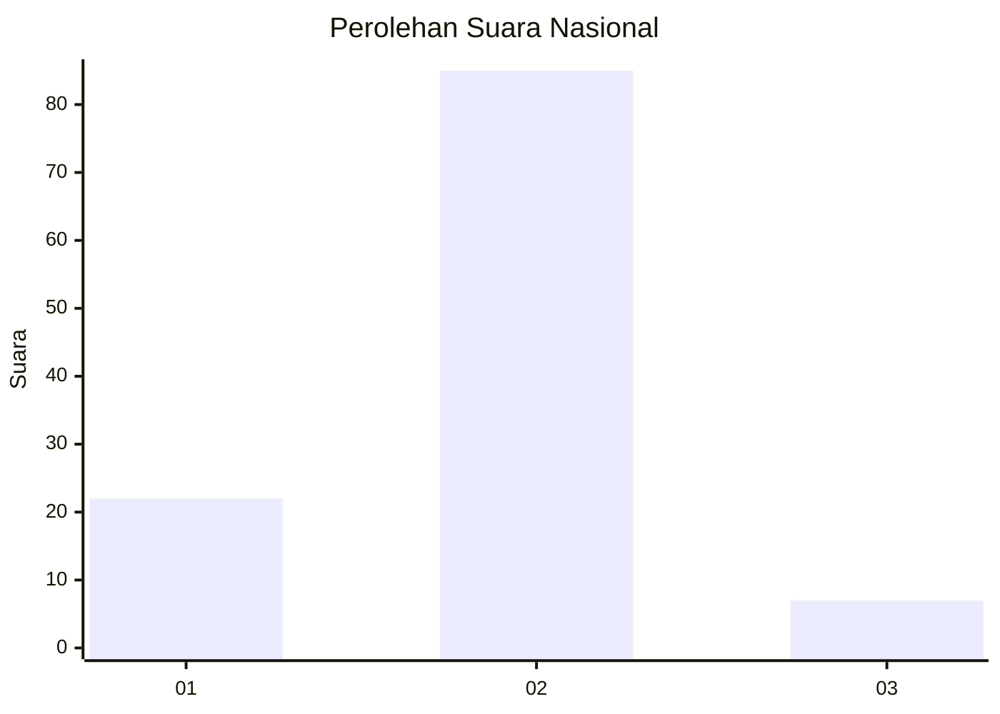
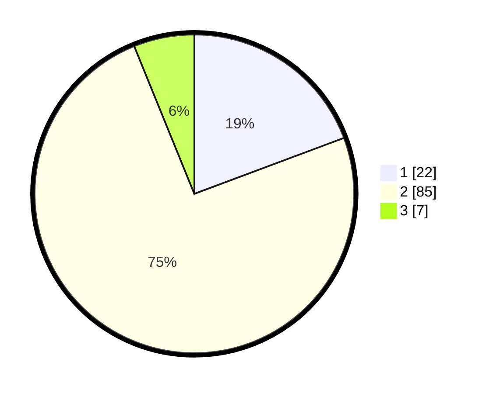

# Hasil

## Grafik

## Tabel

| No. | Nama Paslon    | Suara | Suara (raw) | Persentase |
|:--- |:-------------- | -----:| -----------:| ----------:|
| 1   | ANIES MUHAIMIN | 22    | [22][p-1]   | 19,30      |
| 2   | PRABOWO GIBRAN | 85    | [85][p-2]   | 74,56      |
| 3   | GANJAR MAHFUD  | 7     | [7][p-3]    | 6,14       |

[p-1]: https://github.com/gigit-pemilu/pemilu-2024/blob/main/pilpres/hitung-suara/sub/64-kalimantan-timur/sub/01-paser/sub/01-batu-sopang/sub/2009-samurangau/sub/003-tps/sub/paslon-1.txt
[p-2]: https://github.com/gigit-pemilu/pemilu-2024/blob/main/pilpres/hitung-suara/sub/64-kalimantan-timur/sub/01-paser/sub/01-batu-sopang/sub/2009-samurangau/sub/003-tps/sub/paslon-2.txt
[p-3]: https://github.com/gigit-pemilu/pemilu-2024/blob/main/pilpres/hitung-suara/sub/64-kalimantan-timur/sub/01-paser/sub/01-batu-sopang/sub/2009-samurangau/sub/003-tps/sub/paslon-3.txt

## Foto C Plano

https://sirekap-obj-formc.kpu.go.id/81ed/pemilu/ppwp/64/01/01/20/09/6401012009003-20240214-233638--79b1982d-728d-4810-8215-045dc79a79ae.jpg

https://sirekap-obj-formc.kpu.go.id/81ed/pemilu/ppwp/64/01/01/20/09/6401012009003-20240215-042024--a0470e24-bc78-41d2-9751-18bbd06f46b8.jpg

https://sirekap-obj-formc.kpu.go.id/81ed/pemilu/ppwp/64/01/01/20/09/6401012009003-20240214-233742--658cd07f-6c34-406b-9f27-f8d30c8bdfb4.jpg

## Metadata

| Key        | Value               |
| ---------- | ------------------- |
| Time Stamp | 2024-02-20 11:00:00 |

