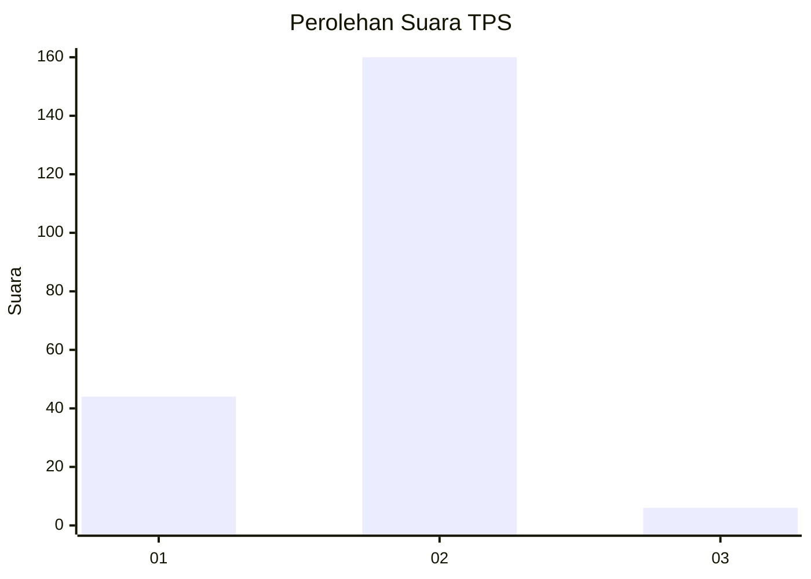
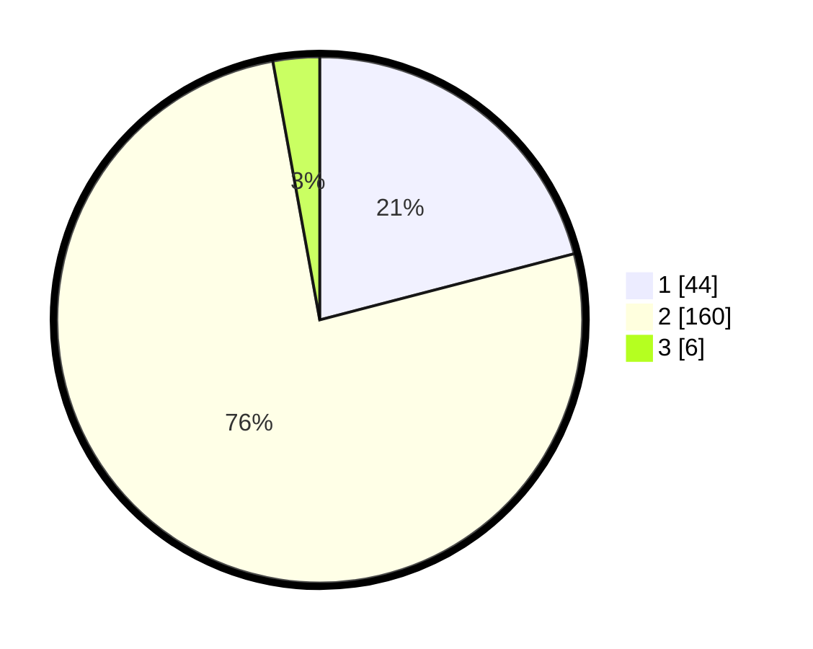

# Hasil

## Grafik

## Tabel

| No. | Nama Paslon    | Suara | Suara (raw) | Persentase |
|:--- |:-------------- | -----:| -----------:| ----------:|
| 1   | ANIES MUHAIMIN | 44    | [44][p-1]   | 20,95      |
| 2   | PRABOWO GIBRAN | 160   | [160][p-2]  | 76,19      |
| 3   | GANJAR MAHFUD  | 6     | [6][p-3]    | 2,86       |

[p-1]: https://github.com/gigit-pemilu/pemilu-2024-64-kalimantan-timur/blob/main/pilpres/hitung-suara/sub/64-kalimantan-timur/sub/01-paser/sub/01-batu-sopang/sub/2010-busui/sub/002-tps/sub/paslon-1.txt
[p-2]: https://github.com/gigit-pemilu/pemilu-2024-64-kalimantan-timur/blob/main/pilpres/hitung-suara/sub/64-kalimantan-timur/sub/01-paser/sub/01-batu-sopang/sub/2010-busui/sub/002-tps/sub/paslon-2.txt
[p-3]: https://github.com/gigit-pemilu/pemilu-2024-64-kalimantan-timur/blob/main/pilpres/hitung-suara/sub/64-kalimantan-timur/sub/01-paser/sub/01-batu-sopang/sub/2010-busui/sub/002-tps/sub/paslon-3.txt

## Foto C Plano

https://sirekap-obj-formc.kpu.go.id/a3e0/pemilu/ppwp/64/01/01/20/10/6401012010002-20240215-051945--b29bd74f-ed16-4a2b-b4ab-6ef51dd9a89d.jpg

https://sirekap-obj-formc.kpu.go.id/a3e0/pemilu/ppwp/64/01/01/20/10/6401012010002-20240214-155904--2d34937e-c1a0-4e1d-8d6f-584d9632554f.jpg

## Metadata

| Key        | Value               |
| ---------- | ------------------- |
| Time Stamp | 2024-02-20 11:00:00 |

