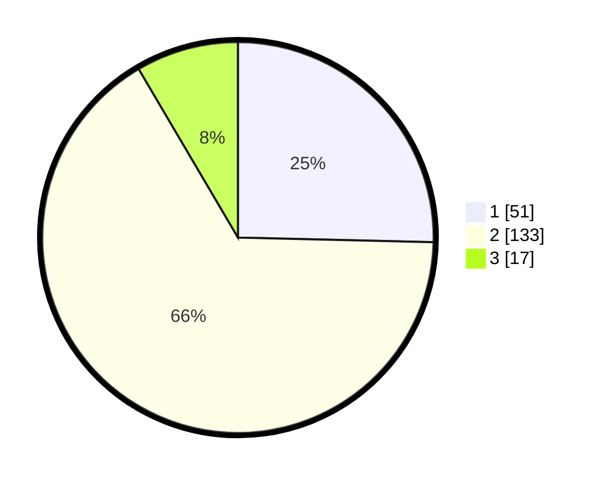

# Hasil

## Grafik

## Tabel

| No. | Nama Paslon    | Suara | Suara (raw) | Persentase |
|:--- |:-------------- | -----:| -----------:| ----------:|
| 1   | ANIES MUHAIMIN | 51    | [51][p-1]   | 25,37      |
| 2   | PRABOWO GIBRAN | 133   | [133][p-2]  | 66,17      |
| 3   | GANJAR MAHFUD  | 17    | [17][p-3]   | 8,46       |

[p-1]: https://github.com/gigit-pemilu/pemilu-2024-64-kalimantan-timur/blob/main/pilpres/hitung-suara/sub/64-kalimantan-timur/sub/01-paser/sub/01-batu-sopang/sub/2010-busui/sub/003-tps/sub/paslon-1.txt
[p-2]: https://github.com/gigit-pemilu/pemilu-2024-64-kalimantan-timur/blob/main/pilpres/hitung-suara/sub/64-kalimantan-timur/sub/01-paser/sub/01-batu-sopang/sub/2010-busui/sub/003-tps/sub/paslon-2.txt
[p-3]: https://github.com/gigit-pemilu/pemilu-2024-64-kalimantan-timur/blob/main/pilpres/hitung-suara/sub/64-kalimantan-timur/sub/01-paser/sub/01-batu-sopang/sub/2010-busui/sub/003-tps/sub/paslon-3.txt

## Foto C Plano

https://sirekap-obj-formc.kpu.go.id/2165/pemilu/ppwp/64/01/01/20/10/6401012010003-20240215-233949--f330c1a2-33f1-463e-bb73-2249d0f8c03c.jpg

https://sirekap-obj-formc.kpu.go.id/2165/pemilu/ppwp/64/01/01/20/10/6401012010003-20240215-233953--9ad17f02-f1f7-42ce-b529-df9d9b31cb0e.jpg

https://sirekap-obj-formc.kpu.go.id/2165/pemilu/ppwp/64/01/01/20/10/6401012010003-20240215-233950--b50472c9-60a2-4bc0-93e8-06a8f9769916.jpg

## Metadata

| Key        | Value               |
| ---------- | ------------------- |
| Time Stamp | 2024-02-16 13:30:32 |

## DATA PEMILIH TETAP

Jumlah pemilih dalam DPT: **253**.
 * L: **134**.
 * P: **119**.

## DATA PENGGUNA HAK PILIH

Jumlah pengguna hak pilih dalam DPT: **209**.
 * L: **105**.
 * P: **104**.

Jumlah pengguna hak pilih dalam DPTb: **0**.
 * L: **0**.
 * P: **0**.

Jumlah pengguna hak pilih dalam DPK: **2**.
 * L: **1**.
 * P: **1**.

Jumlah pengguna hak pilih: **211**.
 * L: **106**.
 * P: **105**.

## JUMLAH SUARA SAH DAN TIDAK SAH

JUMLAH SELURUH SUARA SAH: **201**.

JUMLAH SUARA TIDAK SAH: **10**.

JUMLAH SELURUH SUARA SAH DAN SUARA TIDAK SAH: **211**.

