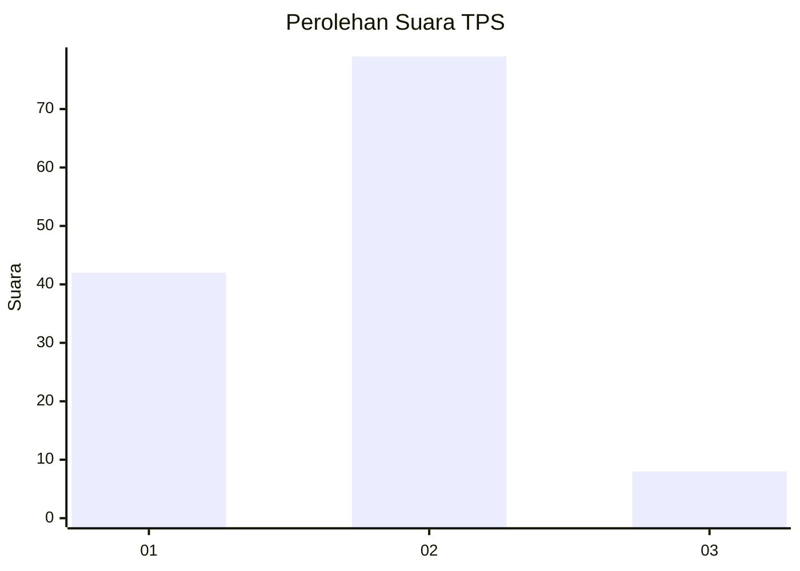
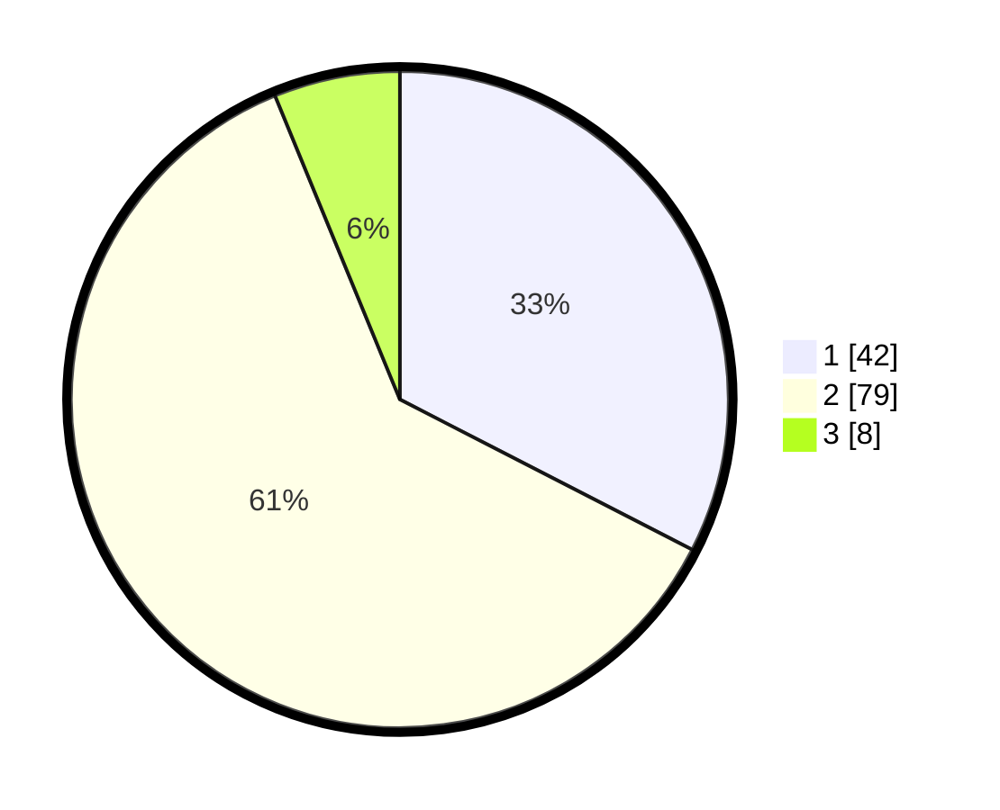

# Hasil

## Grafik

## Tabel

| No. | Nama Paslon    | Suara | Suara (raw) | Persentase |
|:--- |:-------------- | -----:| -----------:| ----------:|
| 1   | ANIES MUHAIMIN | 42    | [42][p-1]   | 32,56      |
| 2   | PRABOWO GIBRAN | 79    | [79][p-2]   | 61,24      |
| 3   | GANJAR MAHFUD  | 8     | [8][p-3]    | 6,20       |

[p-1]: https://github.com/gigit-pemilu/pemilu-2024-64-kalimantan-timur/blob/main/pilpres/hitung-suara/sub/64-kalimantan-timur/sub/01-paser/sub/01-batu-sopang/sub/2010-busui/sub/004-tps/sub/paslon-1.txt
[p-2]: https://github.com/gigit-pemilu/pemilu-2024-64-kalimantan-timur/blob/main/pilpres/hitung-suara/sub/64-kalimantan-timur/sub/01-paser/sub/01-batu-sopang/sub/2010-busui/sub/004-tps/sub/paslon-2.txt
[p-3]: https://github.com/gigit-pemilu/pemilu-2024-64-kalimantan-timur/blob/main/pilpres/hitung-suara/sub/64-kalimantan-timur/sub/01-paser/sub/01-batu-sopang/sub/2010-busui/sub/004-tps/sub/paslon-3.txt

## Foto C Plano

https://sirekap-obj-formc.kpu.go.id/1fb2/pemilu/ppwp/64/01/01/20/10/6401012010004-20240214-141548--92d6c4d5-c353-42cc-98ae-377f99ee1556.jpg

https://sirekap-obj-formc.kpu.go.id/1fb2/pemilu/ppwp/64/01/01/20/10/6401012010004-20240214-141725--10826e32-f5f7-4c93-aa63-2344c0d49389.jpg

https://sirekap-obj-formc.kpu.go.id/1fb2/pemilu/ppwp/64/01/01/20/10/6401012010004-20240215-051349--69110721-0d92-4b29-9e1b-07a2c8d86c50.jpg

## Metadata

| Key        | Value               |
| ---------- | ------------------- |
| Time Stamp | 2024-02-15 15:00:29 |

