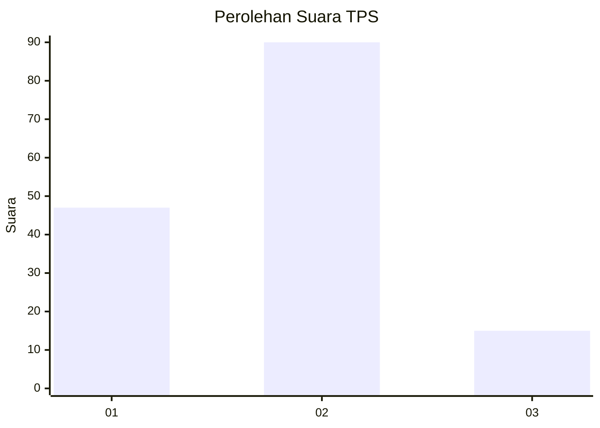
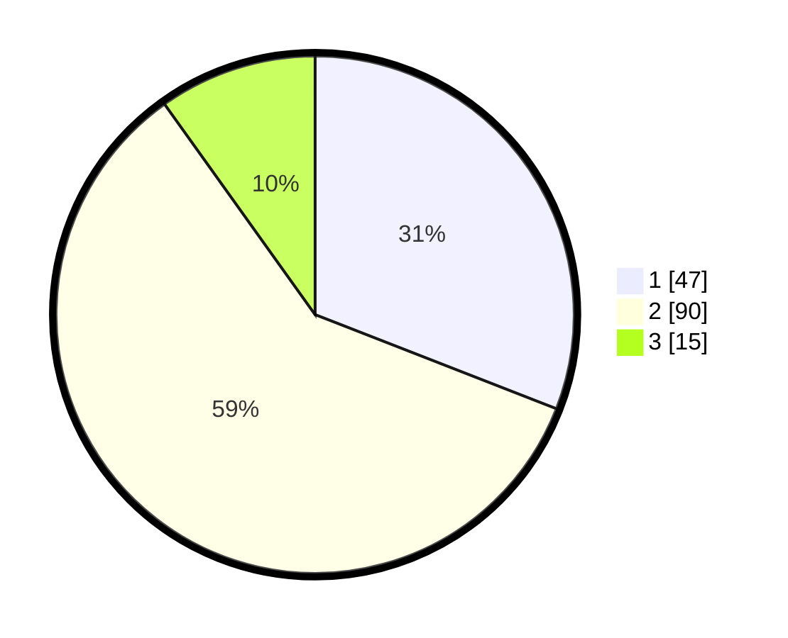

# Hasil

## Grafik

## Tabel

| No. | Nama Paslon    | Suara | Suara (raw) | Persentase |
|:--- |:-------------- | -----:| -----------:| ----------:|
| 1   | ANIES MUHAIMIN | 47    | [47][p-1]   | 30,92      |
| 2   | PRABOWO GIBRAN | 90    | [90][p-2]   | 59,21      |
| 3   | GANJAR MAHFUD  | 15    | [15][p-3]   | 9,87       |

[p-1]: https://github.com/gigit-pemilu/pemilu-2024-64-kalimantan-timur/blob/main/pilpres/hitung-suara/sub/64-kalimantan-timur/sub/01-paser/sub/01-batu-sopang/sub/2011-batu-kajang/sub/001-tps/sub/paslon-1.txt
[p-2]: https://github.com/gigit-pemilu/pemilu-2024-64-kalimantan-timur/blob/main/pilpres/hitung-suara/sub/64-kalimantan-timur/sub/01-paser/sub/01-batu-sopang/sub/2011-batu-kajang/sub/001-tps/sub/paslon-2.txt
[p-3]: https://github.com/gigit-pemilu/pemilu-2024-64-kalimantan-timur/blob/main/pilpres/hitung-suara/sub/64-kalimantan-timur/sub/01-paser/sub/01-batu-sopang/sub/2011-batu-kajang/sub/001-tps/sub/paslon-3.txt

## Foto C Plano

https://sirekap-obj-formc.kpu.go.id/098b/pemilu/ppwp/64/01/01/20/11/6401012011001-20240214-194016--4709d22e-bcca-4da7-9229-267ada7dfe5c.jpg

https://sirekap-obj-formc.kpu.go.id/098b/pemilu/ppwp/64/01/01/20/11/6401012011001-20240214-194106--60011f2b-e617-47b0-94ef-9f56b4fd0c84.jpg

https://sirekap-obj-formc.kpu.go.id/098b/pemilu/ppwp/64/01/01/20/11/6401012011001-20240214-194156--fa0f8cac-c1af-4d3f-bd24-2b2d3141e60d.jpg

## Metadata

| Key        | Value               |
| ---------- | ------------------- |
| Time Stamp | 2024-02-20 11:00:00 |

