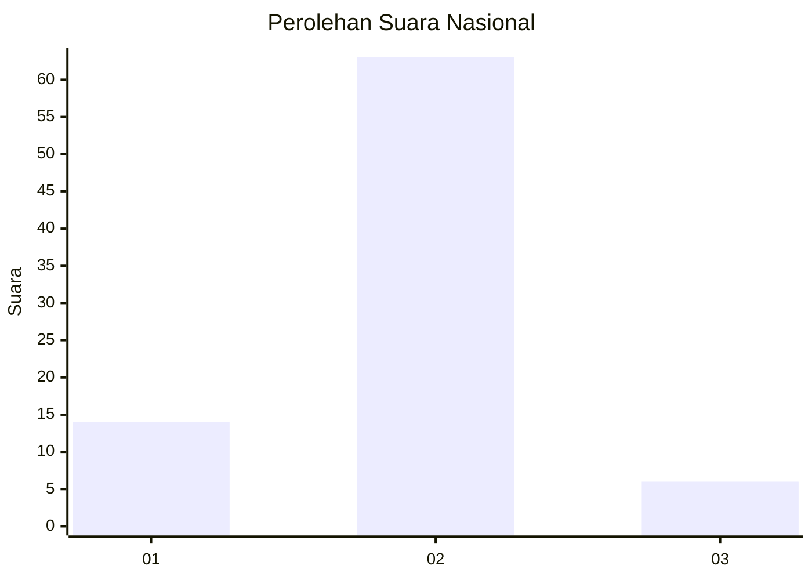
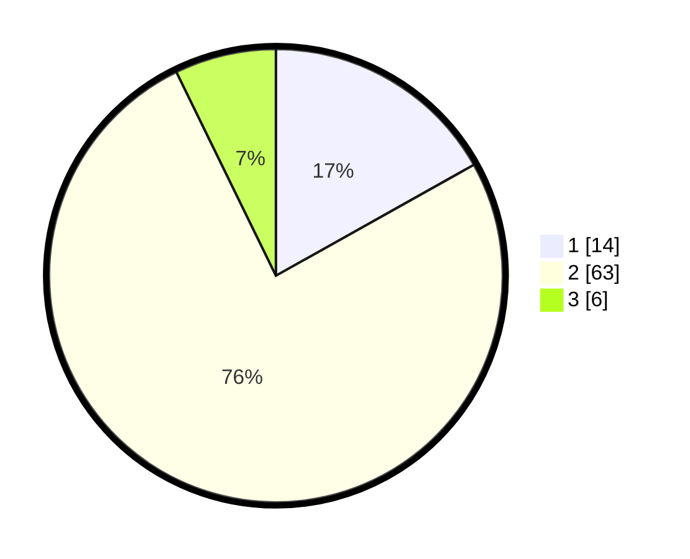

# Hasil

## Grafik

## Tabel

| No. | Nama Paslon    | Suara | Suara (raw) | Persentase |
|:--- |:-------------- | -----:| -----------:| ----------:|
| 1   | ANIES MUHAIMIN | 14    | [14][p-1]   | 16,87      |
| 2   | PRABOWO GIBRAN | 63    | [63][p-2]   | 75,90      |
| 3   | GANJAR MAHFUD  | 6     | [6][p-3]    | 7,23       |

[p-1]: https://github.com/gigit-pemilu/pemilu-2024/blob/main/pilpres/hitung-suara/sub/64-kalimantan-timur/sub/01-paser/sub/01-batu-sopang/sub/2015-rantau-buta/sub/001-tps/sub/paslon-1.txt
[p-2]: https://github.com/gigit-pemilu/pemilu-2024/blob/main/pilpres/hitung-suara/sub/64-kalimantan-timur/sub/01-paser/sub/01-batu-sopang/sub/2015-rantau-buta/sub/001-tps/sub/paslon-2.txt
[p-3]: https://github.com/gigit-pemilu/pemilu-2024/blob/main/pilpres/hitung-suara/sub/64-kalimantan-timur/sub/01-paser/sub/01-batu-sopang/sub/2015-rantau-buta/sub/001-tps/sub/paslon-3.txt

## Foto C Plano

https://sirekap-obj-formc.kpu.go.id/d531/pemilu/ppwp/64/01/01/20/15/6401012015001-20240225-181842--dfdfdd95-1164-4ca6-a6c3-c710f6b2691f.jpg

https://sirekap-obj-formc.kpu.go.id/d531/pemilu/ppwp/64/01/01/20/15/6401012015001-20240225-181902--6baad6b3-dfd6-4992-bd66-be4be0da2367.jpg

https://sirekap-obj-formc.kpu.go.id/d531/pemilu/ppwp/64/01/01/20/15/6401012015001-20240225-181924--6015c18b-0f99-4bcb-8c9b-6871bd1c58e8.jpg

## Metadata

| Key        | Value               |
| ---------- | ------------------- |
| Time Stamp | 2024-02-26 08:00:00 |

## DATA PEMILIH TETAP

Jumlah pemilih dalam DPT: **39**.
 * L: **65**.
 * P: **53**.

## DATA PENGGUNA HAK PILIH

Jumlah pengguna hak pilih dalam DPT: **74**.
 * L: **37**.
 * P: **63**.

Jumlah pengguna hak pilih dalam DPTb: **348**.
 * L: **55**.
 * P: **235**.

Jumlah pengguna hak pilih dalam DPK: **44**.
 * L: **3**.
 * P: **2**.

Jumlah pengguna hak pilih: **454**.
 * L: **840**.
 * P: **73**.

## JUMLAH SUARA SAH DAN TIDAK SAH

JUMLAH SELURUH SUARA SAH: **83**.

JUMLAH SUARA TIDAK SAH: **0**.

JUMLAH SELURUH SUARA SAH DAN SUARA TIDAK SAH: **83**.

