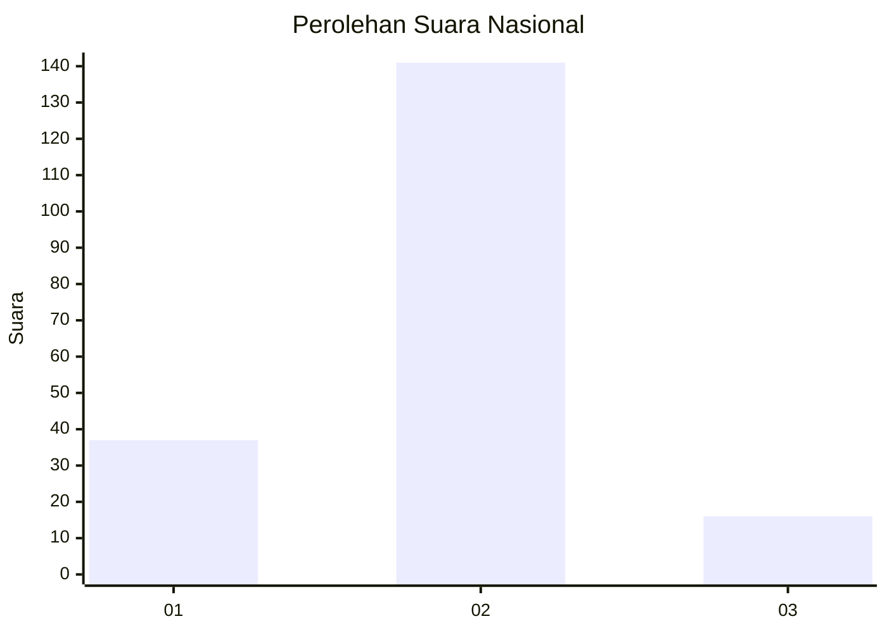
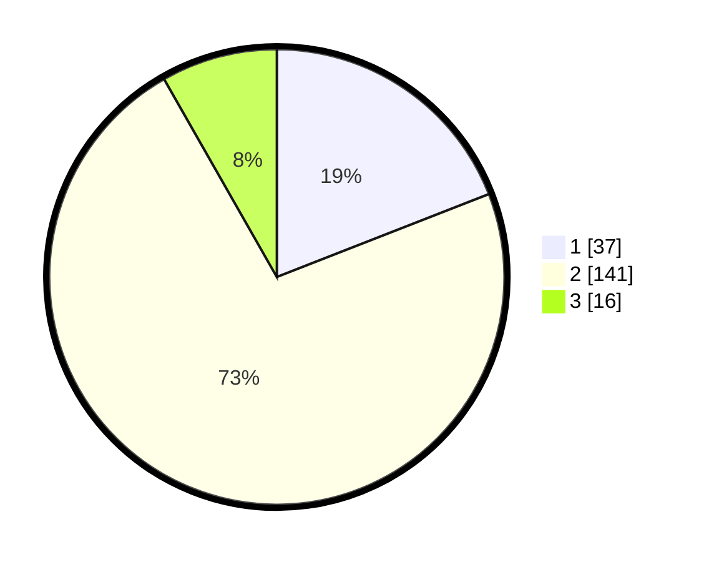

# Hasil

## Grafik

## Tabel

| No. | Nama Paslon    | Suara | Suara (raw) | Persentase |
|:--- |:-------------- | -----:| -----------:| ----------:|
| 1   | ANIES MUHAIMIN | 37    | [37][p-1]   | 19,07      |
| 2   | PRABOWO GIBRAN | 141   | [141][p-2]  | 72,68      |
| 3   | GANJAR MAHFUD  | 16    | [16][p-3]   | 8,25       |

[p-1]: https://github.com/gigit-pemilu/pemilu-2024/blob/main/pilpres/hitung-suara/sub/64-kalimantan-timur/sub/01-paser/sub/01-batu-sopang/sub/2017-songka/sub/008-tps/sub/paslon-1.txt
[p-2]: https://github.com/gigit-pemilu/pemilu-2024/blob/main/pilpres/hitung-suara/sub/64-kalimantan-timur/sub/01-paser/sub/01-batu-sopang/sub/2017-songka/sub/008-tps/sub/paslon-2.txt
[p-3]: https://github.com/gigit-pemilu/pemilu-2024/blob/main/pilpres/hitung-suara/sub/64-kalimantan-timur/sub/01-paser/sub/01-batu-sopang/sub/2017-songka/sub/008-tps/sub/paslon-3.txt

## Foto C Plano

https://sirekap-obj-formc.kpu.go.id/67e9/pemilu/ppwp/64/01/01/20/17/6401012017008-20240225-015133--b2444a02-b157-469c-ab88-65238a8f3239.jpg

https://sirekap-obj-formc.kpu.go.id/67e9/pemilu/ppwp/64/01/01/20/17/6401012017008-20240225-015211--8c0b0ad2-2a0d-4c48-922a-62e34970f1c2.jpg

https://sirekap-obj-formc.kpu.go.id/67e9/pemilu/ppwp/64/01/01/20/17/6401012017008-20240225-015247--f1befaa8-3ad1-4a1b-b0ef-c4c0b04b910f.jpg

## Metadata

| Key        | Value               |
| ---------- | ------------------- |
| Time Stamp | 2024-02-25 17:00:00 |

## DATA PEMILIH TETAP

Jumlah pemilih dalam DPT: **0**.
 * L: **0**.
 * P: **50**.

## DATA PENGGUNA HAK PILIH

Jumlah pengguna hak pilih dalam DPT: **250**.
 * L: **755**.
 * P: **505**.

Jumlah pengguna hak pilih dalam DPTb: **5**.
 * L: **2**.
 * P: **0**.

Jumlah pengguna hak pilih dalam DPK: **775**.
 * L: **1**.
 * P: **8**.

Jumlah pengguna hak pilih: **0**.
 * L: **550**.
 * P: **770**.

## JUMLAH SUARA SAH DAN TIDAK SAH

JUMLAH SELURUH SUARA SAH: **194**.

JUMLAH SUARA TIDAK SAH: **8**.

JUMLAH SELURUH SUARA SAH DAN SUARA TIDAK SAH: **202**.

