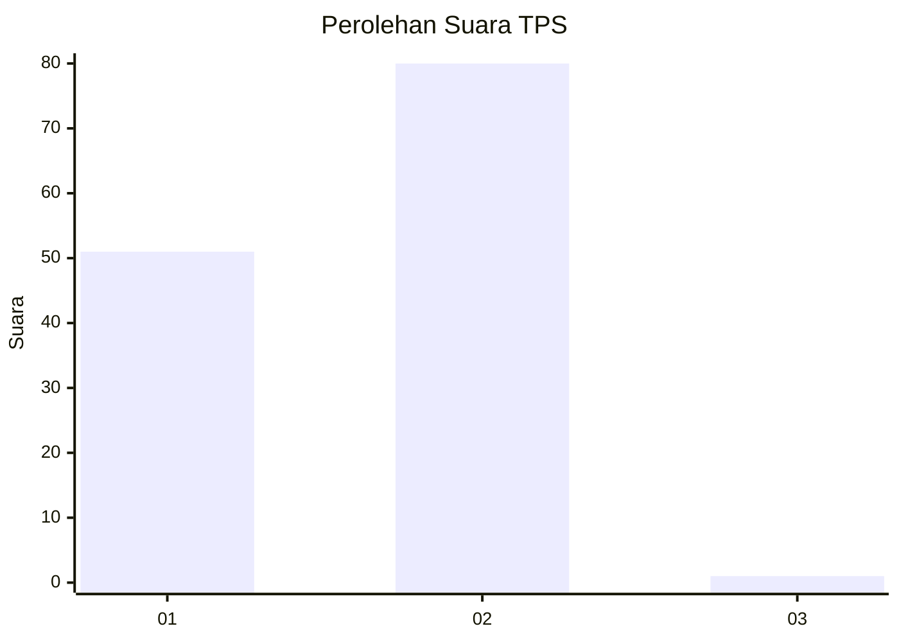
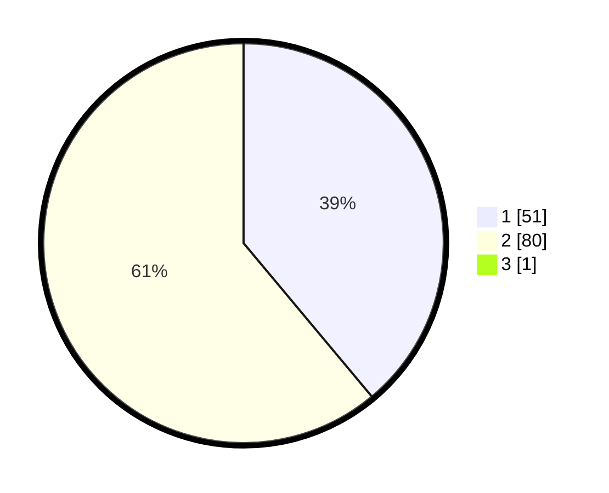

# Hasil

## Grafik

## Tabel

| No. | Nama Paslon    | Suara | Suara (raw) | Persentase |
|:--- |:-------------- | -----:| -----------:| ----------:|
| 1   | ANIES MUHAIMIN | 51    | [51][p-1]   | 38,64      |
| 2   | PRABOWO GIBRAN | 80    | [80][p-2]   | 60,61      |
| 3   | GANJAR MAHFUD  | 1     | [1][p-3]    | 0,76       |

[p-1]: https://github.com/gigit-pemilu/pemilu-2024-64-kalimantan-timur/blob/main/pilpres/hitung-suara/sub/64-kalimantan-timur/sub/01-paser/sub/03-paser-belengkong/sub/2005-suliliran/sub/004-tps/sub/paslon-1.txt
[p-2]: https://github.com/gigit-pemilu/pemilu-2024-64-kalimantan-timur/blob/main/pilpres/hitung-suara/sub/64-kalimantan-timur/sub/01-paser/sub/03-paser-belengkong/sub/2005-suliliran/sub/004-tps/sub/paslon-2.txt
[p-3]: https://github.com/gigit-pemilu/pemilu-2024-64-kalimantan-timur/blob/main/pilpres/hitung-suara/sub/64-kalimantan-timur/sub/01-paser/sub/03-paser-belengkong/sub/2005-suliliran/sub/004-tps/sub/paslon-3.txt

## Foto C Plano

https://sirekap-obj-formc.kpu.go.id/e6b3/pemilu/ppwp/64/01/03/20/05/6401032005004-20240221-032025--ce3210f3-bcdc-4264-98d8-fde0f748ab5e.jpg

https://sirekap-obj-formc.kpu.go.id/e6b3/pemilu/ppwp/64/01/03/20/05/6401032005004-20240221-032140--238d5ea7-db8a-4e9a-8cfe-f90ae7b5753d.jpg

https://sirekap-obj-formc.kpu.go.id/e6b3/pemilu/ppwp/64/01/03/20/05/6401032005004-20240221-032235--57f5bafc-da58-43f8-a530-4cca146f77d0.jpg

## Metadata

| Key        | Value               |
| ---------- | ------------------- |
| Time Stamp | 2024-02-22 22:00:00 |

## DATA PEMILIH TETAP

Jumlah pemilih dalam DPT: **150**.
 * L: **82**.
 * P: **868**.

## DATA PENGGUNA HAK PILIH

Jumlah pengguna hak pilih dalam DPT: **538**.
 * L: **73**.
 * P: **65**.

Jumlah pengguna hak pilih dalam DPTb: **80**.
 * L: **0**.
 * P: **88**.

Jumlah pengguna hak pilih dalam DPK: **3**.
 * L: **1**.
 * P: **4**.

Jumlah pengguna hak pilih: **199**.
 * L: **74**.
 * P: **66**.

## JUMLAH SUARA SAH DAN TIDAK SAH

JUMLAH SELURUH SUARA SAH: **132**.

JUMLAH SUARA TIDAK SAH: **8**.

JUMLAH SELURUH SUARA SAH DAN SUARA TIDAK SAH: **140**.

