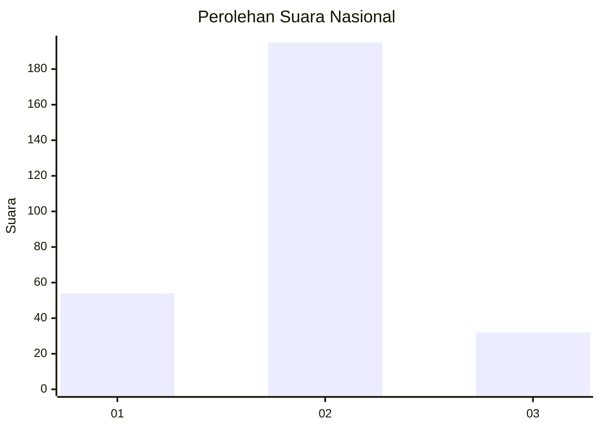
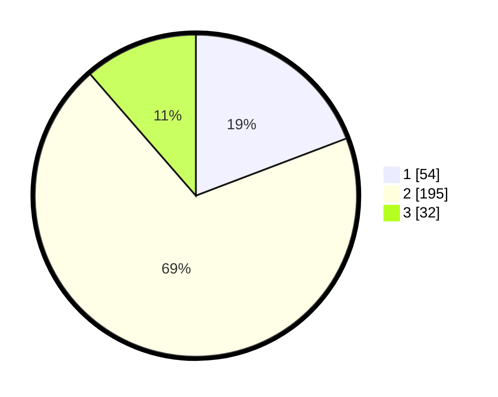

# Hasil

## Grafik

## Tabel

| No. | Nama Paslon    | Suara | Suara (raw) | Persentase |
|:--- |:-------------- | -----:| -----------:| ----------:|
| 1   | ANIES MUHAIMIN | 54    | [54][p-1]   | 19,22      |
| 2   | PRABOWO GIBRAN | 195   | [195][p-2]  | 69,40      |
| 3   | GANJAR MAHFUD  | 32    | [32][p-3]   | 11,39      |

[p-1]: https://github.com/gigit-pemilu/pemilu-2024/blob/main/pilpres/hitung-suara/sub/64-kalimantan-timur/sub/01-paser/sub/04-tanah-grogot/sub/1001-tanah-grogot/sub/028-tps/sub/paslon-1.txt
[p-2]: https://github.com/gigit-pemilu/pemilu-2024/blob/main/pilpres/hitung-suara/sub/64-kalimantan-timur/sub/01-paser/sub/04-tanah-grogot/sub/1001-tanah-grogot/sub/028-tps/sub/paslon-2.txt
[p-3]: https://github.com/gigit-pemilu/pemilu-2024/blob/main/pilpres/hitung-suara/sub/64-kalimantan-timur/sub/01-paser/sub/04-tanah-grogot/sub/1001-tanah-grogot/sub/028-tps/sub/paslon-3.txt

## Foto C Plano

https://sirekap-obj-formc.kpu.go.id/8645/pemilu/ppwp/64/01/04/10/01/6401041001028-20240214-220954--4ba467e2-8611-467a-ae8e-c39e81273d0c.jpg

https://sirekap-obj-formc.kpu.go.id/8645/pemilu/ppwp/64/01/04/10/01/6401041001028-20240214-221547--fd4fce10-b8ae-4580-bd65-bf8d5d18b519.jpg

https://sirekap-obj-formc.kpu.go.id/8645/pemilu/ppwp/64/01/04/10/01/6401041001028-20240214-221629--6ad7ad74-f082-4f3d-8e3e-d21cc8436ae2.jpg

## Metadata

| Key        | Value               |
| ---------- | ------------------- |
| Time Stamp | 2024-02-24 22:31:28 |

