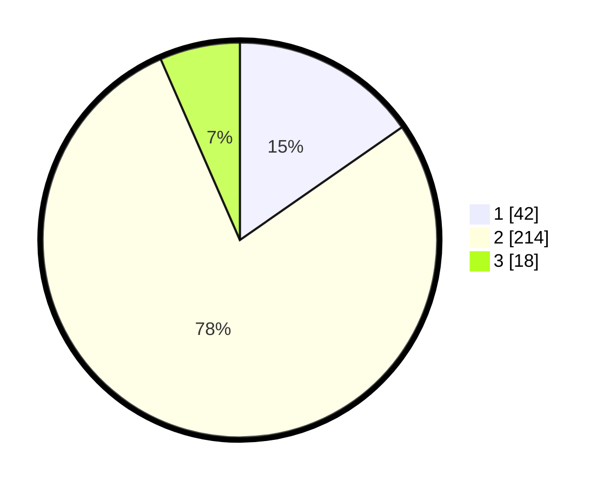

# Hasil

## Grafik

## Tabel

| No. | Nama Paslon    | Suara | Suara (raw) | Persentase |
|:--- |:-------------- | -----:| -----------:| ----------:|
| 1   | ANIES MUHAIMIN | 42    | [42][p-1]   | 15,33      |
| 2   | PRABOWO GIBRAN | 214   | [214][p-2]  | 78,10      |
| 3   | GANJAR MAHFUD  | 18    | [18][p-3]   | 6,57       |

[p-1]: https://github.com/gigit-pemilu/pemilu-2024/blob/main/pilpres/hitung-suara/sub/64-kalimantan-timur/sub/01-paser/sub/04-tanah-grogot/sub/1001-tanah-grogot/sub/029-tps/sub/paslon-1.txt
[p-2]: https://github.com/gigit-pemilu/pemilu-2024/blob/main/pilpres/hitung-suara/sub/64-kalimantan-timur/sub/01-paser/sub/04-tanah-grogot/sub/1001-tanah-grogot/sub/029-tps/sub/paslon-2.txt
[p-3]: https://github.com/gigit-pemilu/pemilu-2024/blob/main/pilpres/hitung-suara/sub/64-kalimantan-timur/sub/01-paser/sub/04-tanah-grogot/sub/1001-tanah-grogot/sub/029-tps/sub/paslon-3.txt

## Foto C Plano

https://sirekap-obj-formc.kpu.go.id/eec1/pemilu/ppwp/64/01/04/10/01/6401041001029-20240222-213753--5fd95fbe-7742-4bd2-af9b-181069b6b02f.jpg

https://sirekap-obj-formc.kpu.go.id/eec1/pemilu/ppwp/64/01/04/10/01/6401041001029-20240222-213841--ce29c7ac-1559-4475-be03-d3de8b7c2397.jpg

https://sirekap-obj-formc.kpu.go.id/eec1/pemilu/ppwp/64/01/04/10/01/6401041001029-20240222-213919--6cb88ce2-d8d3-48b2-9002-450a227b26c7.jpg

## Metadata

| Key        | Value               |
| ---------- | ------------------- |
| Time Stamp | 2024-02-24 22:31:28 |

