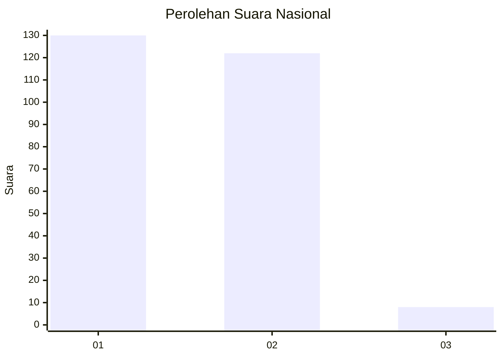
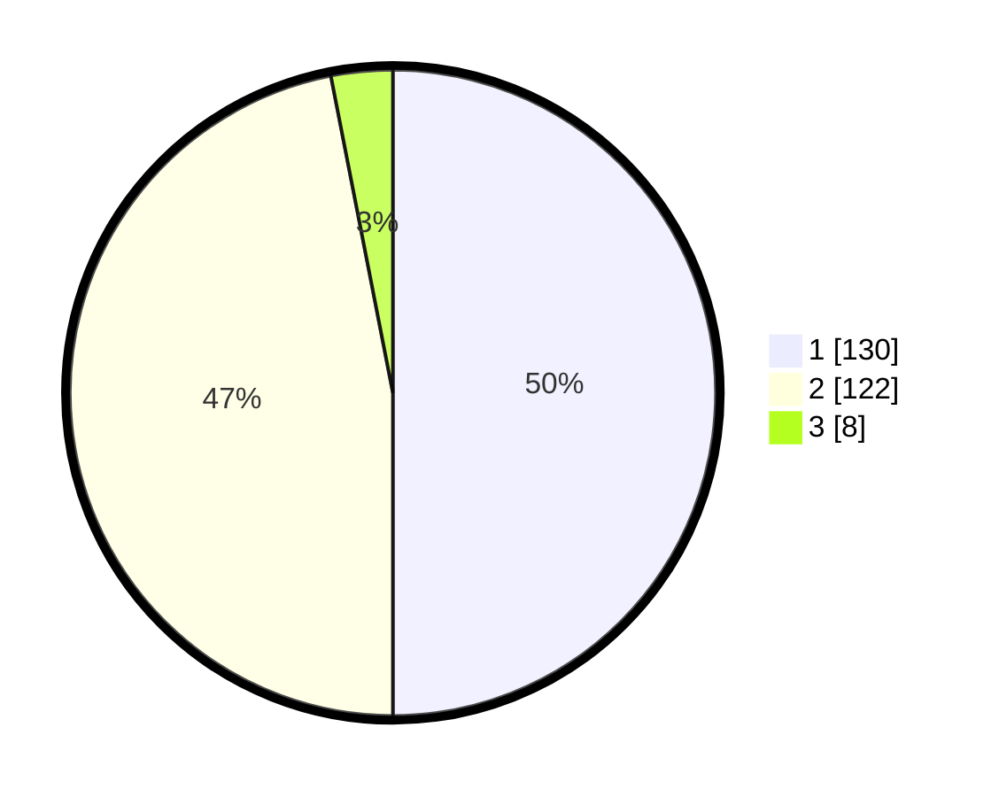

# Hasil

## Grafik

## Tabel

| No. | Nama Paslon    | Suara | Suara (raw) | Persentase |
|:--- |:-------------- | -----:| -----------:| ----------:|
| 1   | ANIES MUHAIMIN | 130   | [130][p-1]  | 50,00      |
| 2   | PRABOWO GIBRAN | 122   | [122][p-2]  | 46,92      |
| 3   | GANJAR MAHFUD  | 8     | [8][p-3]    | 3,08       |

[p-1]: https://github.com/gigit-pemilu/pemilu-2024/blob/main/pilpres/hitung-suara/sub/64-kalimantan-timur/sub/01-paser/sub/04-tanah-grogot/sub/1001-tanah-grogot/sub/064-tps/sub/paslon-1.txt
[p-2]: https://github.com/gigit-pemilu/pemilu-2024/blob/main/pilpres/hitung-suara/sub/64-kalimantan-timur/sub/01-paser/sub/04-tanah-grogot/sub/1001-tanah-grogot/sub/064-tps/sub/paslon-2.txt
[p-3]: https://github.com/gigit-pemilu/pemilu-2024/blob/main/pilpres/hitung-suara/sub/64-kalimantan-timur/sub/01-paser/sub/04-tanah-grogot/sub/1001-tanah-grogot/sub/064-tps/sub/paslon-3.txt

## Foto C Plano

https://sirekap-obj-formc.kpu.go.id/86ac/pemilu/ppwp/64/01/04/10/01/6401041001064-20240214-234411--16822be2-5e32-46b9-8b2e-4394f9dd121e.jpg

https://sirekap-obj-formc.kpu.go.id/86ac/pemilu/ppwp/64/01/04/10/01/6401041001064-20240214-234545--fc153139-8b69-4a95-9f49-db88e09093f5.jpg

https://sirekap-obj-formc.kpu.go.id/86ac/pemilu/ppwp/64/01/04/10/01/6401041001064-20240214-234707--f5002638-33fa-419f-9e78-a53a64e90693.jpg

## Metadata

| Key        | Value               |
| ---------- | ------------------- |
| Time Stamp | 2024-02-25 13:00:00 |

