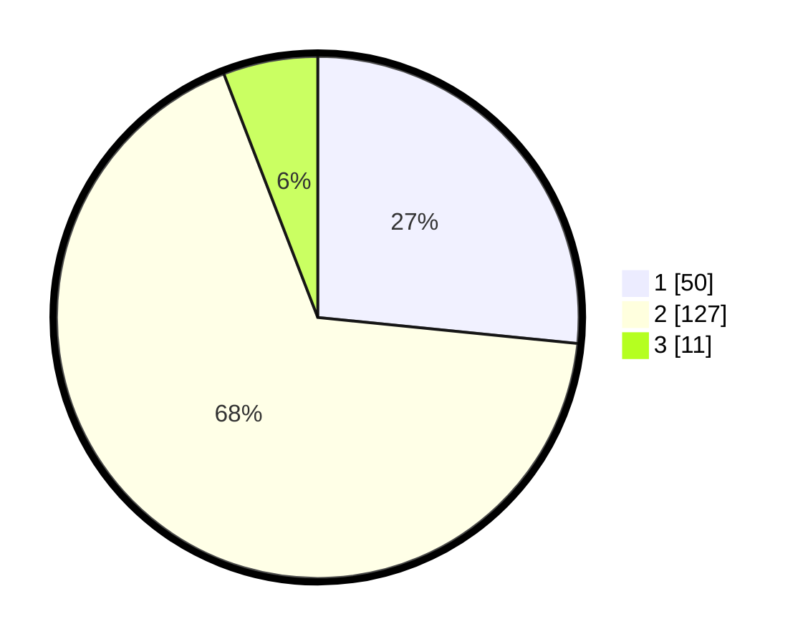

# Hasil

## Grafik

## Tabel

| No. | Nama Paslon    | Suara | Suara (raw) | Persentase |
|:--- |:-------------- | -----:| -----------:| ----------:|
| 1   | ANIES MUHAIMIN | 50    | [50][p-1]   | 26,60      |
| 2   | PRABOWO GIBRAN | 127   | [127][p-2]  | 67,55      |
| 3   | GANJAR MAHFUD  | 11    | [11][p-3]   | 5,85       |

[p-1]: https://github.com/gigit-pemilu/pemilu-2024-64-kalimantan-timur/blob/main/pilpres/hitung-suara/sub/64-kalimantan-timur/sub/01-paser/sub/07-muara-komam/sub/1001-muara-komam/sub/004-tps/sub/paslon-1.txt
[p-2]: https://github.com/gigit-pemilu/pemilu-2024-64-kalimantan-timur/blob/main/pilpres/hitung-suara/sub/64-kalimantan-timur/sub/01-paser/sub/07-muara-komam/sub/1001-muara-komam/sub/004-tps/sub/paslon-2.txt
[p-3]: https://github.com/gigit-pemilu/pemilu-2024-64-kalimantan-timur/blob/main/pilpres/hitung-suara/sub/64-kalimantan-timur/sub/01-paser/sub/07-muara-komam/sub/1001-muara-komam/sub/004-tps/sub/paslon-3.txt

## Foto C Plano

https://sirekap-obj-formc.kpu.go.id/7c01/pemilu/ppwp/64/01/07/10/01/6401071001004-20240215-081240--cf0a10e4-2f2b-4880-b2ac-d9aed22c6881.jpg

https://sirekap-obj-formc.kpu.go.id/7c01/pemilu/ppwp/64/01/07/10/01/6401071001004-20240215-081344--b54cd0d1-b8f1-4b8a-8cc7-7b30b9277a2a.jpg

https://sirekap-obj-formc.kpu.go.id/7c01/pemilu/ppwp/64/01/07/10/01/6401071001004-20240215-081431--060def35-97ec-46d2-86d7-2605f9e578d3.jpg

## Metadata

| Key        | Value               |
| ---------- | ------------------- |
| Time Stamp | 2024-02-16 22:01:00 |

