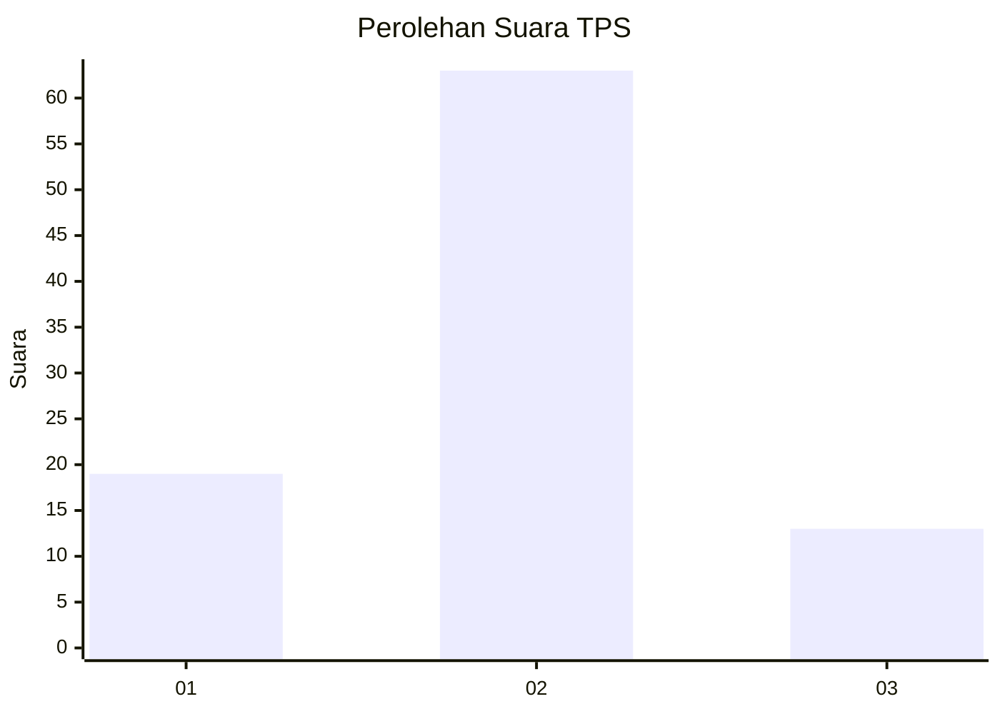
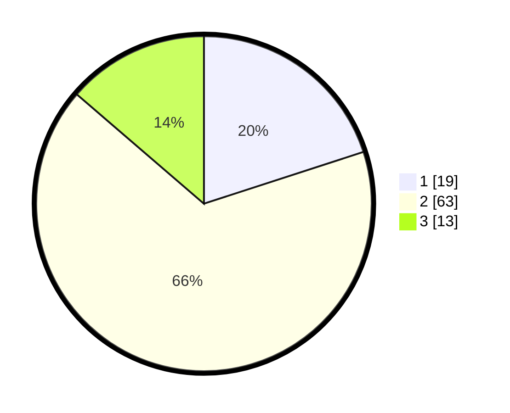

# Hasil

## Grafik

## Tabel

| No. | Nama Paslon    | Suara | Suara (raw) | Persentase |
|:--- |:-------------- | -----:| -----------:| ----------:|
| 1   | ANIES MUHAIMIN | 19    | [19][p-1]   | 20,00      |
| 2   | PRABOWO GIBRAN | 63    | [63][p-2]   | 66,32      |
| 3   | GANJAR MAHFUD  | 13    | [13][p-3]   | 13,68      |

[p-1]: https://github.com/gigit-pemilu/pemilu-2024-64-kalimantan-timur/blob/main/pilpres/hitung-suara/sub/64-kalimantan-timur/sub/01-paser/sub/09-batu-engau/sub/2009-kerang-dayo/sub/005-tps/sub/paslon-1.txt
[p-2]: https://github.com/gigit-pemilu/pemilu-2024-64-kalimantan-timur/blob/main/pilpres/hitung-suara/sub/64-kalimantan-timur/sub/01-paser/sub/09-batu-engau/sub/2009-kerang-dayo/sub/005-tps/sub/paslon-2.txt
[p-3]: https://github.com/gigit-pemilu/pemilu-2024-64-kalimantan-timur/blob/main/pilpres/hitung-suara/sub/64-kalimantan-timur/sub/01-paser/sub/09-batu-engau/sub/2009-kerang-dayo/sub/005-tps/sub/paslon-3.txt

## Foto C Plano

https://sirekap-obj-formc.kpu.go.id/0950/pemilu/ppwp/64/01/09/20/09/6401092009005-20240219-230720--497ccdb8-7c01-49f5-b652-faf4a29d64f0.jpg

https://sirekap-obj-formc.kpu.go.id/0950/pemilu/ppwp/64/01/09/20/09/6401092009005-20240219-230758--d06bf989-446a-42bb-bd46-d822c5203e97.jpg

https://sirekap-obj-formc.kpu.go.id/0950/pemilu/ppwp/64/01/09/20/09/6401092009005-20240219-230844--451bffca-ffda-45d4-9a9c-410c9a23df57.jpg

## Metadata

| Key        | Value               |
| ---------- | ------------------- |
| Time Stamp | 2024-02-21 13:00:00 |

