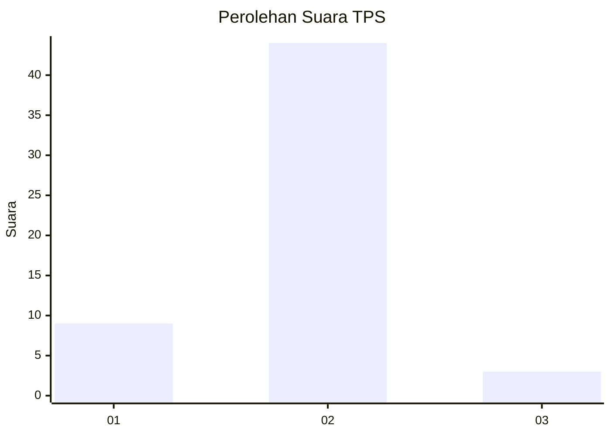
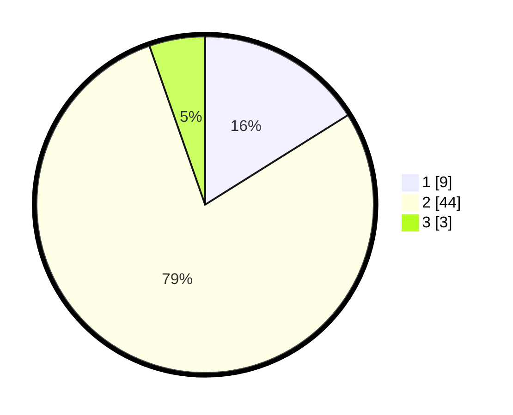

# Hasil

## Grafik

## Tabel

| No. | Nama Paslon    | Suara | Suara (raw) | Persentase |
|:--- |:-------------- | -----:| -----------:| ----------:|
| 1   | ANIES MUHAIMIN | 9     | [9][p-1]    | 16,07      |
| 2   | PRABOWO GIBRAN | 44    | [44][p-2]   | 78,57      |
| 3   | GANJAR MAHFUD  | 3     | [3][p-3]    | 5,36       |

[p-1]: https://github.com/gigit-pemilu/pemilu-2024-64-kalimantan-timur/blob/main/pilpres/hitung-suara/sub/64-kalimantan-timur/sub/01-paser/sub/09-batu-engau/sub/2009-kerang-dayo/sub/902-tps/sub/paslon-1.txt
[p-2]: https://github.com/gigit-pemilu/pemilu-2024-64-kalimantan-timur/blob/main/pilpres/hitung-suara/sub/64-kalimantan-timur/sub/01-paser/sub/09-batu-engau/sub/2009-kerang-dayo/sub/902-tps/sub/paslon-2.txt
[p-3]: https://github.com/gigit-pemilu/pemilu-2024-64-kalimantan-timur/blob/main/pilpres/hitung-suara/sub/64-kalimantan-timur/sub/01-paser/sub/09-batu-engau/sub/2009-kerang-dayo/sub/902-tps/sub/paslon-3.txt

## Foto C Plano

https://sirekap-obj-formc.kpu.go.id/1c3d/pemilu/ppwp/64/01/09/20/09/6401092009902-20240220-160021--f12c7670-2745-454a-9564-06e03040b9a2.jpg

https://sirekap-obj-formc.kpu.go.id/1c3d/pemilu/ppwp/64/01/09/20/09/6401092009902-20240220-160108--7c5b4886-1919-413c-a5e1-7013fc449040.jpg

https://sirekap-obj-formc.kpu.go.id/1c3d/pemilu/ppwp/64/01/09/20/09/6401092009902-20240220-160142--5d475839-19b7-462d-8ca0-55cac28b1bcc.jpg

## Metadata

| Key        | Value               |
| ---------- | ------------------- |
| Time Stamp | 2024-02-21 13:00:00 |

