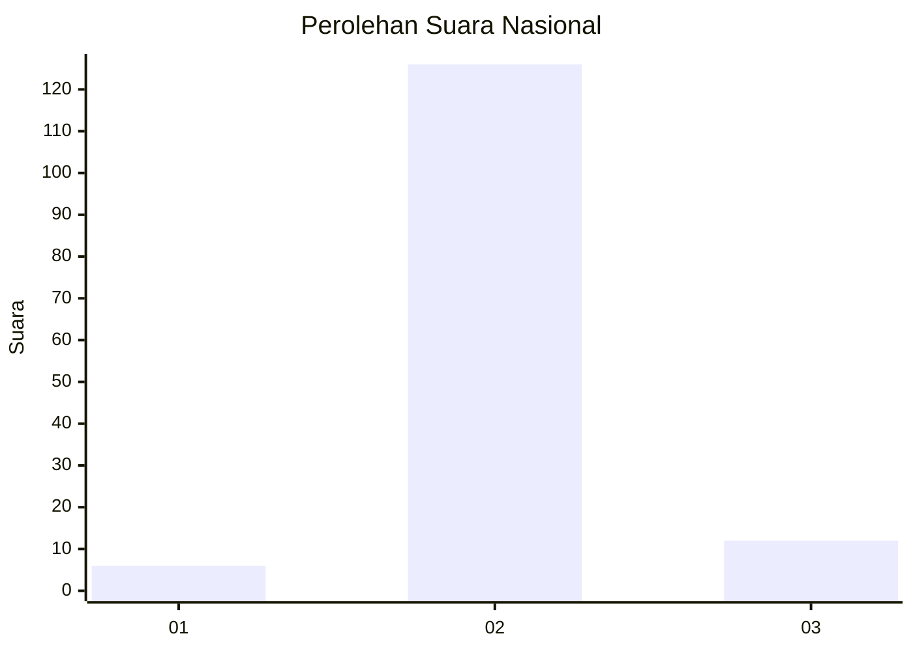
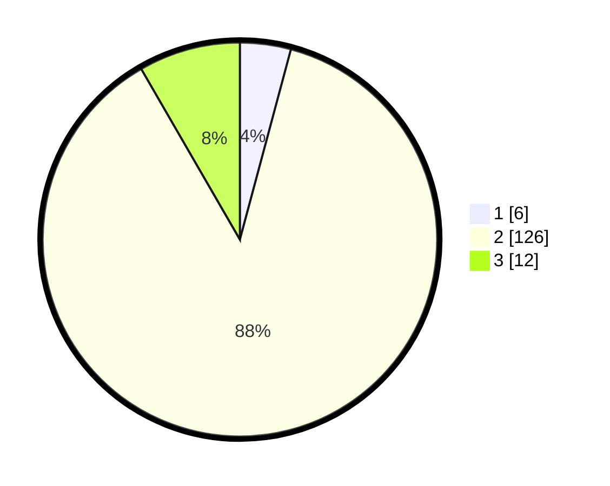

# Hasil

## Grafik

## Tabel

| No. | Nama Paslon    | Suara | Suara (raw) | Persentase |
|:--- |:-------------- | -----:| -----------:| ----------:|
| 1   | ANIES MUHAIMIN | 6     | [6][p-1]    | 4,17       |
| 2   | PRABOWO GIBRAN | 126   | [126][p-2]  | 87,50      |
| 3   | GANJAR MAHFUD  | 12    | [12][p-3]   | 8,33       |

[p-1]: https://github.com/gigit-pemilu/pemilu-2024/blob/main/pilpres/hitung-suara/sub/64-kalimantan-timur/sub/01-paser/sub/10-muara-samu/sub/2001-tanjung-pinang/sub/001-tps/sub/paslon-1.txt
[p-2]: https://github.com/gigit-pemilu/pemilu-2024/blob/main/pilpres/hitung-suara/sub/64-kalimantan-timur/sub/01-paser/sub/10-muara-samu/sub/2001-tanjung-pinang/sub/001-tps/sub/paslon-2.txt
[p-3]: https://github.com/gigit-pemilu/pemilu-2024/blob/main/pilpres/hitung-suara/sub/64-kalimantan-timur/sub/01-paser/sub/10-muara-samu/sub/2001-tanjung-pinang/sub/001-tps/sub/paslon-3.txt

## Foto C Plano

https://sirekap-obj-formc.kpu.go.id/9b01/pemilu/ppwp/64/01/10/20/01/6401102001001-20240219-143154--0755920a-4edc-4e9a-baeb-975ba6cfe220.jpg

https://sirekap-obj-formc.kpu.go.id/9b01/pemilu/ppwp/64/01/10/20/01/6401102001001-20240219-142710--5c22e618-2c8c-4b4e-bfca-65ee10d35a1f.jpg

https://sirekap-obj-formc.kpu.go.id/9b01/pemilu/ppwp/64/01/10/20/01/6401102001001-20240219-142826--9d387313-0c84-48b0-bec2-5ec39d85fd7e.jpg

## Metadata

| Key        | Value               |
| ---------- | ------------------- |
| Time Stamp | 2024-02-19 15:00:00 |

