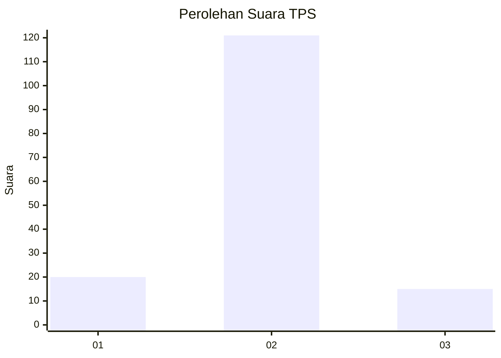
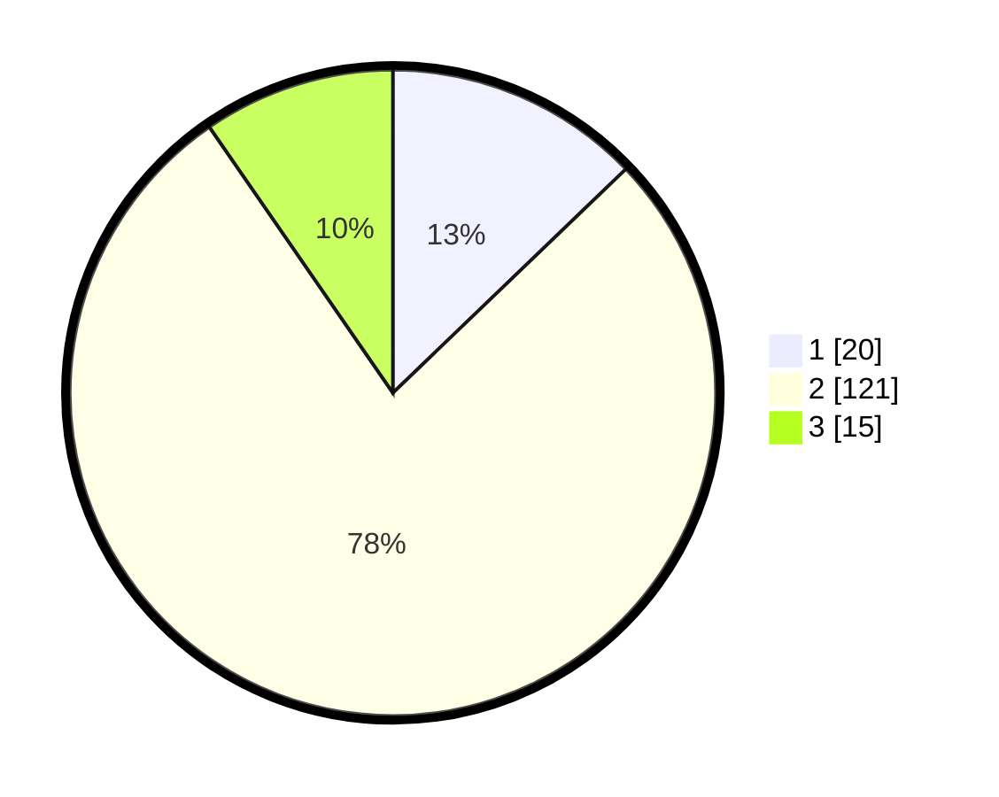

# Hasil

## Grafik

## Tabel

| No. | Nama Paslon    | Suara | Suara (raw) | Persentase |
|:--- |:-------------- | -----:| -----------:| ----------:|
| 1   | ANIES MUHAIMIN | 20    | [20][p-1]   | 12,82      |
| 2   | PRABOWO GIBRAN | 121   | [121][p-2]  | 77,56      |
| 3   | GANJAR MAHFUD  | 15    | [15][p-3]   | 9,62       |

[p-1]: https://github.com/gigit-pemilu/pemilu-2024-64-kalimantan-timur/blob/main/pilpres/hitung-suara/sub/64-kalimantan-timur/sub/02-kutai-kartanegara/sub/03-loa-janan/sub/2001-bakungan/sub/001-tps/sub/paslon-1.txt
[p-2]: https://github.com/gigit-pemilu/pemilu-2024-64-kalimantan-timur/blob/main/pilpres/hitung-suara/sub/64-kalimantan-timur/sub/02-kutai-kartanegara/sub/03-loa-janan/sub/2001-bakungan/sub/001-tps/sub/paslon-2.txt
[p-3]: https://github.com/gigit-pemilu/pemilu-2024-64-kalimantan-timur/blob/main/pilpres/hitung-suara/sub/64-kalimantan-timur/sub/02-kutai-kartanegara/sub/03-loa-janan/sub/2001-bakungan/sub/001-tps/sub/paslon-3.txt

## Foto C Plano

https://sirekap-obj-formc.kpu.go.id/2f2c/pemilu/ppwp/64/02/03/20/01/6402032001001-20240219-180820--9359c2b1-fc17-4b29-b1ab-4fdd20a20e45.jpg

https://sirekap-obj-formc.kpu.go.id/2f2c/pemilu/ppwp/64/02/03/20/01/6402032001001-20240219-180845--f4898f05-94ad-4ea9-9aef-22d7077c7a85.jpg

https://sirekap-obj-formc.kpu.go.id/2f2c/pemilu/ppwp/64/02/03/20/01/6402032001001-20240219-180900--2acfb6d0-9be4-4021-9eaf-57d08d4a18d2.jpg

## Metadata

| Key        | Value               |
| ---------- | ------------------- |
| Time Stamp | 2024-02-25 15:00:00 |

