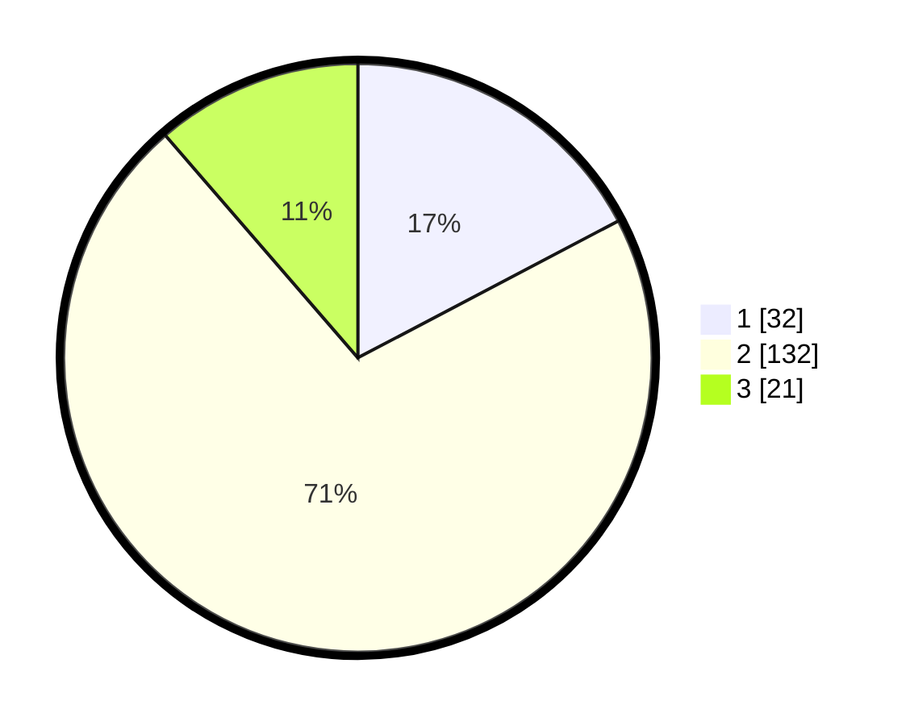

# Hasil

## Grafik

## Tabel

| No. | Nama Paslon    | Suara | Suara (raw) | Persentase |
|:--- |:-------------- | -----:| -----------:| ----------:|
| 1   | ANIES MUHAIMIN | 32    | [32][p-1]   | 17,30      |
| 2   | PRABOWO GIBRAN | 132   | [132][p-2]  | 71,35      |
| 3   | GANJAR MAHFUD  | 21    | [21][p-3]   | 11,35      |

[p-1]: https://github.com/gigit-pemilu/pemilu-2024-64-kalimantan-timur/blob/main/pilpres/hitung-suara/sub/64-kalimantan-timur/sub/02-kutai-kartanegara/sub/03-loa-janan/sub/2001-bakungan/sub/004-tps/sub/paslon-1.txt
[p-2]: https://github.com/gigit-pemilu/pemilu-2024-64-kalimantan-timur/blob/main/pilpres/hitung-suara/sub/64-kalimantan-timur/sub/02-kutai-kartanegara/sub/03-loa-janan/sub/2001-bakungan/sub/004-tps/sub/paslon-2.txt
[p-3]: https://github.com/gigit-pemilu/pemilu-2024-64-kalimantan-timur/blob/main/pilpres/hitung-suara/sub/64-kalimantan-timur/sub/02-kutai-kartanegara/sub/03-loa-janan/sub/2001-bakungan/sub/004-tps/sub/paslon-3.txt

## Foto C Plano

https://sirekap-obj-formc.kpu.go.id/b358/pemilu/ppwp/64/02/03/20/01/6402032001004-20240215-185800--d70abc56-8853-468b-8105-665dda0e75b7.jpg

https://sirekap-obj-formc.kpu.go.id/b358/pemilu/ppwp/64/02/03/20/01/6402032001004-20240215-190045--5185e169-099f-469d-8218-a284f08bcdb9.jpg

https://sirekap-obj-formc.kpu.go.id/b358/pemilu/ppwp/64/02/03/20/01/6402032001004-20240215-190415--fcbacdef-1693-459e-b884-0dad9607c94c.jpg

## Metadata

| Key        | Value               |
| ---------- | ------------------- |
| Time Stamp | 2024-02-26 12:00:00 |

