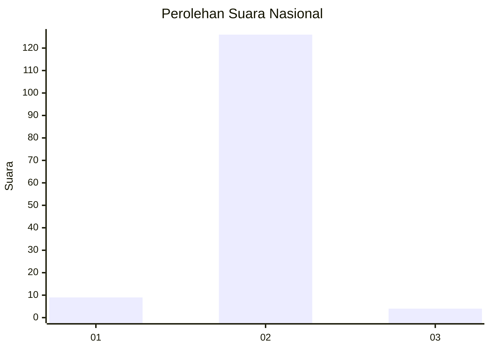
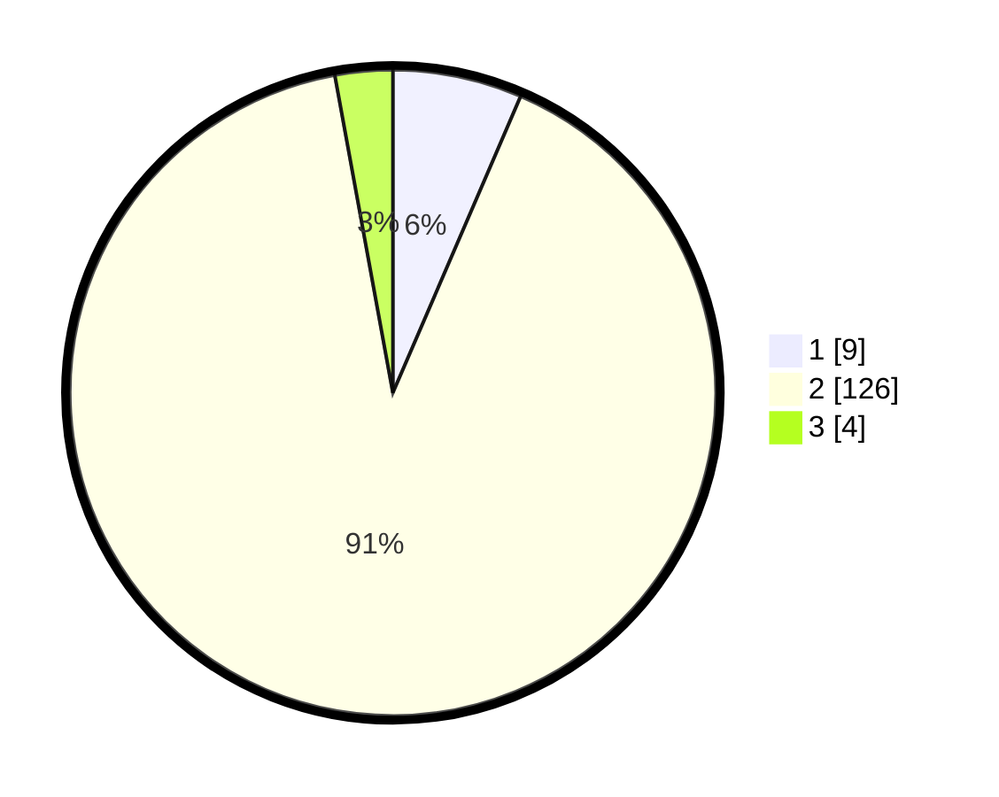

# Hasil

## Grafik

## Tabel

| No. | Nama Paslon    | Suara | Suara (raw) | Persentase |
|:--- |:-------------- | -----:| -----------:| ----------:|
| 1   | ANIES MUHAIMIN | 9     | [9][p-1]    | 6,47       |
| 2   | PRABOWO GIBRAN | 126   | [126][p-2]  | 90,65      |
| 3   | GANJAR MAHFUD  | 4     | [4][p-3]    | 2,88       |

[p-1]: https://github.com/gigit-pemilu/pemilu-2024/blob/main/pilpres/hitung-suara/sub/64-kalimantan-timur/sub/02-kutai-kartanegara/sub/04-anggana/sub/2002-muara-pantuan/sub/007-tps/sub/paslon-1.txt
[p-2]: https://github.com/gigit-pemilu/pemilu-2024/blob/main/pilpres/hitung-suara/sub/64-kalimantan-timur/sub/02-kutai-kartanegara/sub/04-anggana/sub/2002-muara-pantuan/sub/007-tps/sub/paslon-2.txt
[p-3]: https://github.com/gigit-pemilu/pemilu-2024/blob/main/pilpres/hitung-suara/sub/64-kalimantan-timur/sub/02-kutai-kartanegara/sub/04-anggana/sub/2002-muara-pantuan/sub/007-tps/sub/paslon-3.txt

## Foto C Plano

https://sirekap-obj-formc.kpu.go.id/b78f/pemilu/ppwp/64/02/04/20/02/6402042002007-20240215-051909--0f4b53d8-dfb1-4c5d-9c1d-186c71be583f.jpg

https://sirekap-obj-formc.kpu.go.id/b78f/pemilu/ppwp/64/02/04/20/02/6402042002007-20240215-051821--6e4c12fd-c052-409e-a75e-d5095e2ce9ed.jpg

https://sirekap-obj-formc.kpu.go.id/b78f/pemilu/ppwp/64/02/04/20/02/6402042002007-20240215-052003--f7fb04cb-7c46-4224-ac2d-09c29414306c.jpg

## Metadata

| Key        | Value               |
| ---------- | ------------------- |
| Time Stamp | 2024-02-15 22:30:27 |

