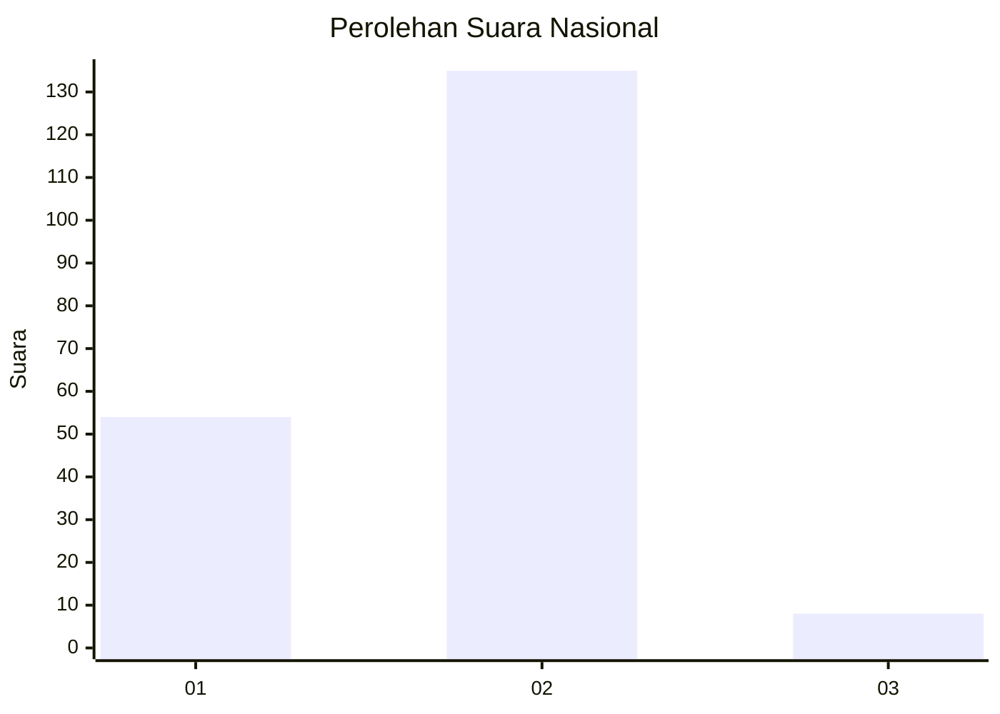
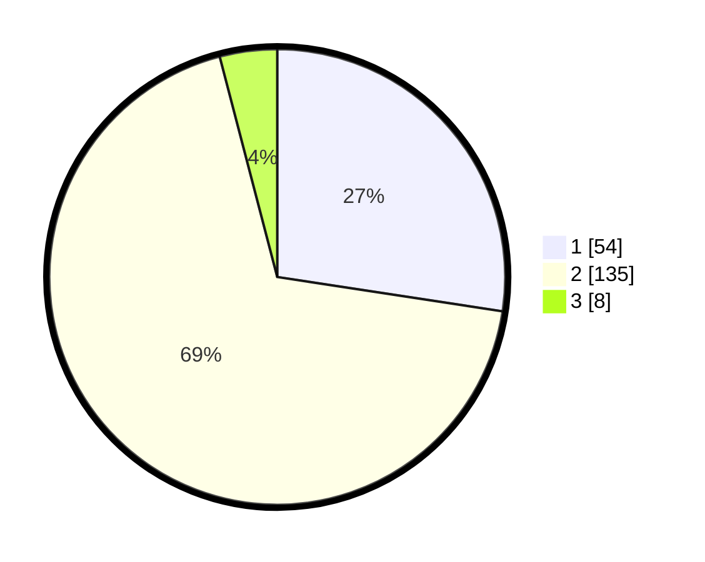

# Hasil

## Grafik

## Tabel

| No. | Nama Paslon    | Suara | Suara (raw) | Persentase |
|:--- |:-------------- | -----:| -----------:| ----------:|
| 1   | ANIES MUHAIMIN | 54    | [54][p-1]   | 27,41      |
| 2   | PRABOWO GIBRAN | 135   | [135][p-2]  | 68,53      |
| 3   | GANJAR MAHFUD  | 8     | [8][p-3]    | 4,06       |

[p-1]: https://github.com/gigit-pemilu/pemilu-2024/blob/main/pilpres/hitung-suara/sub/64-kalimantan-timur/sub/02-kutai-kartanegara/sub/05-muara-badak/sub/2001-saliki/sub/004-tps/sub/paslon-1.txt
[p-2]: https://github.com/gigit-pemilu/pemilu-2024/blob/main/pilpres/hitung-suara/sub/64-kalimantan-timur/sub/02-kutai-kartanegara/sub/05-muara-badak/sub/2001-saliki/sub/004-tps/sub/paslon-2.txt
[p-3]: https://github.com/gigit-pemilu/pemilu-2024/blob/main/pilpres/hitung-suara/sub/64-kalimantan-timur/sub/02-kutai-kartanegara/sub/05-muara-badak/sub/2001-saliki/sub/004-tps/sub/paslon-3.txt

## Foto C Plano

https://sirekap-obj-formc.kpu.go.id/128b/pemilu/ppwp/64/02/05/20/01/6402052001004-20240223-152726--c45e2365-c8e4-4a0f-a639-ebf39336a892.jpg

https://sirekap-obj-formc.kpu.go.id/128b/pemilu/ppwp/64/02/05/20/01/6402052001004-20240223-152823--571572f6-4210-4db1-942c-916dd8936d43.jpg

https://sirekap-obj-formc.kpu.go.id/128b/pemilu/ppwp/64/02/05/20/01/6402052001004-20240223-152912--9a5821c3-aa66-4ca6-92b9-b3ab5e50607c.jpg

## Metadata

| Key        | Value               |
| ---------- | ------------------- |
| Time Stamp | 2024-02-25 12:00:00 |

