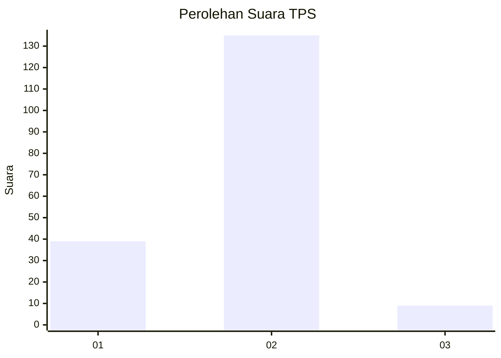
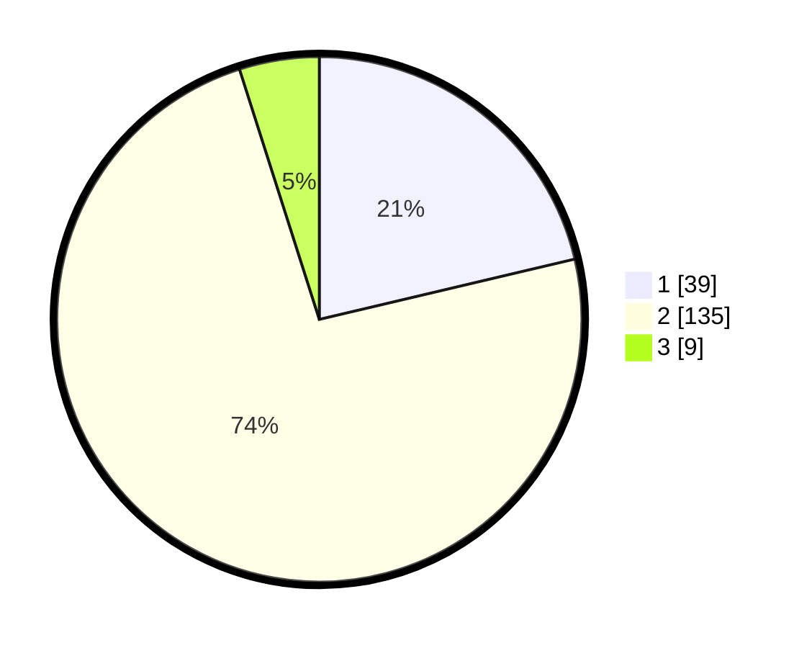

# Hasil

## Grafik

## Tabel

| No. | Nama Paslon    | Suara | Suara (raw) | Persentase |
|:--- |:-------------- | -----:| -----------:| ----------:|
| 1   | ANIES MUHAIMIN | 39    | [39][p-1]   | 21,31      |
| 2   | PRABOWO GIBRAN | 135   | [135][p-2]  | 73,77      |
| 3   | GANJAR MAHFUD  | 9     | [9][p-3]    | 4,92       |

[p-1]: https://github.com/gigit-pemilu/pemilu-2024-64-kalimantan-timur/blob/main/pilpres/hitung-suara/sub/64-kalimantan-timur/sub/02-kutai-kartanegara/sub/05-muara-badak/sub/2001-saliki/sub/006-tps/sub/paslon-1.txt
[p-2]: https://github.com/gigit-pemilu/pemilu-2024-64-kalimantan-timur/blob/main/pilpres/hitung-suara/sub/64-kalimantan-timur/sub/02-kutai-kartanegara/sub/05-muara-badak/sub/2001-saliki/sub/006-tps/sub/paslon-2.txt
[p-3]: https://github.com/gigit-pemilu/pemilu-2024-64-kalimantan-timur/blob/main/pilpres/hitung-suara/sub/64-kalimantan-timur/sub/02-kutai-kartanegara/sub/05-muara-badak/sub/2001-saliki/sub/006-tps/sub/paslon-3.txt

## Foto C Plano

https://sirekap-obj-formc.kpu.go.id/5902/pemilu/ppwp/64/02/05/20/01/6402052001006-20240214-155645--a87fa371-9b29-480b-b171-48a1be5ef369.jpg

https://sirekap-obj-formc.kpu.go.id/5902/pemilu/ppwp/64/02/05/20/01/6402052001006-20240214-155922--d681c8ec-6b79-4b0d-91b4-c5efc0b2aaad.jpg

https://sirekap-obj-formc.kpu.go.id/5902/pemilu/ppwp/64/02/05/20/01/6402052001006-20240214-160137--424106a7-9644-4f60-bce2-e8be27d01cce.jpg

## Metadata

| Key        | Value               |
| ---------- | ------------------- |
| Time Stamp | 2024-02-25 14:00:00 |

