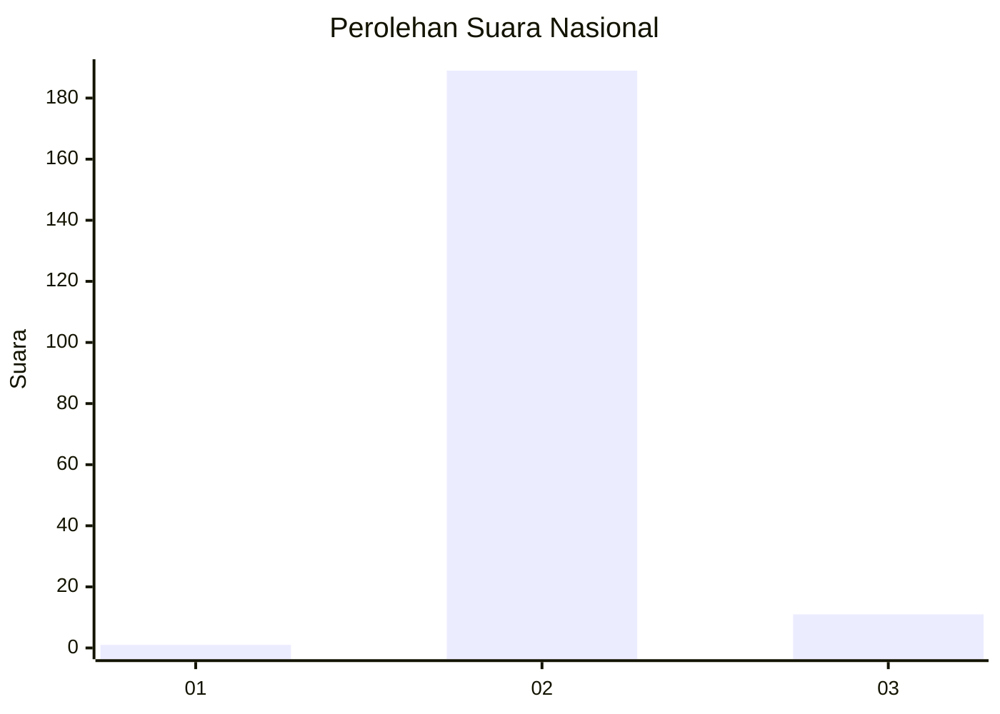
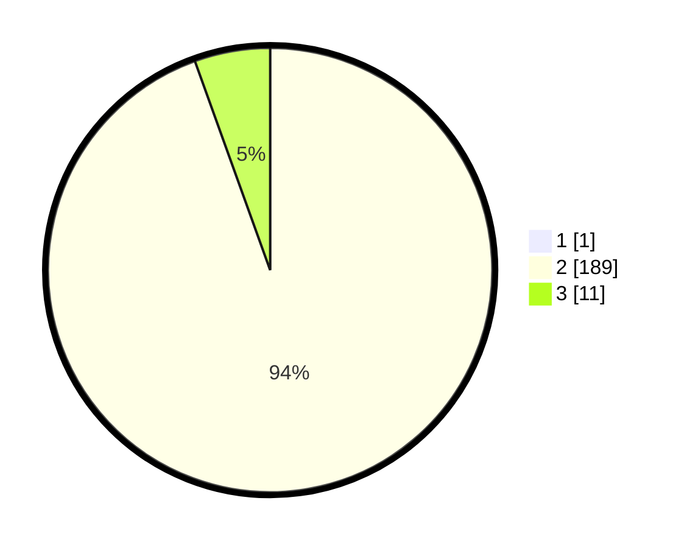

# Hasil

## Grafik

## Tabel

| No. | Nama Paslon    | Suara | Suara (raw) | Persentase |
|:--- |:-------------- | -----:| -----------:| ----------:|
| 1   | ANIES MUHAIMIN | 1     | [1][p-1]    | 0,50       |
| 2   | PRABOWO GIBRAN | 189   | [189][p-2]  | 94,03      |
| 3   | GANJAR MAHFUD  | 11    | [11][p-3]   | 5,47       |

[p-1]: https://github.com/gigit-pemilu/pemilu-2024/blob/main/pilpres/hitung-suara/sub/64-kalimantan-timur/sub/02-kutai-kartanegara/sub/06-tenggarong/sub/1001-jahab/sub/001-tps/sub/paslon-1.txt
[p-2]: https://github.com/gigit-pemilu/pemilu-2024/blob/main/pilpres/hitung-suara/sub/64-kalimantan-timur/sub/02-kutai-kartanegara/sub/06-tenggarong/sub/1001-jahab/sub/001-tps/sub/paslon-2.txt
[p-3]: https://github.com/gigit-pemilu/pemilu-2024/blob/main/pilpres/hitung-suara/sub/64-kalimantan-timur/sub/02-kutai-kartanegara/sub/06-tenggarong/sub/1001-jahab/sub/001-tps/sub/paslon-3.txt

## Foto C Plano

https://sirekap-obj-formc.kpu.go.id/4d88/pemilu/ppwp/64/02/06/10/01/6402061001001-20240215-002716--38908c65-6ca8-4ed1-a08f-d9578b5f1879.jpg

https://sirekap-obj-formc.kpu.go.id/4d88/pemilu/ppwp/64/02/06/10/01/6402061001001-20240215-002954--180f3533-5f1a-4db1-a91e-b1945538f040.jpg

https://sirekap-obj-formc.kpu.go.id/4d88/pemilu/ppwp/64/02/06/10/01/6402061001001-20240215-003110--3750cc75-bbcc-4279-9f14-1017983daef4.jpg

## Metadata

| Key        | Value               |
| ---------- | ------------------- |
| Time Stamp | 2024-02-20 11:00:00 |

