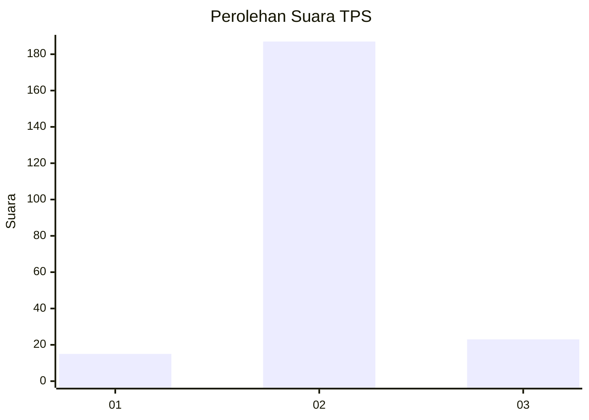
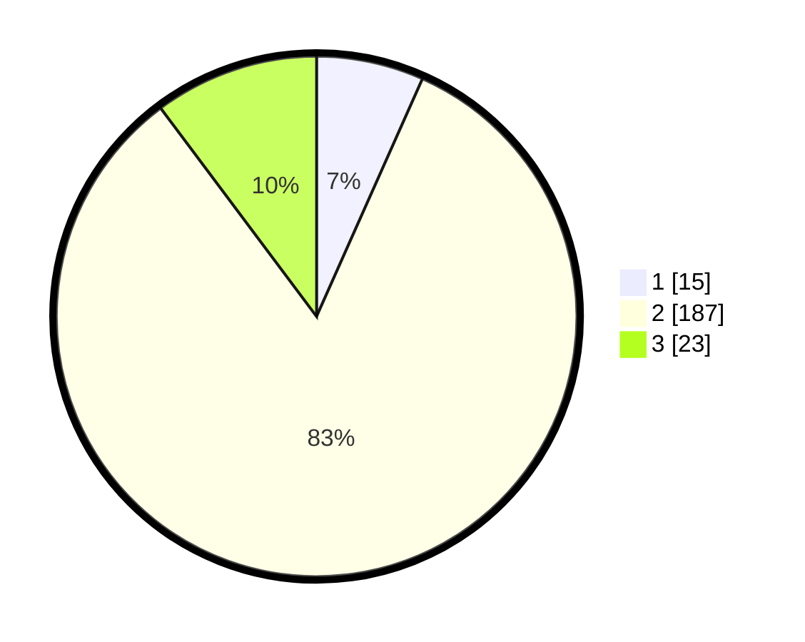

# Hasil

## Grafik

## Tabel

| No. | Nama Paslon    | Suara | Suara (raw) | Persentase |
|:--- |:-------------- | -----:| -----------:| ----------:|
| 1   | ANIES MUHAIMIN | 15    | [15][p-1]   | 6,67       |
| 2   | PRABOWO GIBRAN | 187   | [187][p-2]  | 83,11      |
| 3   | GANJAR MAHFUD  | 23    | [23][p-3]   | 10,22      |

[p-1]: https://github.com/gigit-pemilu/pemilu-2024-64-kalimantan-timur/blob/main/pilpres/hitung-suara/sub/64-kalimantan-timur/sub/02-kutai-kartanegara/sub/06-tenggarong/sub/1001-jahab/sub/005-tps/sub/paslon-1.txt
[p-2]: https://github.com/gigit-pemilu/pemilu-2024-64-kalimantan-timur/blob/main/pilpres/hitung-suara/sub/64-kalimantan-timur/sub/02-kutai-kartanegara/sub/06-tenggarong/sub/1001-jahab/sub/005-tps/sub/paslon-2.txt
[p-3]: https://github.com/gigit-pemilu/pemilu-2024-64-kalimantan-timur/blob/main/pilpres/hitung-suara/sub/64-kalimantan-timur/sub/02-kutai-kartanegara/sub/06-tenggarong/sub/1001-jahab/sub/005-tps/sub/paslon-3.txt

## Foto C Plano

https://sirekap-obj-formc.kpu.go.id/a223/pemilu/ppwp/64/02/06/10/01/6402061001005-20240214-231417--e295f5b2-9091-4401-8d8c-559d2a3453ee.jpg

https://sirekap-obj-formc.kpu.go.id/a223/pemilu/ppwp/64/02/06/10/01/6402061001005-20240214-231600--86a830bd-b4c0-4235-b214-7c4c00feff3c.jpg

https://sirekap-obj-formc.kpu.go.id/a223/pemilu/ppwp/64/02/06/10/01/6402061001005-20240214-231709--c34c6ca5-bb56-443e-b5ea-fe9b64cf3f5a.jpg

## Metadata

| Key        | Value               |
| ---------- | ------------------- |
| Time Stamp | 2024-02-20 11:00:00 |

