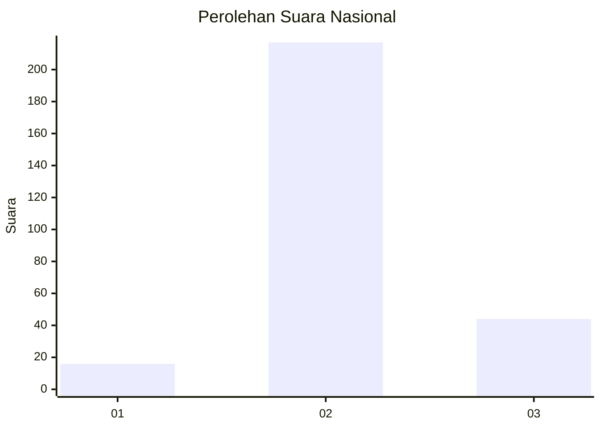
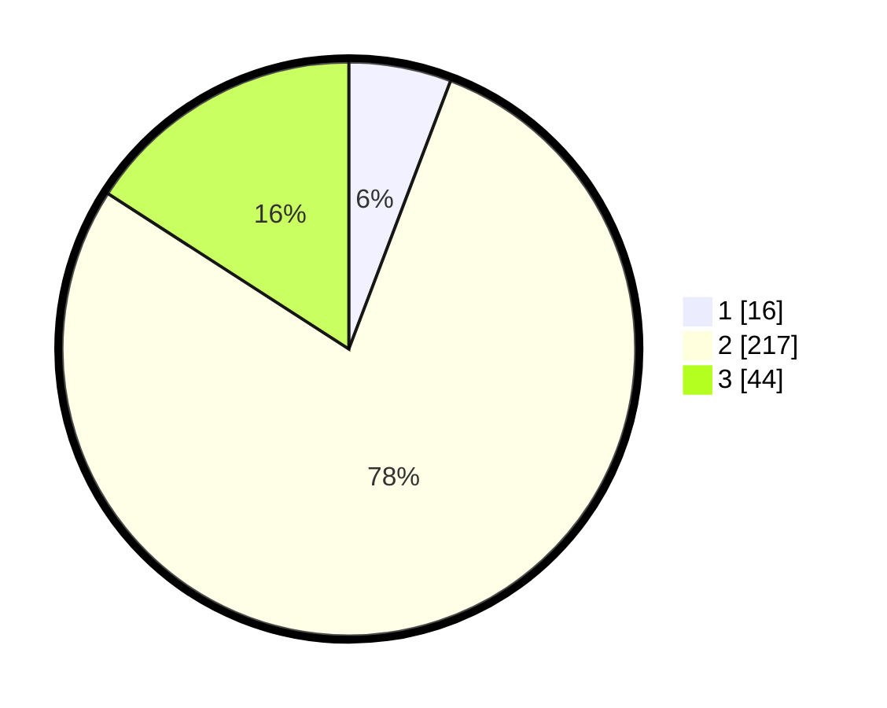

# Hasil

## Grafik

## Tabel

| No. | Nama Paslon    | Suara | Suara (raw) | Persentase |
|:--- |:-------------- | -----:| -----------:| ----------:|
| 1   | ANIES MUHAIMIN | 16    | [16][p-1]   | 5,78       |
| 2   | PRABOWO GIBRAN | 217   | [217][p-2]  | 78,34      |
| 3   | GANJAR MAHFUD  | 44    | [44][p-3]   | 15,88      |

[p-1]: https://github.com/gigit-pemilu/pemilu-2024/blob/main/pilpres/hitung-suara/sub/64-kalimantan-timur/sub/02-kutai-kartanegara/sub/06-tenggarong/sub/1002-loa-ipuh/sub/904-tps/sub/paslon-1.txt
[p-2]: https://github.com/gigit-pemilu/pemilu-2024/blob/main/pilpres/hitung-suara/sub/64-kalimantan-timur/sub/02-kutai-kartanegara/sub/06-tenggarong/sub/1002-loa-ipuh/sub/904-tps/sub/paslon-2.txt
[p-3]: https://github.com/gigit-pemilu/pemilu-2024/blob/main/pilpres/hitung-suara/sub/64-kalimantan-timur/sub/02-kutai-kartanegara/sub/06-tenggarong/sub/1002-loa-ipuh/sub/904-tps/sub/paslon-3.txt

## Foto C Plano

https://sirekap-obj-formc.kpu.go.id/6255/pemilu/ppwp/64/02/06/10/02/6402061002904-20240215-002909--2310156b-30d4-450d-819a-c57c52f12e91.jpg

https://sirekap-obj-formc.kpu.go.id/6255/pemilu/ppwp/64/02/06/10/02/6402061002904-20240214-211150--a95c4884-828d-4523-b8ee-382ba86f44a4.jpg

https://sirekap-obj-formc.kpu.go.id/6255/pemilu/ppwp/64/02/06/10/02/6402061002904-20240214-211320--4d5dc424-eb32-4a0a-ba30-7d76a114ef02.jpg

## Metadata

| Key        | Value               |
| ---------- | ------------------- |
| Time Stamp | 2024-02-15 15:00:29 |

