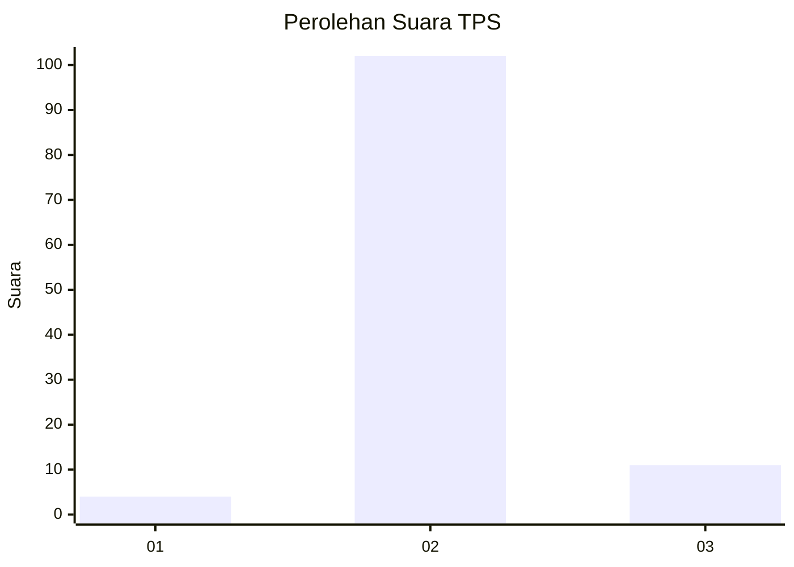
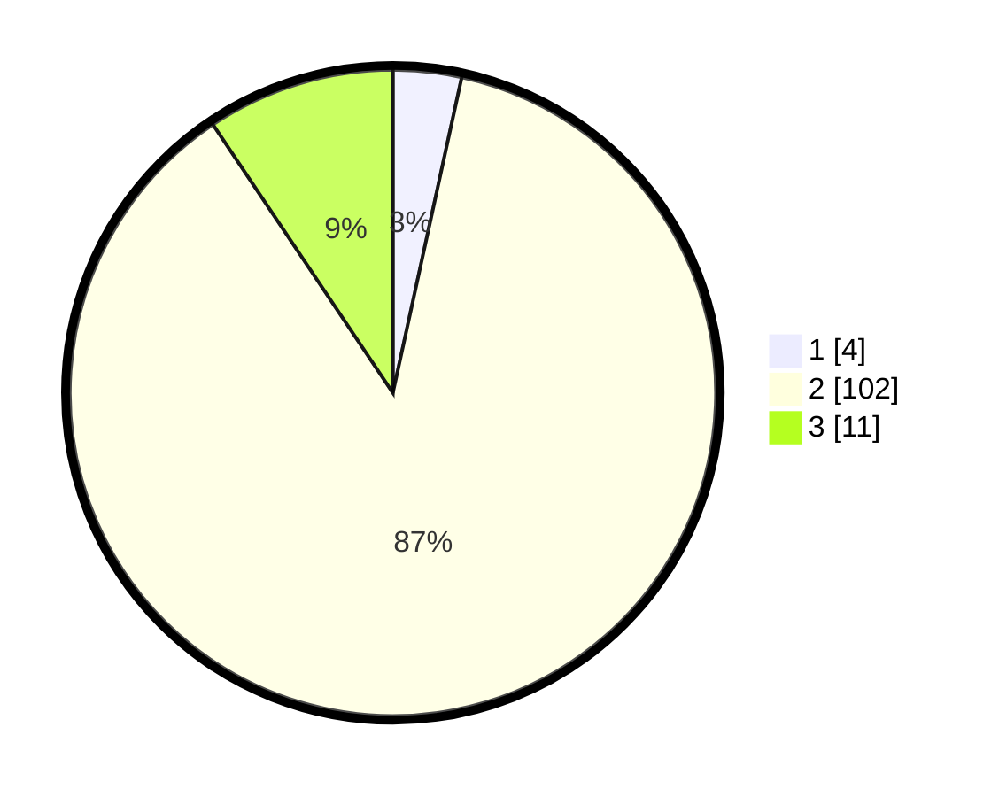

# Hasil

## Grafik

## Tabel

| No. | Nama Paslon    | Suara | Suara (raw) | Persentase |
|:--- |:-------------- | -----:| -----------:| ----------:|
| 1   | ANIES MUHAIMIN | 4     | [4][p-1]    | 3,42       |
| 2   | PRABOWO GIBRAN | 102   | [102][p-2]  | 87,18      |
| 3   | GANJAR MAHFUD  | 11    | [11][p-3]   | 9,40       |

[p-1]: https://github.com/gigit-pemilu/pemilu-2024-64-kalimantan-timur/blob/main/pilpres/hitung-suara/sub/64-kalimantan-timur/sub/02-kutai-kartanegara/sub/09-kenohan/sub/2001-lamin-telihan/sub/002-tps/sub/paslon-1.txt
[p-2]: https://github.com/gigit-pemilu/pemilu-2024-64-kalimantan-timur/blob/main/pilpres/hitung-suara/sub/64-kalimantan-timur/sub/02-kutai-kartanegara/sub/09-kenohan/sub/2001-lamin-telihan/sub/002-tps/sub/paslon-2.txt
[p-3]: https://github.com/gigit-pemilu/pemilu-2024-64-kalimantan-timur/blob/main/pilpres/hitung-suara/sub/64-kalimantan-timur/sub/02-kutai-kartanegara/sub/09-kenohan/sub/2001-lamin-telihan/sub/002-tps/sub/paslon-3.txt

## Foto C Plano

https://sirekap-obj-formc.kpu.go.id/ae53/pemilu/ppwp/64/02/09/20/01/6402092001002-20240220-143533--e666dfc2-0485-477a-90a0-65c1023ce691.jpg

https://sirekap-obj-formc.kpu.go.id/ae53/pemilu/ppwp/64/02/09/20/01/6402092001002-20240220-143607--59a6d754-8067-467a-8f32-ce8d6fa54a53.jpg

https://sirekap-obj-formc.kpu.go.id/ae53/pemilu/ppwp/64/02/09/20/01/6402092001002-20240220-143633--c4ee2699-213a-42b2-9eec-16d8f69dcb7b.jpg

## Metadata

| Key        | Value               |
| ---------- | ------------------- |
| Time Stamp | 2024-02-24 22:31:28 |

