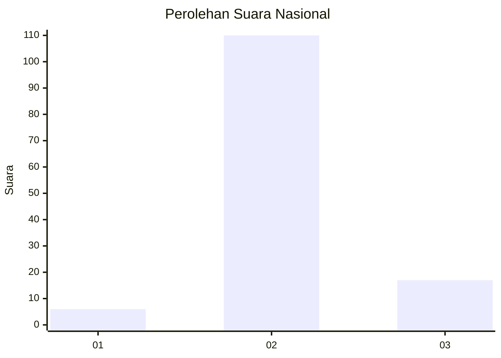
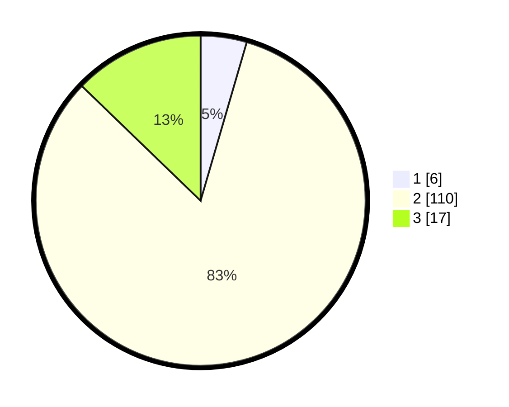

# Hasil

## Grafik

## Tabel

| No. | Nama Paslon    | Suara | Suara (raw) | Persentase |
|:--- |:-------------- | -----:| -----------:| ----------:|
| 1   | ANIES MUHAIMIN | 6     | [6][p-1]    | 4,51       |
| 2   | PRABOWO GIBRAN | 110   | [110][p-2]  | 82,71      |
| 3   | GANJAR MAHFUD  | 17    | [17][p-3]   | 12,78      |

[p-1]: https://github.com/gigit-pemilu/pemilu-2024/blob/main/pilpres/hitung-suara/sub/64-kalimantan-timur/sub/02-kutai-kartanegara/sub/09-kenohan/sub/2001-lamin-telihan/sub/003-tps/sub/paslon-1.txt
[p-2]: https://github.com/gigit-pemilu/pemilu-2024/blob/main/pilpres/hitung-suara/sub/64-kalimantan-timur/sub/02-kutai-kartanegara/sub/09-kenohan/sub/2001-lamin-telihan/sub/003-tps/sub/paslon-2.txt
[p-3]: https://github.com/gigit-pemilu/pemilu-2024/blob/main/pilpres/hitung-suara/sub/64-kalimantan-timur/sub/02-kutai-kartanegara/sub/09-kenohan/sub/2001-lamin-telihan/sub/003-tps/sub/paslon-3.txt

## Foto C Plano

https://sirekap-obj-formc.kpu.go.id/b63f/pemilu/ppwp/64/02/09/20/01/6402092001003-20240220-151637--c0498b6e-abb5-4663-8d85-a61a163a824e.jpg

https://sirekap-obj-formc.kpu.go.id/b63f/pemilu/ppwp/64/02/09/20/01/6402092001003-20240220-151819--c9b9f7e0-ecca-4b85-a47d-62eb3affa21d.jpg

https://sirekap-obj-formc.kpu.go.id/b63f/pemilu/ppwp/64/02/09/20/01/6402092001003-20240220-151834--e3126150-f2e4-4a71-bbe4-6a5356c49ca7.jpg

## Metadata

| Key        | Value               |
| ---------- | ------------------- |
| Time Stamp | 2024-02-26 12:00:00 |

