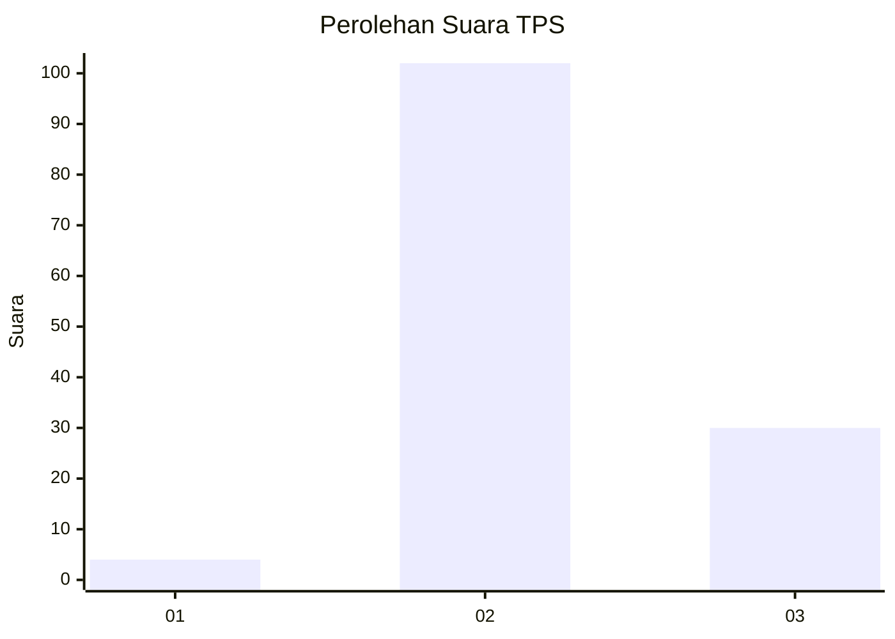

# Hasil

## Grafik

## Tabel

| No. | Nama Paslon    | Suara | Suara (raw) | Persentase |
|:--- |:-------------- | -----:| -----------:| ----------:|
| 1   | ANIES MUHAIMIN | 4     | [4][p-1]    | 2,94       |
| 2   | PRABOWO GIBRAN | 102   | [102][p-2]  | 75,00      |
| 3   | GANJAR MAHFUD  | 30    | [30][p-3]   | 22,06      |

[p-1]: https://github.com/gigit-pemilu/pemilu-2024-64-kalimantan-timur/blob/main/pilpres/hitung-suara/sub/64-kalimantan-timur/sub/02-kutai-kartanegara/sub/09-kenohan/sub/2001-lamin-telihan/sub/004-tps/sub/paslon-1.txt
[p-2]: https://github.com/gigit-pemilu/pemilu-2024-64-kalimantan-timur/blob/main/pilpres/hitung-suara/sub/64-kalimantan-timur/sub/02-kutai-kartanegara/sub/09-kenohan/sub/2001-lamin-telihan/sub/004-tps/sub/paslon-2.txt
[p-3]: https://github.com/gigit-pemilu/pemilu-2024-64-kalimantan-timur/blob/main/pilpres/hitung-suara/sub/64-kalimantan-timur/sub/02-kutai-kartanegara/sub/09-kenohan/sub/2001-lamin-telihan/sub/004-tps/sub/paslon-3.txt

## Foto C Plano

https://sirekap-obj-formc.kpu.go.id/c2b1/pemilu/ppwp/64/02/09/20/01/6402092001004-20240220-152746--a815cba9-d196-4e9d-b821-0fc85beb15cc.jpg

https://sirekap-obj-formc.kpu.go.id/c2b1/pemilu/ppwp/64/02/09/20/01/6402092001004-20240220-152905--cb0d664c-2140-4422-8067-db9b3c96fcb5.jpg

https://sirekap-obj-formc.kpu.go.id/c2b1/pemilu/ppwp/64/02/09/20/01/6402092001004-20240220-153124--0b59c8d8-3900-4f99-9c2f-20adfed184d4.jpg

## Metadata

| Key        | Value               |
| ---------- | ------------------- |
| Time Stamp | 2024-02-25 16:00:00 |

