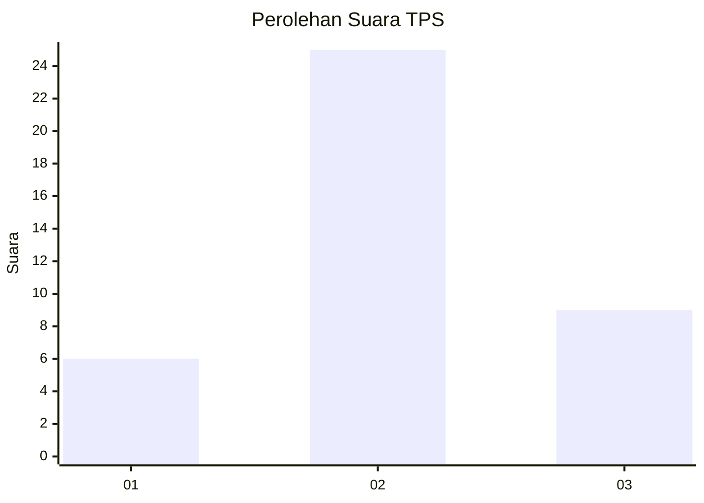
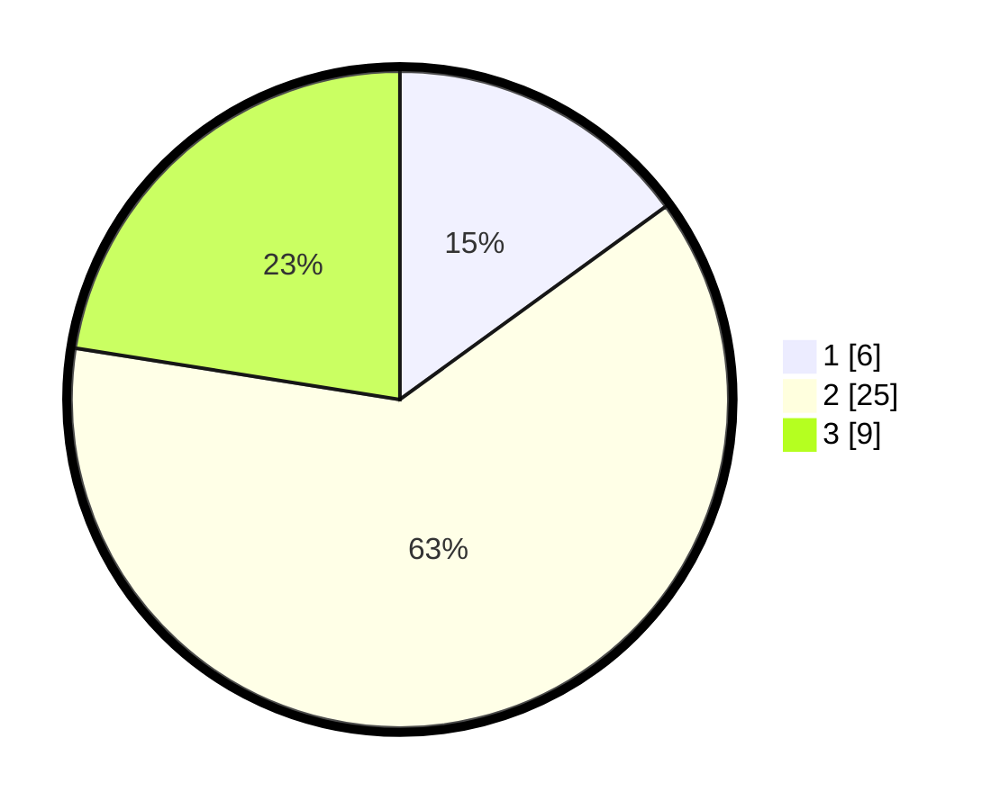

# Hasil

## Grafik

## Tabel

| No. | Nama Paslon    | Suara | Suara (raw) | Persentase |
|:--- |:-------------- | -----:| -----------:| ----------:|
| 1   | ANIES MUHAIMIN | 6     | [6][p-1]    | 15,00      |
| 2   | PRABOWO GIBRAN | 25    | [25][p-2]   | 62,50      |
| 3   | GANJAR MAHFUD  | 9     | [9][p-3]    | 22,50      |

[p-1]: https://github.com/gigit-pemilu/pemilu-2024-64-kalimantan-timur/blob/main/pilpres/hitung-suara/sub/64-kalimantan-timur/sub/02-kutai-kartanegara/sub/09-kenohan/sub/2004-kahala/sub/006-tps/sub/paslon-1.txt
[p-2]: https://github.com/gigit-pemilu/pemilu-2024-64-kalimantan-timur/blob/main/pilpres/hitung-suara/sub/64-kalimantan-timur/sub/02-kutai-kartanegara/sub/09-kenohan/sub/2004-kahala/sub/006-tps/sub/paslon-2.txt
[p-3]: https://github.com/gigit-pemilu/pemilu-2024-64-kalimantan-timur/blob/main/pilpres/hitung-suara/sub/64-kalimantan-timur/sub/02-kutai-kartanegara/sub/09-kenohan/sub/2004-kahala/sub/006-tps/sub/paslon-3.txt

## Foto C Plano

https://sirekap-obj-formc.kpu.go.id/8434/pemilu/ppwp/64/02/09/20/04/6402092004006-20240222-213643--4989134d-2aa8-4092-b1bf-ca008ebb1a60.jpg

https://sirekap-obj-formc.kpu.go.id/8434/pemilu/ppwp/64/02/09/20/04/6402092004006-20240222-213718--03cb582b-63e2-41ad-96fc-97fa503c266a.jpg

https://sirekap-obj-formc.kpu.go.id/8434/pemilu/ppwp/64/02/09/20/04/6402092004006-20240222-213752--23e23898-9171-4b76-89c6-123b92b05db1.jpg

## Metadata

| Key        | Value               |
| ---------- | ------------------- |
| Time Stamp | 2024-02-25 13:00:00 |

