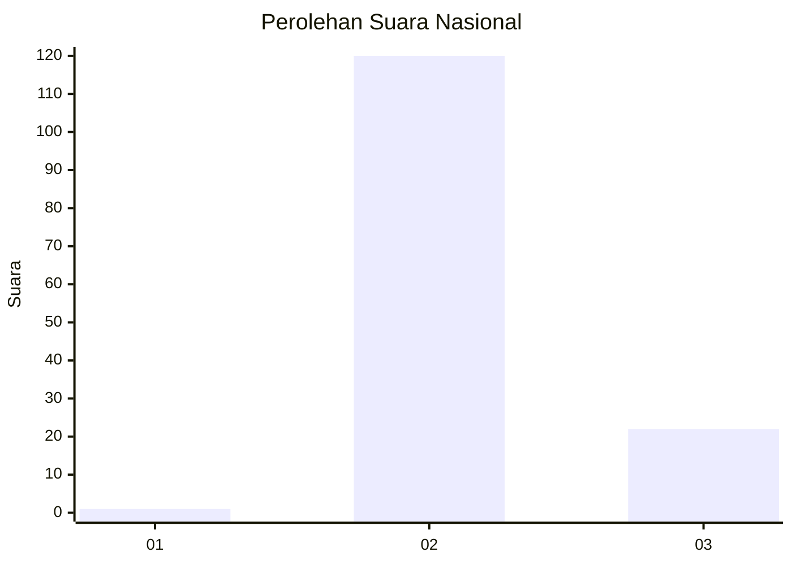
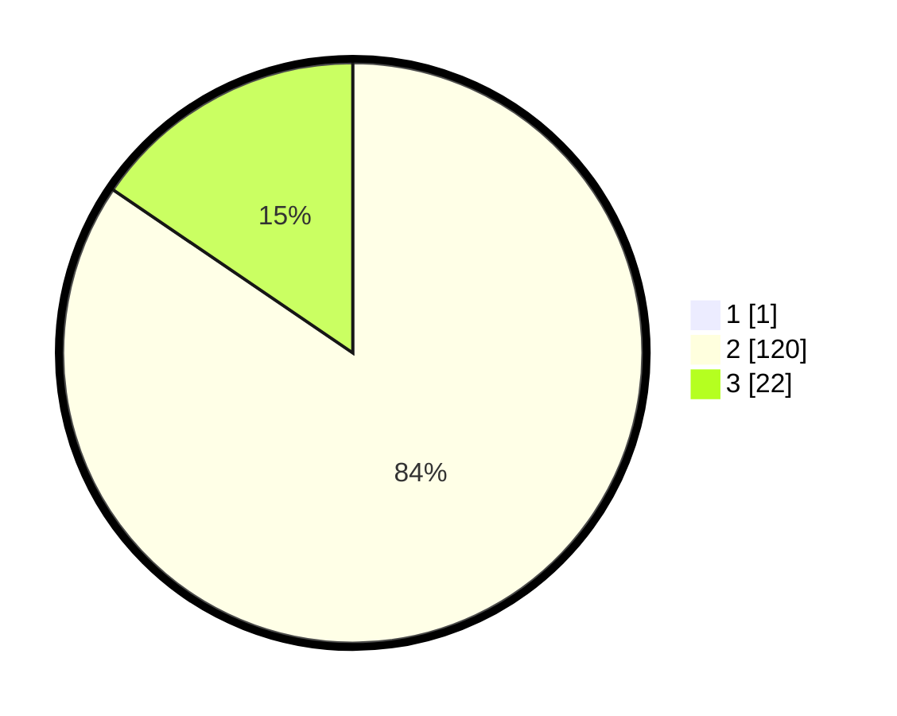

# Hasil

## Grafik

## Tabel

| No. | Nama Paslon    | Suara | Suara (raw) | Persentase |
|:--- |:-------------- | -----:| -----------:| ----------:|
| 1   | ANIES MUHAIMIN | 1     | [1][p-1]    | 0,70       |
| 2   | PRABOWO GIBRAN | 120   | [120][p-2]  | 83,92      |
| 3   | GANJAR MAHFUD  | 22    | [22][p-3]   | 15,38      |

[p-1]: https://github.com/gigit-pemilu/pemilu-2024/blob/main/pilpres/hitung-suara/sub/64-kalimantan-timur/sub/02-kutai-kartanegara/sub/10-kembang-janggut/sub/2005-kelekat/sub/001-tps/sub/paslon-1.txt
[p-2]: https://github.com/gigit-pemilu/pemilu-2024/blob/main/pilpres/hitung-suara/sub/64-kalimantan-timur/sub/02-kutai-kartanegara/sub/10-kembang-janggut/sub/2005-kelekat/sub/001-tps/sub/paslon-2.txt
[p-3]: https://github.com/gigit-pemilu/pemilu-2024/blob/main/pilpres/hitung-suara/sub/64-kalimantan-timur/sub/02-kutai-kartanegara/sub/10-kembang-janggut/sub/2005-kelekat/sub/001-tps/sub/paslon-3.txt

## Foto C Plano

https://sirekap-obj-formc.kpu.go.id/96cf/pemilu/ppwp/64/02/10/20/05/6402102005001-20240214-214344--1724e3fd-0b3f-449b-a435-b05fdca25a0d.jpg

https://sirekap-obj-formc.kpu.go.id/96cf/pemilu/ppwp/64/02/10/20/05/6402102005001-20240214-202346--1dbd8bd5-5d2c-49de-b091-f7e7153fd26c.jpg

https://sirekap-obj-formc.kpu.go.id/96cf/pemilu/ppwp/64/02/10/20/05/6402102005001-20240214-214529--11120826-ffb2-443d-9b69-681ab4915c2d.jpg

## Metadata

| Key        | Value               |
| ---------- | ------------------- |
| Time Stamp | 2024-02-15 15:00:29 |

