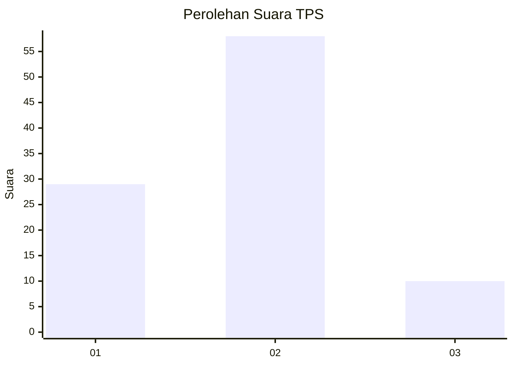
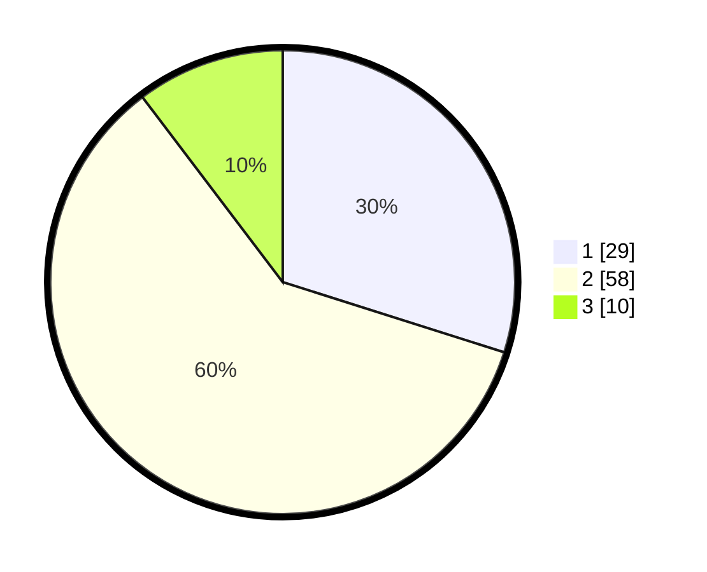

# Hasil

## Grafik

## Tabel

| No. | Nama Paslon    | Suara | Suara (raw) | Persentase |
|:--- |:-------------- | -----:| -----------:| ----------:|
| 1   | ANIES MUHAIMIN | 29    | [29][p-1]   | 29,90      |
| 2   | PRABOWO GIBRAN | 58    | [58][p-2]   | 59,79      |
| 3   | GANJAR MAHFUD  | 10    | [10][p-3]   | 10,31      |

[p-1]: https://github.com/gigit-pemilu/pemilu-2024-64-kalimantan-timur/blob/main/pilpres/hitung-suara/sub/64-kalimantan-timur/sub/02-kutai-kartanegara/sub/12-tabang/sub/2001-gunung-sari/sub/002-tps/sub/paslon-1.txt
[p-2]: https://github.com/gigit-pemilu/pemilu-2024-64-kalimantan-timur/blob/main/pilpres/hitung-suara/sub/64-kalimantan-timur/sub/02-kutai-kartanegara/sub/12-tabang/sub/2001-gunung-sari/sub/002-tps/sub/paslon-2.txt
[p-3]: https://github.com/gigit-pemilu/pemilu-2024-64-kalimantan-timur/blob/main/pilpres/hitung-suara/sub/64-kalimantan-timur/sub/02-kutai-kartanegara/sub/12-tabang/sub/2001-gunung-sari/sub/002-tps/sub/paslon-3.txt

## Foto C Plano

https://sirekap-obj-formc.kpu.go.id/1ebc/pemilu/ppwp/64/02/12/20/01/6402122001002-20240214-220609--b32b2114-35e3-481e-b3de-96a8e26f5652.jpg

https://sirekap-obj-formc.kpu.go.id/1ebc/pemilu/ppwp/64/02/12/20/01/6402122001002-20240214-220748--ba5f8981-7142-4393-b1d8-223c2f08b1ea.jpg

https://sirekap-obj-formc.kpu.go.id/1ebc/pemilu/ppwp/64/02/12/20/01/6402122001002-20240214-220843--8c8fc82a-18bb-46cc-826c-43911cd09640.jpg

## Metadata

| Key        | Value               |
| ---------- | ------------------- |
| Time Stamp | 2024-02-21 16:00:00 |

