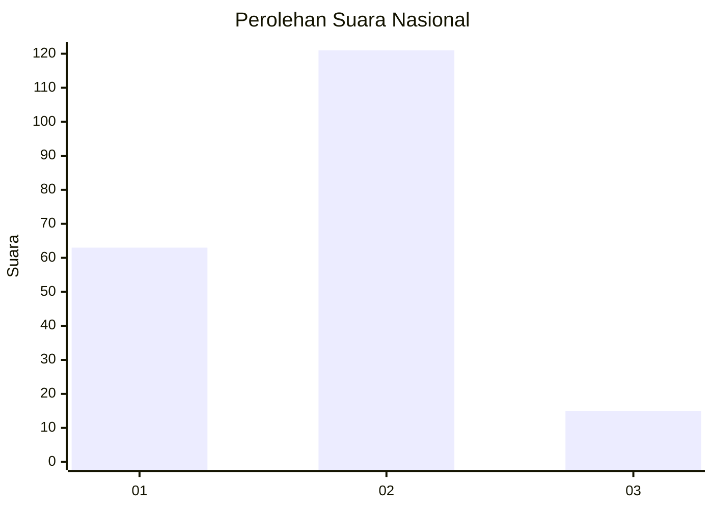
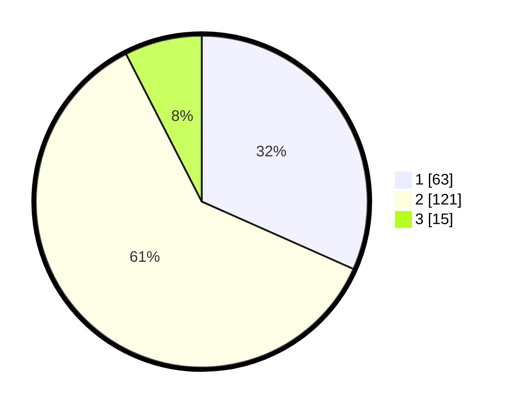

# Hasil

## Grafik

## Tabel

| No. | Nama Paslon    | Suara | Suara (raw) | Persentase |
|:--- |:-------------- | -----:| -----------:| ----------:|
| 1   | ANIES MUHAIMIN | 63    | [63][p-1]   | 31,66      |
| 2   | PRABOWO GIBRAN | 121   | [121][p-2]  | 60,80      |
| 3   | GANJAR MAHFUD  | 15    | [15][p-3]   | 7,54       |

[p-1]: https://github.com/gigit-pemilu/pemilu-2024/blob/main/pilpres/hitung-suara/sub/64-kalimantan-timur/sub/02-kutai-kartanegara/sub/13-samboja/sub/1007-sungai-seluang/sub/002-tps/sub/paslon-1.txt
[p-2]: https://github.com/gigit-pemilu/pemilu-2024/blob/main/pilpres/hitung-suara/sub/64-kalimantan-timur/sub/02-kutai-kartanegara/sub/13-samboja/sub/1007-sungai-seluang/sub/002-tps/sub/paslon-2.txt
[p-3]: https://github.com/gigit-pemilu/pemilu-2024/blob/main/pilpres/hitung-suara/sub/64-kalimantan-timur/sub/02-kutai-kartanegara/sub/13-samboja/sub/1007-sungai-seluang/sub/002-tps/sub/paslon-3.txt

## Foto C Plano

https://sirekap-obj-formc.kpu.go.id/98b7/pemilu/ppwp/64/02/13/10/07/6402131007002-20240225-090112--de591b13-8956-47fd-a78c-9eb4371829b1.jpg

https://sirekap-obj-formc.kpu.go.id/98b7/pemilu/ppwp/64/02/13/10/07/6402131007002-20240225-085753--bd73c1ad-fbc6-4629-992b-f1ed17847535.jpg

https://sirekap-obj-formc.kpu.go.id/98b7/pemilu/ppwp/64/02/13/10/07/6402131007002-20240225-085827--44dafcce-e074-4ebc-9aff-a354f03aec0a.jpg

## Metadata

| Key        | Value               |
| ---------- | ------------------- |
| Time Stamp | 2024-02-28 19:00:00 |

