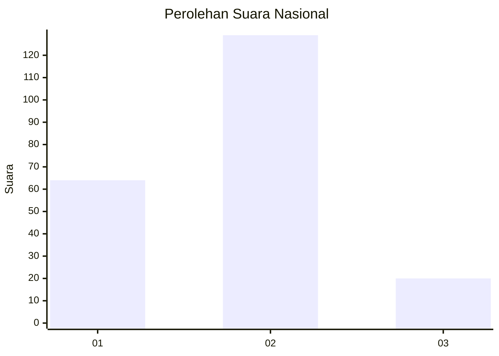
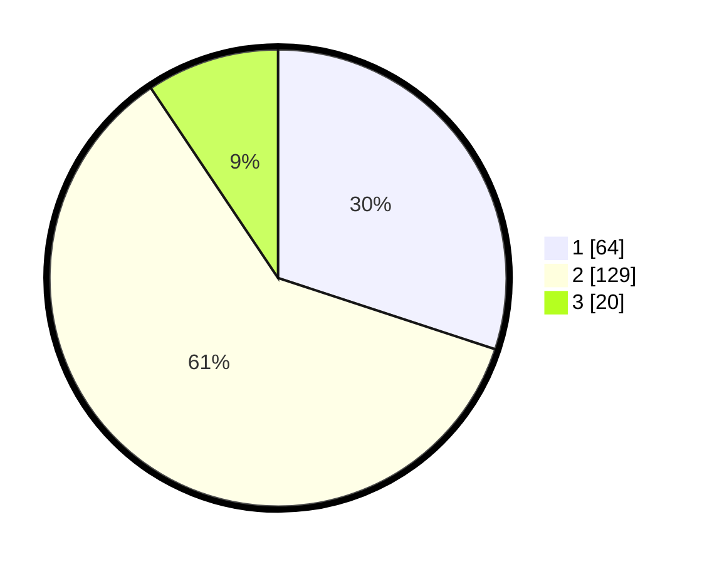

# Hasil

## Grafik

## Tabel

| No. | Nama Paslon    | Suara | Suara (raw) | Persentase |
|:--- |:-------------- | -----:| -----------:| ----------:|
| 1   | ANIES MUHAIMIN | 64    | [64][p-1]   | 30,05      |
| 2   | PRABOWO GIBRAN | 129   | [129][p-2]  | 60,56      |
| 3   | GANJAR MAHFUD  | 20    | [20][p-3]   | 9,39       |

[p-1]: https://github.com/gigit-pemilu/pemilu-2024/blob/main/pilpres/hitung-suara/sub/64-kalimantan-timur/sub/02-kutai-kartanegara/sub/13-samboja/sub/1007-sungai-seluang/sub/003-tps/sub/paslon-1.txt
[p-2]: https://github.com/gigit-pemilu/pemilu-2024/blob/main/pilpres/hitung-suara/sub/64-kalimantan-timur/sub/02-kutai-kartanegara/sub/13-samboja/sub/1007-sungai-seluang/sub/003-tps/sub/paslon-2.txt
[p-3]: https://github.com/gigit-pemilu/pemilu-2024/blob/main/pilpres/hitung-suara/sub/64-kalimantan-timur/sub/02-kutai-kartanegara/sub/13-samboja/sub/1007-sungai-seluang/sub/003-tps/sub/paslon-3.txt

## Foto C Plano

https://sirekap-obj-formc.kpu.go.id/4e58/pemilu/ppwp/64/02/13/10/07/6402131007003-20240214-141209--0f70d8e0-7ab6-45e1-8ca0-b7c8089bfabb.jpg

https://sirekap-obj-formc.kpu.go.id/4e58/pemilu/ppwp/64/02/13/10/07/6402131007003-20240214-141701--b9d3bf15-23c6-4d24-b95b-9186acf66dba.jpg

https://sirekap-obj-formc.kpu.go.id/4e58/pemilu/ppwp/64/02/13/10/07/6402131007003-20240214-141905--55f5f3f3-9ac9-469d-b6e1-246b3757e8b8.jpg

## Metadata

| Key        | Value               |
| ---------- | ------------------- |
| Time Stamp | 2024-02-25 21:00:00 |

