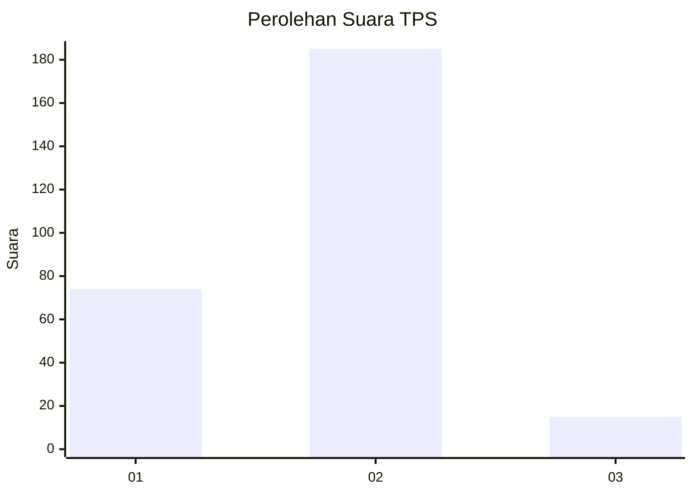
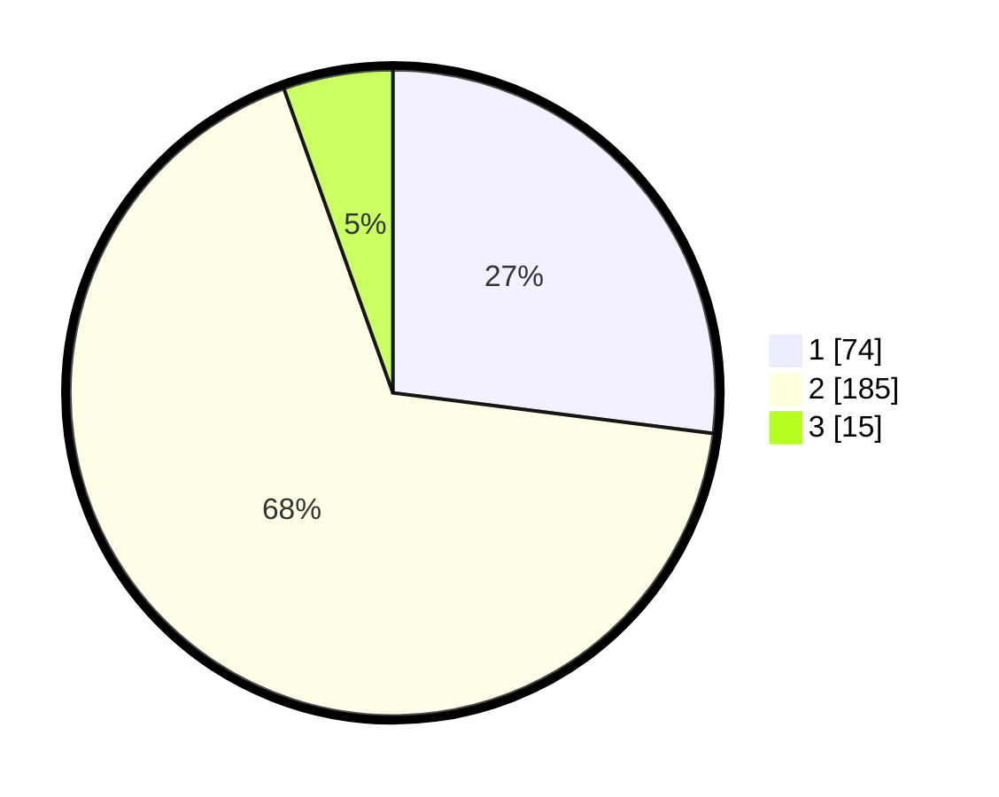

# Hasil

## Grafik

## Tabel

| No. | Nama Paslon    | Suara | Suara (raw) | Persentase |
|:--- |:-------------- | -----:| -----------:| ----------:|
| 1   | ANIES MUHAIMIN | 74    | [74][p-1]   | 27,01      |
| 2   | PRABOWO GIBRAN | 185   | [185][p-2]  | 67,52      |
| 3   | GANJAR MAHFUD  | 15    | [15][p-3]   | 5,47       |

[p-1]: https://github.com/gigit-pemilu/pemilu-2024-64-kalimantan-timur/blob/main/pilpres/hitung-suara/sub/64-kalimantan-timur/sub/02-kutai-kartanegara/sub/13-samboja/sub/1010-samboja-kuala/sub/006-tps/sub/paslon-1.txt
[p-2]: https://github.com/gigit-pemilu/pemilu-2024-64-kalimantan-timur/blob/main/pilpres/hitung-suara/sub/64-kalimantan-timur/sub/02-kutai-kartanegara/sub/13-samboja/sub/1010-samboja-kuala/sub/006-tps/sub/paslon-2.txt
[p-3]: https://github.com/gigit-pemilu/pemilu-2024-64-kalimantan-timur/blob/main/pilpres/hitung-suara/sub/64-kalimantan-timur/sub/02-kutai-kartanegara/sub/13-samboja/sub/1010-samboja-kuala/sub/006-tps/sub/paslon-3.txt

## Foto C Plano

https://sirekap-obj-formc.kpu.go.id/57c9/pemilu/ppwp/64/02/13/10/10/6402131010006-20240214-202133--47a5c8de-13a0-4145-9fc9-fefc463b0351.jpg

https://sirekap-obj-formc.kpu.go.id/57c9/pemilu/ppwp/64/02/13/10/10/6402131010006-20240214-202332--1d855d40-616b-496d-88e8-522a615cd6a8.jpg

https://sirekap-obj-formc.kpu.go.id/57c9/pemilu/ppwp/64/02/13/10/10/6402131010006-20240215-144131--cb4dea3a-c61f-46ee-b200-320d1212c5fc.jpg

## Metadata

| Key        | Value               |
| ---------- | ------------------- |
| Time Stamp | 2024-02-15 17:00:25 |

