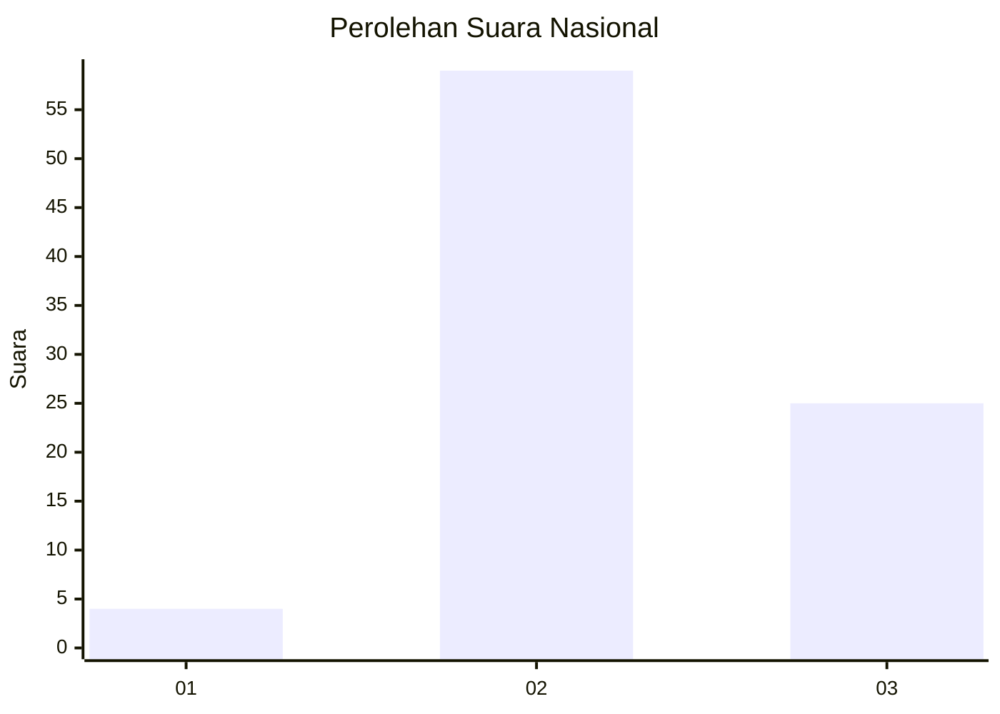
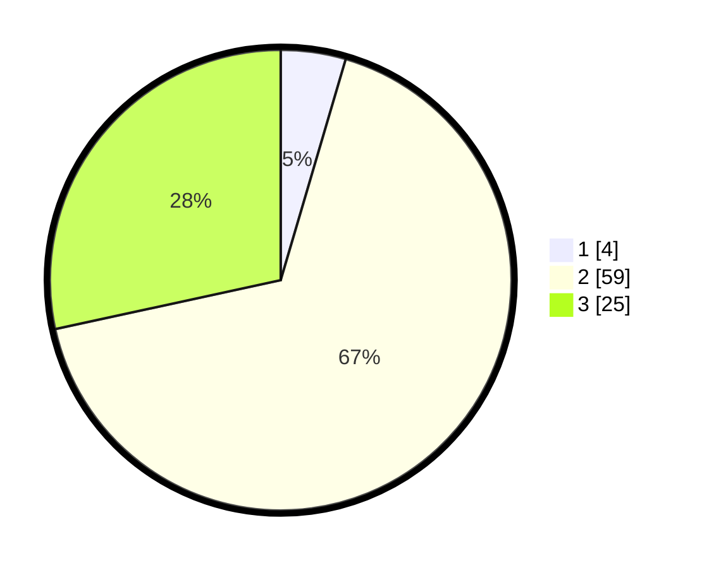

# Hasil

## Grafik

## Tabel

| No. | Nama Paslon    | Suara | Suara (raw) | Persentase |
|:--- |:-------------- | -----:| -----------:| ----------:|
| 1   | ANIES MUHAIMIN | 4     | [4][p-1]    | 4,55       |
| 2   | PRABOWO GIBRAN | 59    | [59][p-2]   | 67,05      |
| 3   | GANJAR MAHFUD  | 25    | [25][p-3]   | 28,41      |

[p-1]: https://github.com/gigit-pemilu/pemilu-2024/blob/main/pilpres/hitung-suara/sub/64-kalimantan-timur/sub/02-kutai-kartanegara/sub/13-samboja/sub/2016-bukit-raya/sub/002-tps/sub/paslon-1.txt
[p-2]: https://github.com/gigit-pemilu/pemilu-2024/blob/main/pilpres/hitung-suara/sub/64-kalimantan-timur/sub/02-kutai-kartanegara/sub/13-samboja/sub/2016-bukit-raya/sub/002-tps/sub/paslon-2.txt
[p-3]: https://github.com/gigit-pemilu/pemilu-2024/blob/main/pilpres/hitung-suara/sub/64-kalimantan-timur/sub/02-kutai-kartanegara/sub/13-samboja/sub/2016-bukit-raya/sub/002-tps/sub/paslon-3.txt

## Foto C Plano

https://sirekap-obj-formc.kpu.go.id/6e1f/pemilu/ppwp/64/02/13/20/16/6402132016002-20240224-084824--ad1e92b4-61cc-405e-9135-265721e32e4e.jpg

https://sirekap-obj-formc.kpu.go.id/6e1f/pemilu/ppwp/64/02/13/20/16/6402132016002-20240224-084933--90eca209-2683-4ed7-9f52-c501155217f4.jpg

https://sirekap-obj-formc.kpu.go.id/6e1f/pemilu/ppwp/64/02/13/20/16/6402132016002-20240224-085011--1765da6f-85f5-4626-ac1a-5de7f75a0822.jpg

## Metadata

| Key        | Value               |
| ---------- | ------------------- |
| Time Stamp | 2024-02-24 22:31:28 |

## DATA PEMILIH TETAP

Jumlah pemilih dalam DPT: **220**.
 * L: **115**.
 * P: **100**.

## DATA PENGGUNA HAK PILIH

Jumlah pengguna hak pilih dalam DPT: **174**.
 * L: **386**.
 * P: **473**.

Jumlah pengguna hak pilih dalam DPTb: **31**.
 * L: **80**.
 * P: **31**.

Jumlah pengguna hak pilih dalam DPK: **388**.
 * L: **841**.
 * P: **343**.

Jumlah pengguna hak pilih: **535**.
 * L: **433**.
 * P: **593**.

## JUMLAH SUARA SAH DAN TIDAK SAH

JUMLAH SELURUH SUARA SAH: **173**.

JUMLAH SUARA TIDAK SAH: **83**.

JUMLAH SELURUH SUARA SAH DAN SUARA TIDAK SAH: **136**.

