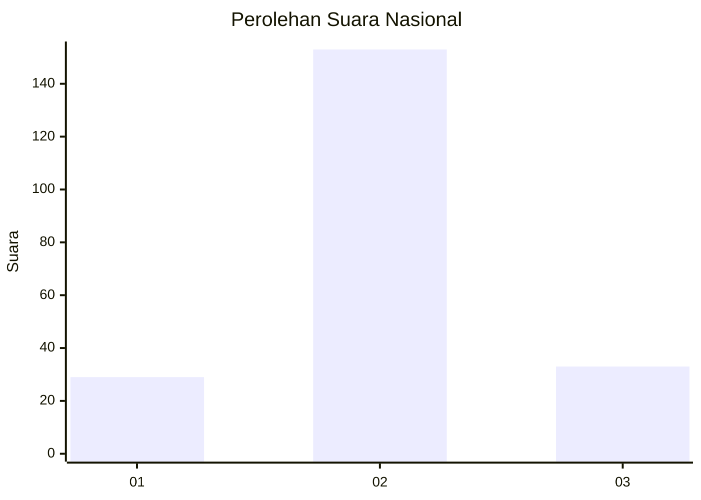

# Hasil

## Grafik

## Tabel

| No. | Nama Paslon    | Suara | Suara (raw) | Persentase |
|:--- |:-------------- | -----:| -----------:| ----------:|
| 1   | ANIES MUHAIMIN | 29    | [29][p-1]   | 13,49      |
| 2   | PRABOWO GIBRAN | 153   | [153][p-2]  | 71,16      |
| 3   | GANJAR MAHFUD  | 33    | [33][p-3]   | 15,35      |

[p-1]: https://github.com/gigit-pemilu/pemilu-2024/blob/main/pilpres/hitung-suara/sub/64-kalimantan-timur/sub/02-kutai-kartanegara/sub/16-tenggarong-seberang/sub/2001-manunggal-jaya/sub/011-tps/sub/paslon-1.txt
[p-2]: https://github.com/gigit-pemilu/pemilu-2024/blob/main/pilpres/hitung-suara/sub/64-kalimantan-timur/sub/02-kutai-kartanegara/sub/16-tenggarong-seberang/sub/2001-manunggal-jaya/sub/011-tps/sub/paslon-2.txt
[p-3]: https://github.com/gigit-pemilu/pemilu-2024/blob/main/pilpres/hitung-suara/sub/64-kalimantan-timur/sub/02-kutai-kartanegara/sub/16-tenggarong-seberang/sub/2001-manunggal-jaya/sub/011-tps/sub/paslon-3.txt

## Foto C Plano

https://sirekap-obj-formc.kpu.go.id/d201/pemilu/ppwp/64/02/16/20/01/6402162001011-20240214-221141--434d8e33-8c7b-4cd5-af3e-47d1659898be.jpg

https://sirekap-obj-formc.kpu.go.id/d201/pemilu/ppwp/64/02/16/20/01/6402162001011-20240214-221154--8720f40b-e85c-4ae4-9ce9-4ef8495561a6.jpg

https://sirekap-obj-formc.kpu.go.id/d201/pemilu/ppwp/64/02/16/20/01/6402162001011-20240214-221210--8db57454-78d9-4c16-8eb5-bb970ff10570.jpg

## Metadata

| Key        | Value               |
| ---------- | ------------------- |
| Time Stamp | 2024-02-25 15:00:00 |

