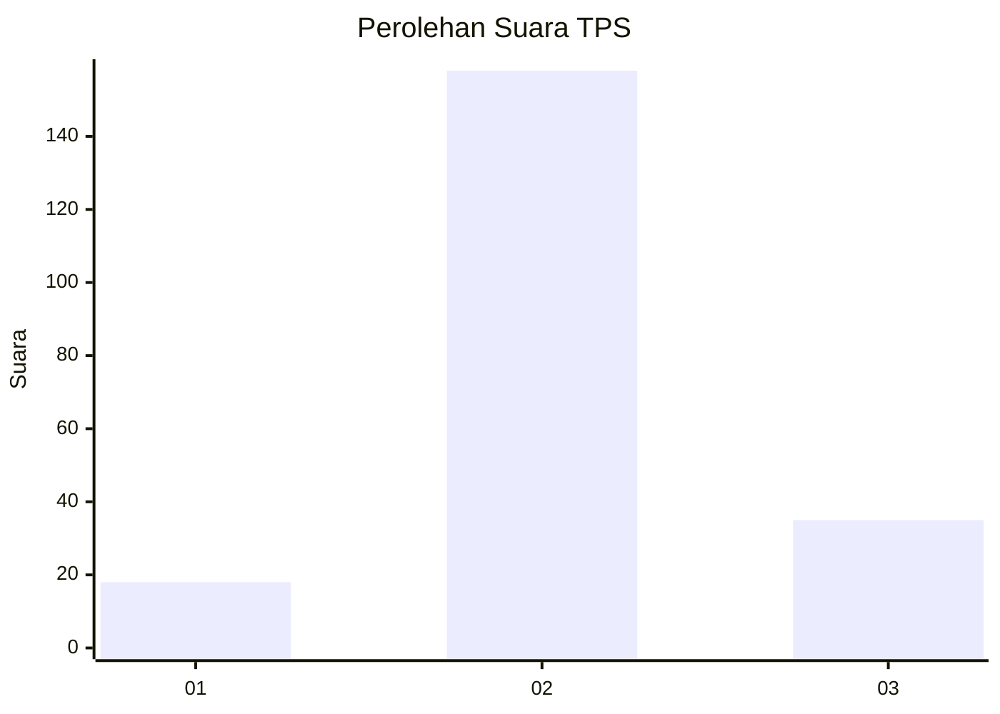
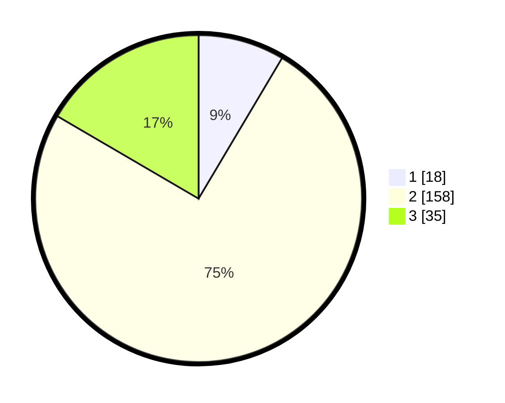

# Hasil

## Grafik

## Tabel

| No. | Nama Paslon    | Suara | Suara (raw) | Persentase |
|:--- |:-------------- | -----:| -----------:| ----------:|
| 1   | ANIES MUHAIMIN | 18    | [18][p-1]   | 8,53       |
| 2   | PRABOWO GIBRAN | 158   | [158][p-2]  | 74,88      |
| 3   | GANJAR MAHFUD  | 35    | [35][p-3]   | 16,59      |

[p-1]: https://github.com/gigit-pemilu/pemilu-2024-64-kalimantan-timur/blob/main/pilpres/hitung-suara/sub/64-kalimantan-timur/sub/02-kutai-kartanegara/sub/16-tenggarong-seberang/sub/2001-manunggal-jaya/sub/012-tps/sub/paslon-1.txt
[p-2]: https://github.com/gigit-pemilu/pemilu-2024-64-kalimantan-timur/blob/main/pilpres/hitung-suara/sub/64-kalimantan-timur/sub/02-kutai-kartanegara/sub/16-tenggarong-seberang/sub/2001-manunggal-jaya/sub/012-tps/sub/paslon-2.txt
[p-3]: https://github.com/gigit-pemilu/pemilu-2024-64-kalimantan-timur/blob/main/pilpres/hitung-suara/sub/64-kalimantan-timur/sub/02-kutai-kartanegara/sub/16-tenggarong-seberang/sub/2001-manunggal-jaya/sub/012-tps/sub/paslon-3.txt

## Foto C Plano

https://sirekap-obj-formc.kpu.go.id/c8de/pemilu/ppwp/64/02/16/20/01/6402162001012-20240215-002504--6448baaf-c643-42b0-b856-d37fe4c75c16.jpg

https://sirekap-obj-formc.kpu.go.id/c8de/pemilu/ppwp/64/02/16/20/01/6402162001012-20240215-002603--0f8ede7f-df84-4ae7-ab5e-ed3b6439cedc.jpg

https://sirekap-obj-formc.kpu.go.id/c8de/pemilu/ppwp/64/02/16/20/01/6402162001012-20240215-002656--5b659123-1d57-411d-adc5-43323449a9ef.jpg

## Metadata

| Key        | Value               |
| ---------- | ------------------- |
| Time Stamp | 2024-02-20 14:00:00 |

