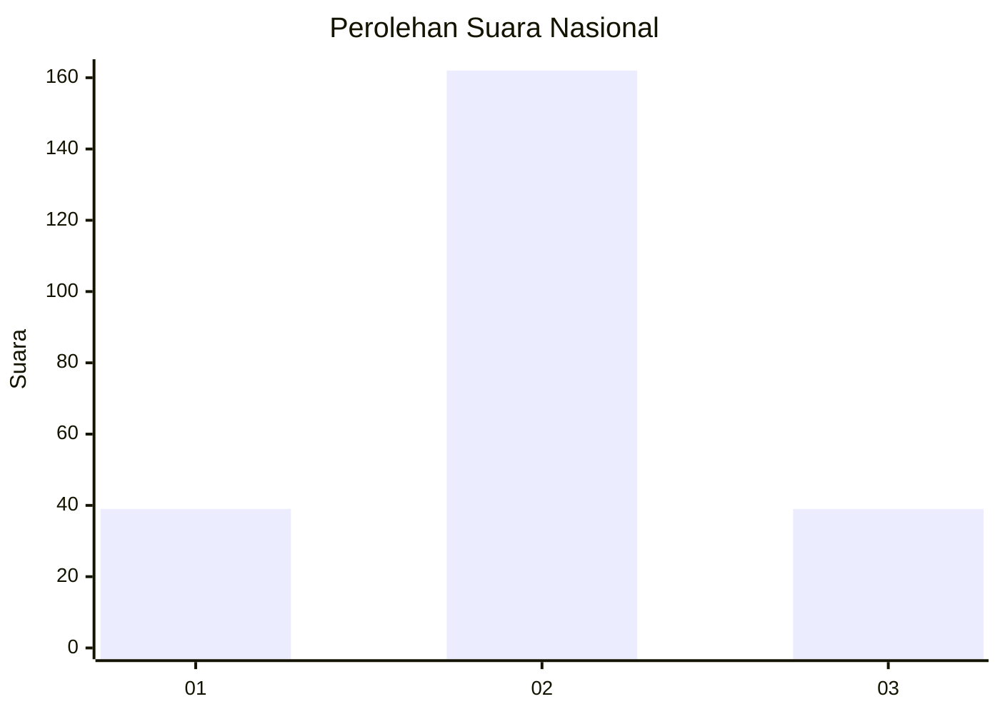
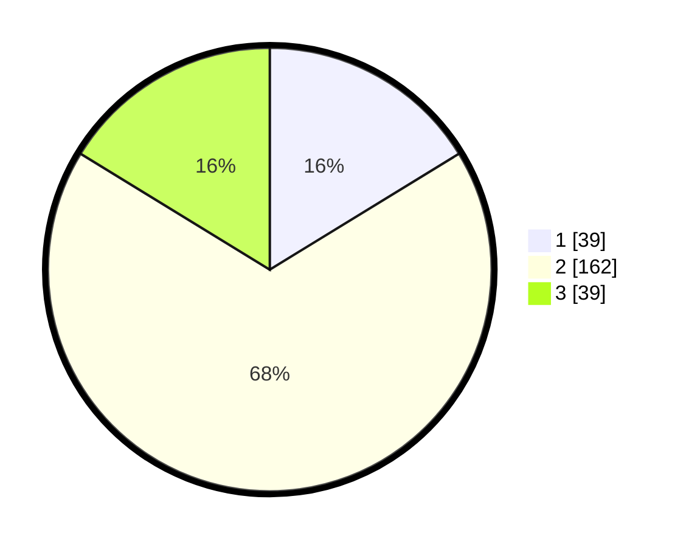

# Hasil

## Grafik

## Tabel

| No. | Nama Paslon    | Suara | Suara (raw) | Persentase |
|:--- |:-------------- | -----:| -----------:| ----------:|
| 1   | ANIES MUHAIMIN | 39    | [39][p-1]   | 16,25      |
| 2   | PRABOWO GIBRAN | 162   | [162][p-2]  | 67,50      |
| 3   | GANJAR MAHFUD  | 39    | [39][p-3]   | 16,25      |

[p-1]: https://github.com/gigit-pemilu/pemilu-2024/blob/main/pilpres/hitung-suara/sub/64-kalimantan-timur/sub/02-kutai-kartanegara/sub/16-tenggarong-seberang/sub/2001-manunggal-jaya/sub/014-tps/sub/paslon-1.txt
[p-2]: https://github.com/gigit-pemilu/pemilu-2024/blob/main/pilpres/hitung-suara/sub/64-kalimantan-timur/sub/02-kutai-kartanegara/sub/16-tenggarong-seberang/sub/2001-manunggal-jaya/sub/014-tps/sub/paslon-2.txt
[p-3]: https://github.com/gigit-pemilu/pemilu-2024/blob/main/pilpres/hitung-suara/sub/64-kalimantan-timur/sub/02-kutai-kartanegara/sub/16-tenggarong-seberang/sub/2001-manunggal-jaya/sub/014-tps/sub/paslon-3.txt

## Foto C Plano

https://sirekap-obj-formc.kpu.go.id/0b84/pemilu/ppwp/64/02/16/20/01/6402162001014-20240215-012707--ee93c355-050f-4a84-a8da-444eb417ed80.jpg

https://sirekap-obj-formc.kpu.go.id/0b84/pemilu/ppwp/64/02/16/20/01/6402162001014-20240215-012721--80f2085a-9d78-4cf0-b926-8b2b7d29459e.jpg

https://sirekap-obj-formc.kpu.go.id/0b84/pemilu/ppwp/64/02/16/20/01/6402162001014-20240215-012738--9420a4e8-da15-4223-8407-b7f4f908096f.jpg

## Metadata

| Key        | Value               |
| ---------- | ------------------- |
| Time Stamp | 2024-02-20 14:00:00 |

