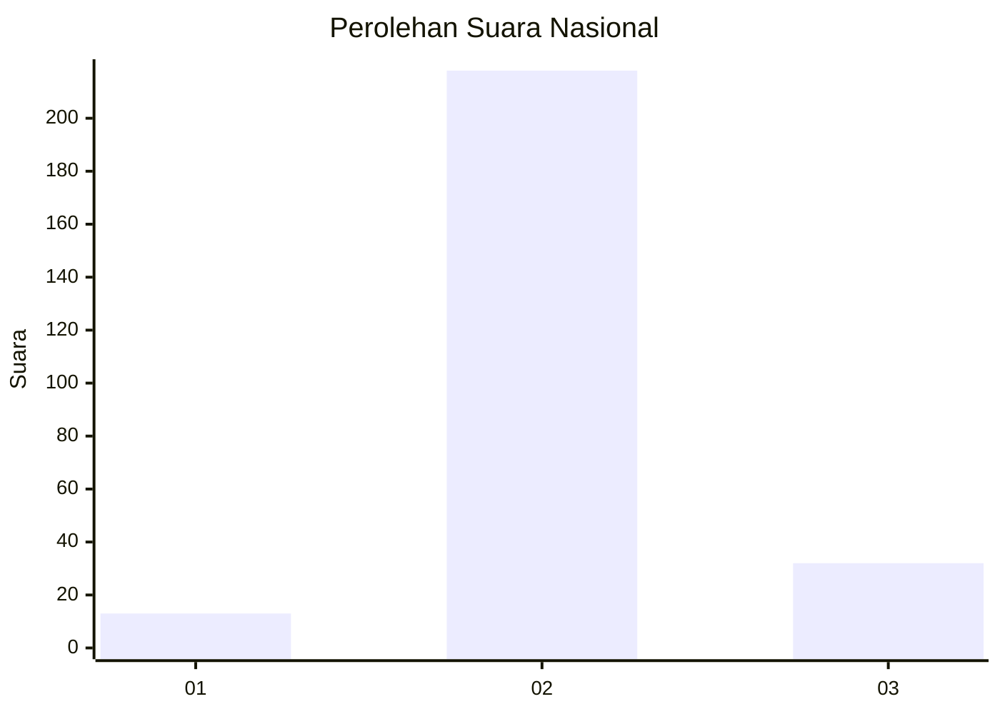
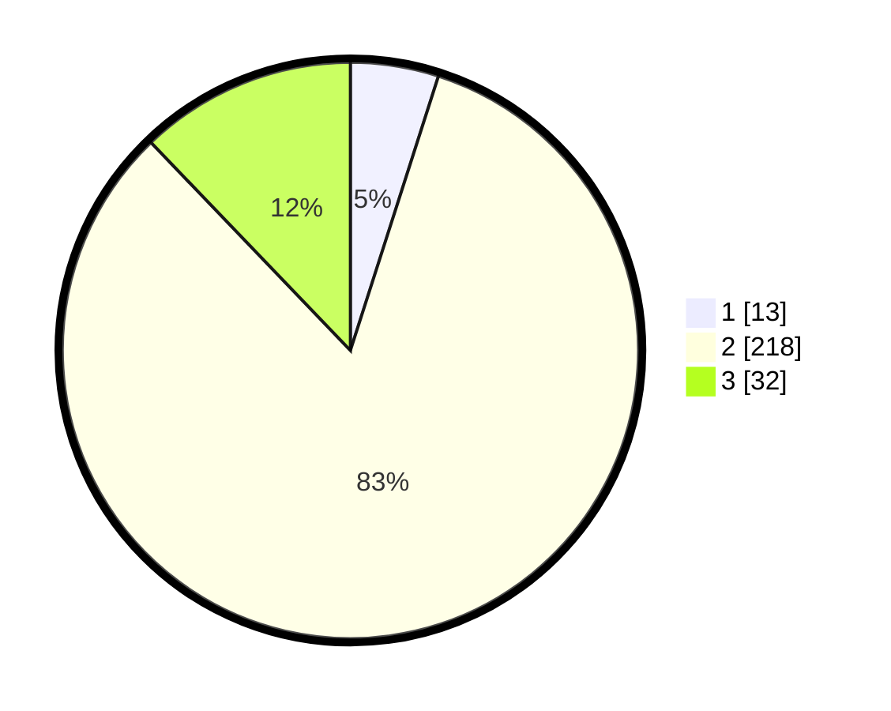

# Hasil

## Grafik

## Tabel

| No. | Nama Paslon    | Suara | Suara (raw) | Persentase |
|:--- |:-------------- | -----:| -----------:| ----------:|
| 1   | ANIES MUHAIMIN | 13    | [13][p-1]   | 4,94       |
| 2   | PRABOWO GIBRAN | 218   | [218][p-2]  | 82,89      |
| 3   | GANJAR MAHFUD  | 32    | [32][p-3]   | 12,17      |

[p-1]: https://github.com/gigit-pemilu/pemilu-2024/blob/main/pilpres/hitung-suara/sub/64-kalimantan-timur/sub/02-kutai-kartanegara/sub/16-tenggarong-seberang/sub/2001-manunggal-jaya/sub/015-tps/sub/paslon-1.txt
[p-2]: https://github.com/gigit-pemilu/pemilu-2024/blob/main/pilpres/hitung-suara/sub/64-kalimantan-timur/sub/02-kutai-kartanegara/sub/16-tenggarong-seberang/sub/2001-manunggal-jaya/sub/015-tps/sub/paslon-2.txt
[p-3]: https://github.com/gigit-pemilu/pemilu-2024/blob/main/pilpres/hitung-suara/sub/64-kalimantan-timur/sub/02-kutai-kartanegara/sub/16-tenggarong-seberang/sub/2001-manunggal-jaya/sub/015-tps/sub/paslon-3.txt

## Foto C Plano

https://sirekap-obj-formc.kpu.go.id/6488/pemilu/ppwp/64/02/16/20/01/6402162001015-20240214-205439--d97df777-c5e6-4d47-977c-b132498f51b4.jpg

https://sirekap-obj-formc.kpu.go.id/6488/pemilu/ppwp/64/02/16/20/01/6402162001015-20240214-205544--f197c9de-d454-4507-8302-9c3d90d4e324.jpg

https://sirekap-obj-formc.kpu.go.id/6488/pemilu/ppwp/64/02/16/20/01/6402162001015-20240214-205654--fccc87b1-9ece-4ecf-8554-f293d573b4e4.jpg

## Metadata

| Key        | Value               |
| ---------- | ------------------- |
| Time Stamp | 2024-02-20 14:00:00 |

