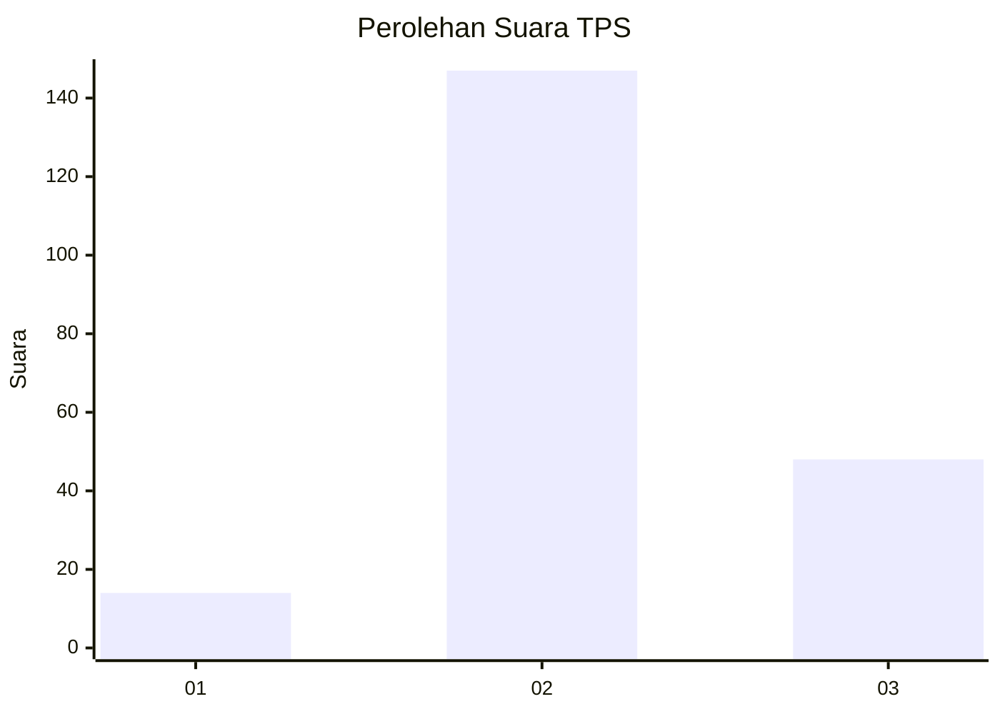
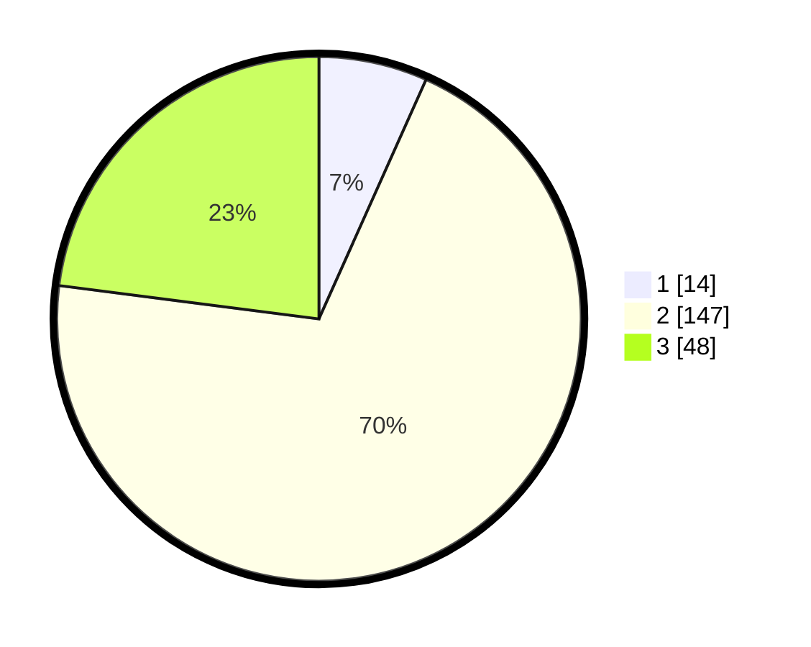

# Hasil

## Grafik

## Tabel

| No. | Nama Paslon    | Suara | Suara (raw) | Persentase |
|:--- |:-------------- | -----:| -----------:| ----------:|
| 1   | ANIES MUHAIMIN | 14    | [14][p-1]   | 6,70       |
| 2   | PRABOWO GIBRAN | 147   | [147][p-2]  | 70,33      |
| 3   | GANJAR MAHFUD  | 48    | [48][p-3]   | 22,97      |

[p-1]: https://github.com/gigit-pemilu/pemilu-2024-64-kalimantan-timur/blob/main/pilpres/hitung-suara/sub/64-kalimantan-timur/sub/02-kutai-kartanegara/sub/19-kota-bangun-darat/sub/2001-kedang-ipil/sub/002-tps/sub/paslon-1.txt
[p-2]: https://github.com/gigit-pemilu/pemilu-2024-64-kalimantan-timur/blob/main/pilpres/hitung-suara/sub/64-kalimantan-timur/sub/02-kutai-kartanegara/sub/19-kota-bangun-darat/sub/2001-kedang-ipil/sub/002-tps/sub/paslon-2.txt
[p-3]: https://github.com/gigit-pemilu/pemilu-2024-64-kalimantan-timur/blob/main/pilpres/hitung-suara/sub/64-kalimantan-timur/sub/02-kutai-kartanegara/sub/19-kota-bangun-darat/sub/2001-kedang-ipil/sub/002-tps/sub/paslon-3.txt

## Foto C Plano

https://sirekap-obj-formc.kpu.go.id/5e05/pemilu/ppwp/64/02/19/20/01/6402192001002-20240215-081952--84e42ed5-60f1-49da-989d-80df615049a7.jpg

https://sirekap-obj-formc.kpu.go.id/5e05/pemilu/ppwp/64/02/19/20/01/6402192001002-20240215-082047--99f1beb5-69df-496c-a67a-a3708315a763.jpg

https://sirekap-obj-formc.kpu.go.id/5e05/pemilu/ppwp/64/02/19/20/01/6402192001002-20240215-082148--996714e5-e45b-409f-bd6b-73e7b114d34f.jpg

## Metadata

| Key        | Value               |
| ---------- | ------------------- |
| Time Stamp | 2024-02-20 14:00:00 |

