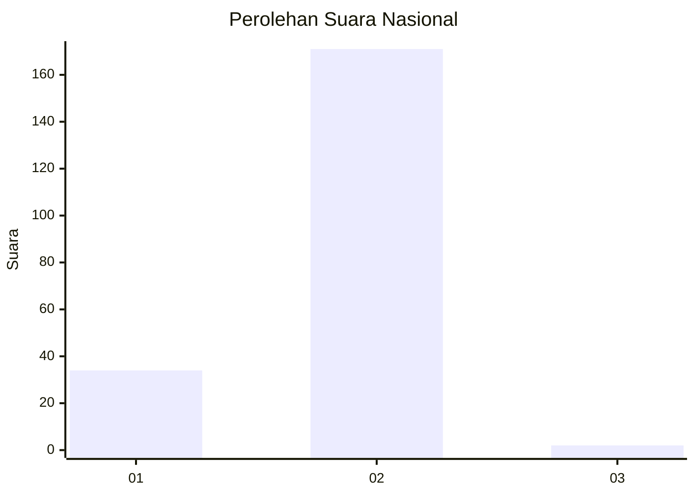
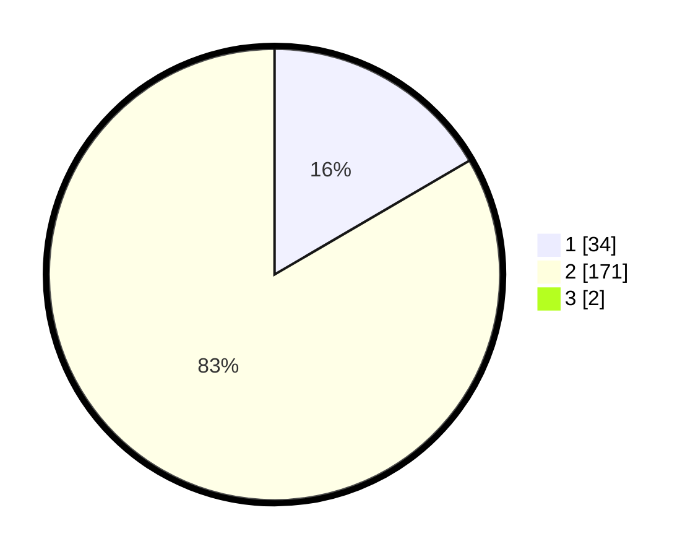

# Hasil

## Grafik

## Tabel

| No. | Nama Paslon    | Suara | Suara (raw) | Persentase |
|:--- |:-------------- | -----:| -----------:| ----------:|
| 1   | ANIES MUHAIMIN | 34    | [34][p-1]   | 16,43      |
| 2   | PRABOWO GIBRAN | 171   | [171][p-2]  | 82,61      |
| 3   | GANJAR MAHFUD  | 2     | [2][p-3]    | 0,97       |

[p-1]: https://github.com/gigit-pemilu/pemilu-2024/blob/main/pilpres/hitung-suara/sub/64-kalimantan-timur/sub/02-kutai-kartanegara/sub/20-samboja-barat/sub/1001-bukit-merdeka/sub/006-tps/sub/paslon-1.txt
[p-2]: https://github.com/gigit-pemilu/pemilu-2024/blob/main/pilpres/hitung-suara/sub/64-kalimantan-timur/sub/02-kutai-kartanegara/sub/20-samboja-barat/sub/1001-bukit-merdeka/sub/006-tps/sub/paslon-2.txt
[p-3]: https://github.com/gigit-pemilu/pemilu-2024/blob/main/pilpres/hitung-suara/sub/64-kalimantan-timur/sub/02-kutai-kartanegara/sub/20-samboja-barat/sub/1001-bukit-merdeka/sub/006-tps/sub/paslon-3.txt

## Foto C Plano

https://sirekap-obj-formc.kpu.go.id/2e7f/pemilu/ppwp/64/02/20/10/01/6402201001006-20240214-132835--e0852b31-a201-4d10-95af-5480f9da240e.jpg

https://sirekap-obj-formc.kpu.go.id/2e7f/pemilu/ppwp/64/02/20/10/01/6402201001006-20240214-131838--4392c10d-c16d-4b98-83d6-1e9624d714cb.jpg

https://sirekap-obj-formc.kpu.go.id/2e7f/pemilu/ppwp/64/02/20/10/01/6402201001006-20240214-132003--fba36ec4-5332-423a-8e34-b9edc4fff963.jpg

## Metadata

| Key        | Value               |
| ---------- | ------------------- |
| Time Stamp | 2024-02-14 21:46:01 |

