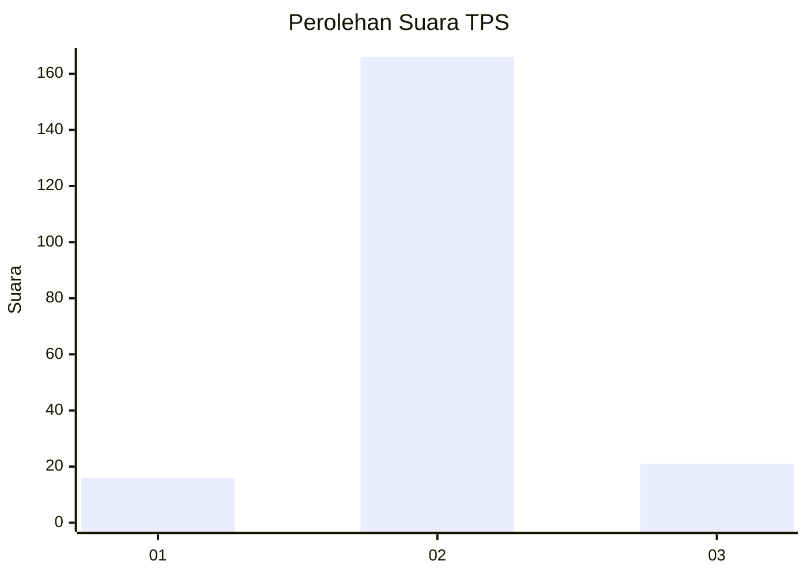
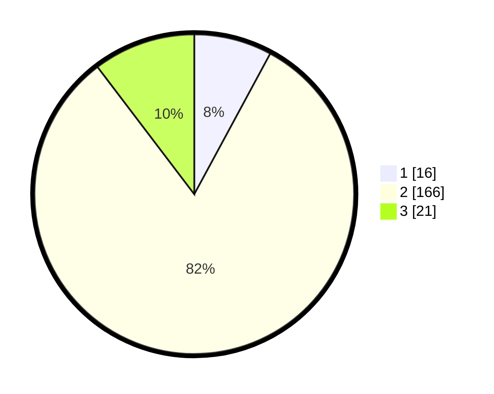

# Hasil

## Grafik

## Tabel

| No. | Nama Paslon    | Suara | Suara (raw) | Persentase |
|:--- |:-------------- | -----:| -----------:| ----------:|
| 1   | ANIES MUHAIMIN | 16    | [16][p-1]   | 7,88       |
| 2   | PRABOWO GIBRAN | 166   | [166][p-2]  | 81,77      |
| 3   | GANJAR MAHFUD  | 21    | [21][p-3]   | 10,34      |

[p-1]: https://github.com/gigit-pemilu/pemilu-2024-64-kalimantan-timur/blob/main/pilpres/hitung-suara/sub/64-kalimantan-timur/sub/03-berau/sub/01-kelay/sub/2003-merapun/sub/001-tps/sub/paslon-1.txt
[p-2]: https://github.com/gigit-pemilu/pemilu-2024-64-kalimantan-timur/blob/main/pilpres/hitung-suara/sub/64-kalimantan-timur/sub/03-berau/sub/01-kelay/sub/2003-merapun/sub/001-tps/sub/paslon-2.txt
[p-3]: https://github.com/gigit-pemilu/pemilu-2024-64-kalimantan-timur/blob/main/pilpres/hitung-suara/sub/64-kalimantan-timur/sub/03-berau/sub/01-kelay/sub/2003-merapun/sub/001-tps/sub/paslon-3.txt

## Foto C Plano

https://sirekap-obj-formc.kpu.go.id/a96e/pemilu/ppwp/64/03/01/20/03/6403012003001-20240215-055322--0e6b04a5-93e4-402f-bf56-2cc23b53e6c1.jpg

https://sirekap-obj-formc.kpu.go.id/a96e/pemilu/ppwp/64/03/01/20/03/6403012003001-20240215-055341--70a7f226-707f-4c05-8765-cca66fe1aa21.jpg

https://sirekap-obj-formc.kpu.go.id/a96e/pemilu/ppwp/64/03/01/20/03/6403012003001-20240215-055356--6e2ffdde-30f1-481a-8b44-246414b02493.jpg

## Metadata

| Key        | Value               |
| ---------- | ------------------- |
| Time Stamp | 2024-02-24 22:31:28 |

