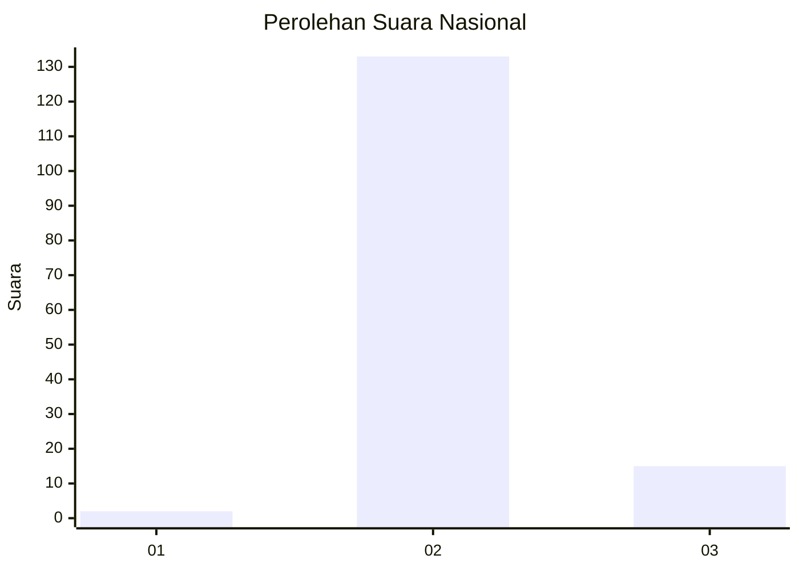
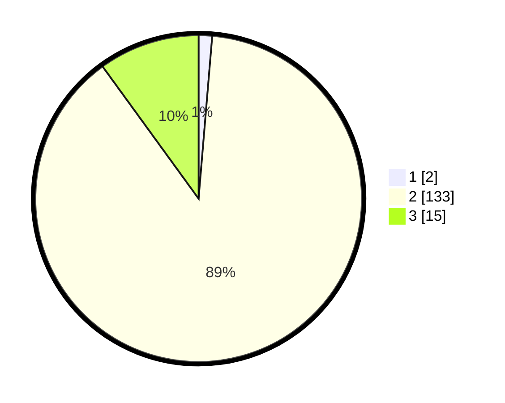

# Hasil

## Grafik

## Tabel

| No. | Nama Paslon    | Suara | Suara (raw) | Persentase |
|:--- |:-------------- | -----:| -----------:| ----------:|
| 1   | ANIES MUHAIMIN | 2     | [2][p-1]    | 1,33       |
| 2   | PRABOWO GIBRAN | 133   | [133][p-2]  | 88,67      |
| 3   | GANJAR MAHFUD  | 15    | [15][p-3]   | 10,00      |

[p-1]: https://github.com/gigit-pemilu/pemilu-2024/blob/main/pilpres/hitung-suara/sub/64-kalimantan-timur/sub/03-berau/sub/01-kelay/sub/2005-merasa/sub/003-tps/sub/paslon-1.txt
[p-2]: https://github.com/gigit-pemilu/pemilu-2024/blob/main/pilpres/hitung-suara/sub/64-kalimantan-timur/sub/03-berau/sub/01-kelay/sub/2005-merasa/sub/003-tps/sub/paslon-2.txt
[p-3]: https://github.com/gigit-pemilu/pemilu-2024/blob/main/pilpres/hitung-suara/sub/64-kalimantan-timur/sub/03-berau/sub/01-kelay/sub/2005-merasa/sub/003-tps/sub/paslon-3.txt

## Foto C Plano

https://sirekap-obj-formc.kpu.go.id/2142/pemilu/ppwp/64/03/01/20/05/6403012005003-20240215-015318--215d69cb-1777-4e50-bf03-4dd682db7187.jpg

https://sirekap-obj-formc.kpu.go.id/2142/pemilu/ppwp/64/03/01/20/05/6403012005003-20240215-015415--b494d2e8-e8a4-4522-ae1a-4cc6cad06d07.jpg

https://sirekap-obj-formc.kpu.go.id/2142/pemilu/ppwp/64/03/01/20/05/6403012005003-20240215-015604--1ed3bf2b-3c47-42b2-8639-0488f88b05e0.jpg

## Metadata

| Key        | Value               |
| ---------- | ------------------- |
| Time Stamp | 2024-02-25 16:00:00 |

