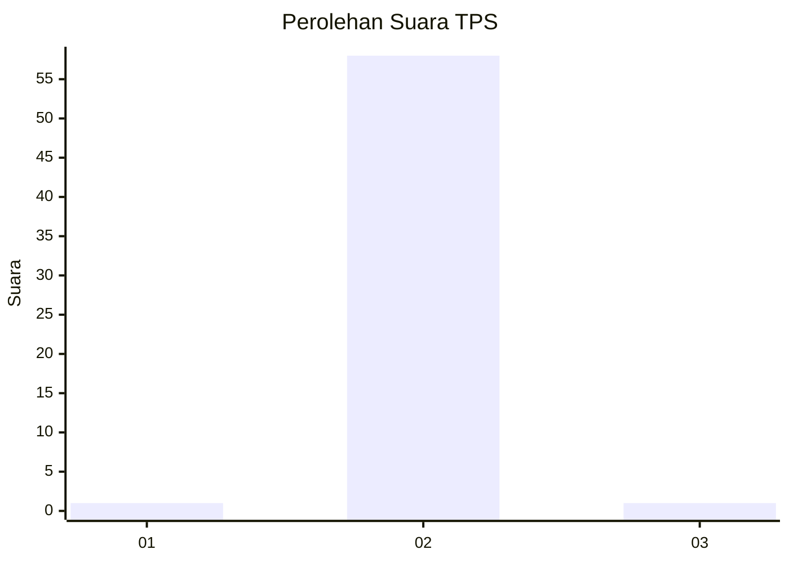
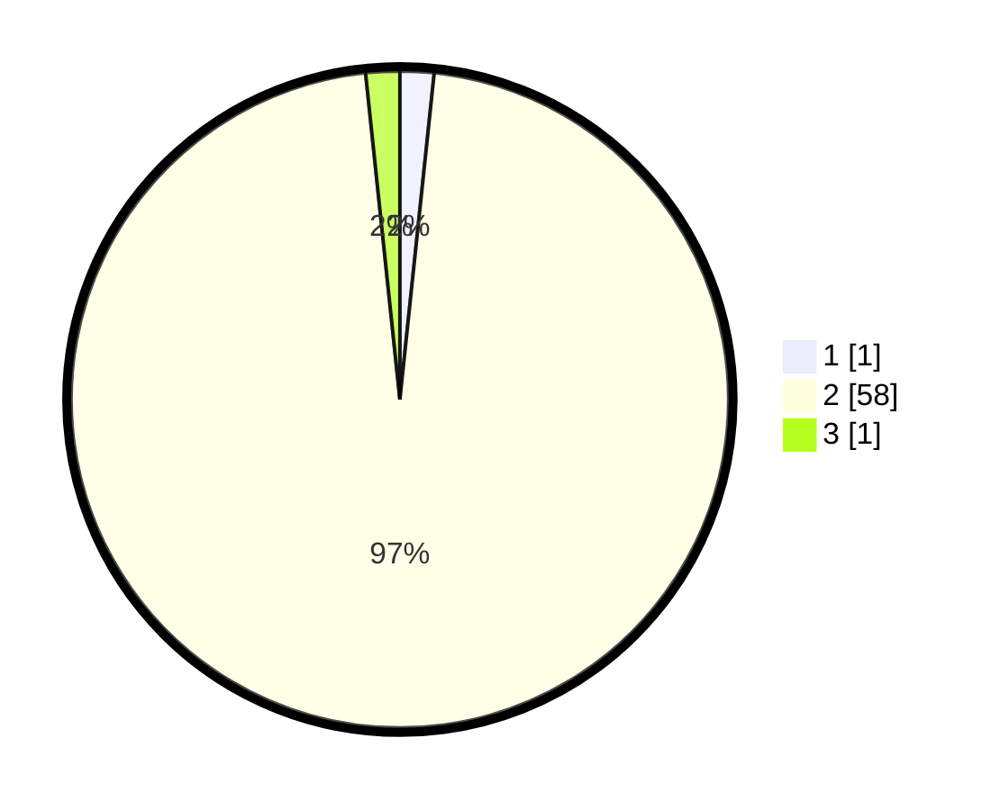

# Hasil

## Grafik

## Tabel

| No. | Nama Paslon    | Suara | Suara (raw) | Persentase |
|:--- |:-------------- | -----:| -----------:| ----------:|
| 1   | ANIES MUHAIMIN | 1     | [1][p-1]    | 1,67       |
| 2   | PRABOWO GIBRAN | 58    | [58][p-2]   | 96,67      |
| 3   | GANJAR MAHFUD  | 1     | [1][p-3]    | 1,67       |

[p-1]: https://github.com/gigit-pemilu/pemilu-2024-64-kalimantan-timur/blob/main/pilpres/hitung-suara/sub/64-kalimantan-timur/sub/03-berau/sub/01-kelay/sub/2013-long-sului/sub/002-tps/sub/paslon-1.txt
[p-2]: https://github.com/gigit-pemilu/pemilu-2024-64-kalimantan-timur/blob/main/pilpres/hitung-suara/sub/64-kalimantan-timur/sub/03-berau/sub/01-kelay/sub/2013-long-sului/sub/002-tps/sub/paslon-2.txt
[p-3]: https://github.com/gigit-pemilu/pemilu-2024-64-kalimantan-timur/blob/main/pilpres/hitung-suara/sub/64-kalimantan-timur/sub/03-berau/sub/01-kelay/sub/2013-long-sului/sub/002-tps/sub/paslon-3.txt

## Foto C Plano

https://sirekap-obj-formc.kpu.go.id/2be1/pemilu/ppwp/64/03/01/20/13/6403012013002-20240215-011420--f25582ac-d05c-4785-878f-131a17d0ba44.jpg

https://sirekap-obj-formc.kpu.go.id/2be1/pemilu/ppwp/64/03/01/20/13/6403012013002-20240215-012029--477c40c2-a791-4682-96e3-603c819af1c3.jpg

https://sirekap-obj-formc.kpu.go.id/2be1/pemilu/ppwp/64/03/01/20/13/6403012013002-20240215-011526--3d03fdc4-1466-4f81-9753-2e0cb6885213.jpg

## Metadata

| Key        | Value               |
| ---------- | ------------------- |
| Time Stamp | 2024-02-15 19:30:26 |

