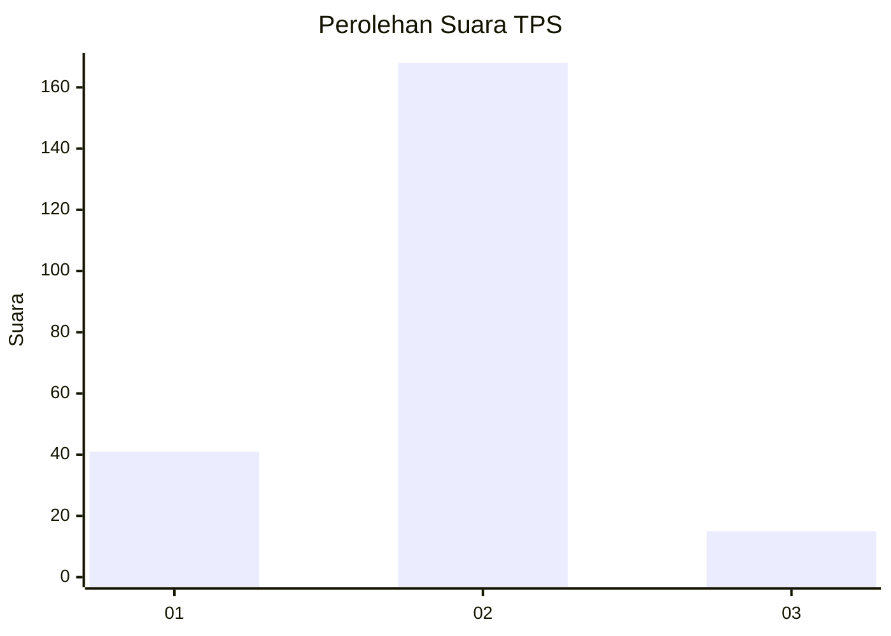
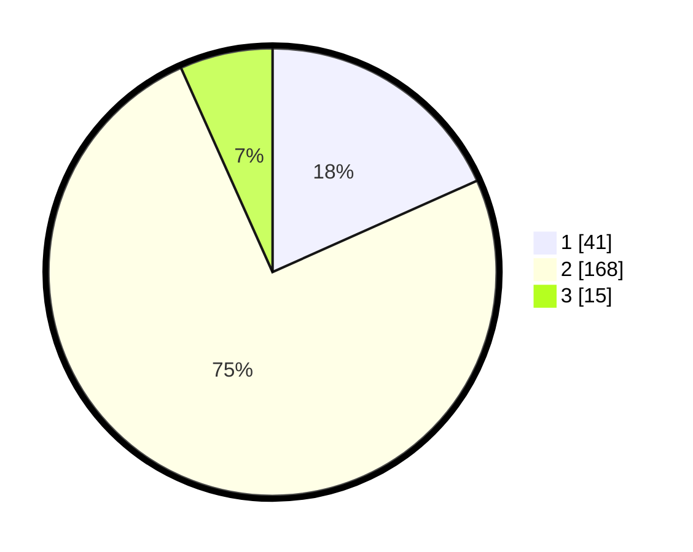

# Hasil

## Grafik

## Tabel

| No. | Nama Paslon    | Suara | Suara (raw) | Persentase |
|:--- |:-------------- | -----:| -----------:| ----------:|
| 1   | ANIES MUHAIMIN | 41    | [41][p-1]   | 18,30      |
| 2   | PRABOWO GIBRAN | 168   | [168][p-2]  | 75,00      |
| 3   | GANJAR MAHFUD  | 15    | [15][p-3]   | 6,70       |

[p-1]: https://github.com/gigit-pemilu/pemilu-2024-64-kalimantan-timur/blob/main/pilpres/hitung-suara/sub/64-kalimantan-timur/sub/03-berau/sub/02-talisayan/sub/2002-dumaring/sub/002-tps/sub/paslon-1.txt
[p-2]: https://github.com/gigit-pemilu/pemilu-2024-64-kalimantan-timur/blob/main/pilpres/hitung-suara/sub/64-kalimantan-timur/sub/03-berau/sub/02-talisayan/sub/2002-dumaring/sub/002-tps/sub/paslon-2.txt
[p-3]: https://github.com/gigit-pemilu/pemilu-2024-64-kalimantan-timur/blob/main/pilpres/hitung-suara/sub/64-kalimantan-timur/sub/03-berau/sub/02-talisayan/sub/2002-dumaring/sub/002-tps/sub/paslon-3.txt

## Foto C Plano

https://sirekap-obj-formc.kpu.go.id/5048/pemilu/ppwp/64/03/02/20/02/6403022002002-20240218-151124--4208d82d-e714-4f83-b97c-da3683d18f61.jpg

https://sirekap-obj-formc.kpu.go.id/5048/pemilu/ppwp/64/03/02/20/02/6403022002002-20240218-151207--3da00193-1a73-41b5-9659-bf943d9d65db.jpg

https://sirekap-obj-formc.kpu.go.id/5048/pemilu/ppwp/64/03/02/20/02/6403022002002-20240218-151250--8d9b85d7-af5a-43db-88b3-932e2045379a.jpg

## Metadata

| Key        | Value               |
| ---------- | ------------------- |
| Time Stamp | 2024-02-19 06:16:00 |

