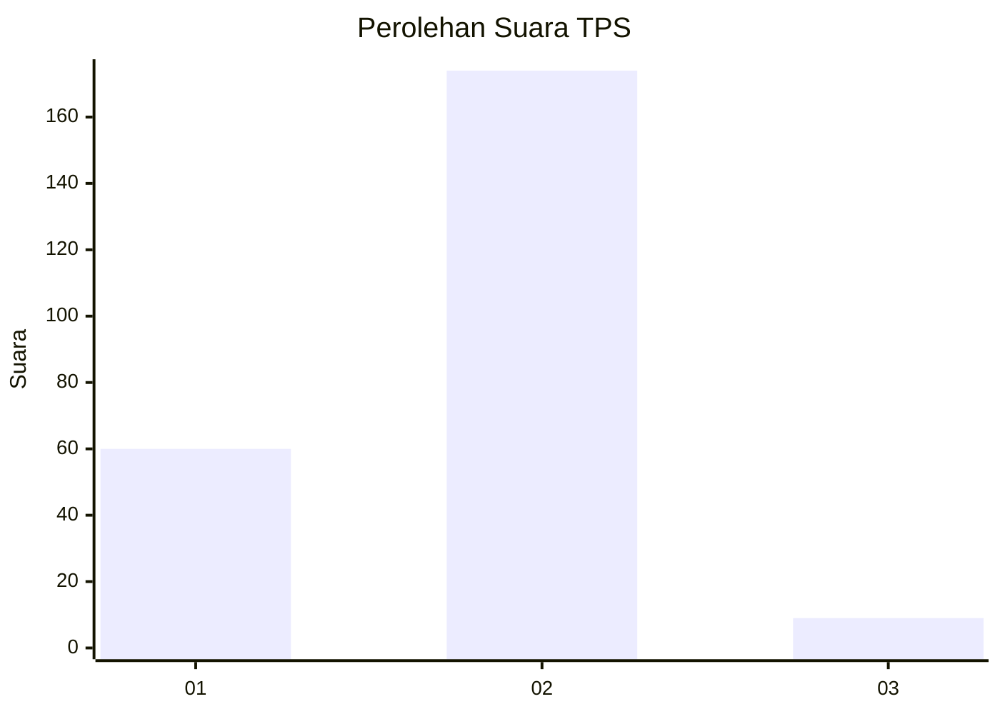
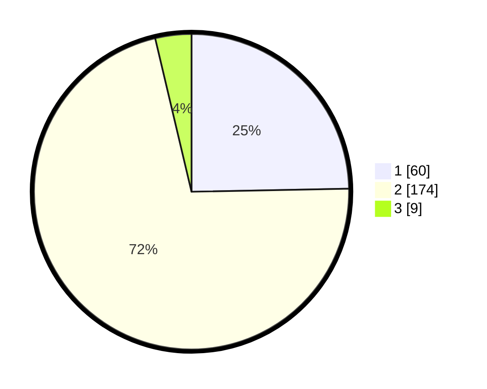

# Hasil

## Grafik

## Tabel

| No. | Nama Paslon    | Suara | Suara (raw) | Persentase |
|:--- |:-------------- | -----:| -----------:| ----------:|
| 1   | ANIES MUHAIMIN | 60    | [60][p-1]   | 24,69      |
| 2   | PRABOWO GIBRAN | 174   | [174][p-2]  | 71,60      |
| 3   | GANJAR MAHFUD  | 9     | [9][p-3]    | 3,70       |

[p-1]: https://github.com/gigit-pemilu/pemilu-2024-64-kalimantan-timur/blob/main/pilpres/hitung-suara/sub/64-kalimantan-timur/sub/03-berau/sub/02-talisayan/sub/2002-dumaring/sub/003-tps/sub/paslon-1.txt
[p-2]: https://github.com/gigit-pemilu/pemilu-2024-64-kalimantan-timur/blob/main/pilpres/hitung-suara/sub/64-kalimantan-timur/sub/03-berau/sub/02-talisayan/sub/2002-dumaring/sub/003-tps/sub/paslon-2.txt
[p-3]: https://github.com/gigit-pemilu/pemilu-2024-64-kalimantan-timur/blob/main/pilpres/hitung-suara/sub/64-kalimantan-timur/sub/03-berau/sub/02-talisayan/sub/2002-dumaring/sub/003-tps/sub/paslon-3.txt

## Foto C Plano

https://sirekap-obj-formc.kpu.go.id/6ca5/pemilu/ppwp/64/03/02/20/02/6403022002003-20240215-002108--21b50c51-7300-4b12-a4c7-ea83eaf2ee13.jpg

https://sirekap-obj-formc.kpu.go.id/6ca5/pemilu/ppwp/64/03/02/20/02/6403022002003-20240215-002415--4e7742aa-715c-424c-b1ef-d2e04b6bf916.jpg

https://sirekap-obj-formc.kpu.go.id/6ca5/pemilu/ppwp/64/03/02/20/02/6403022002003-20240215-002635--50691c36-7c9c-4ccd-aab5-360b2789df57.jpg

## Metadata

| Key        | Value               |
| ---------- | ------------------- |
| Time Stamp | 2024-02-25 13:00:00 |

