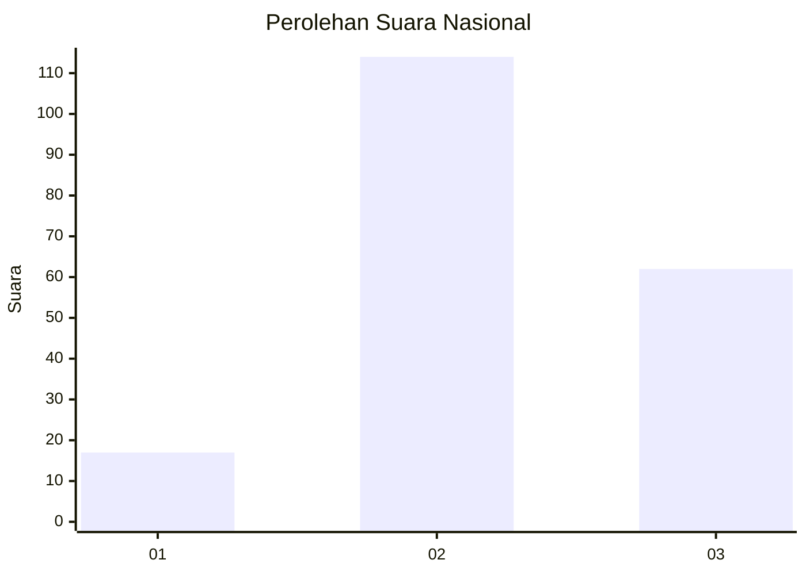
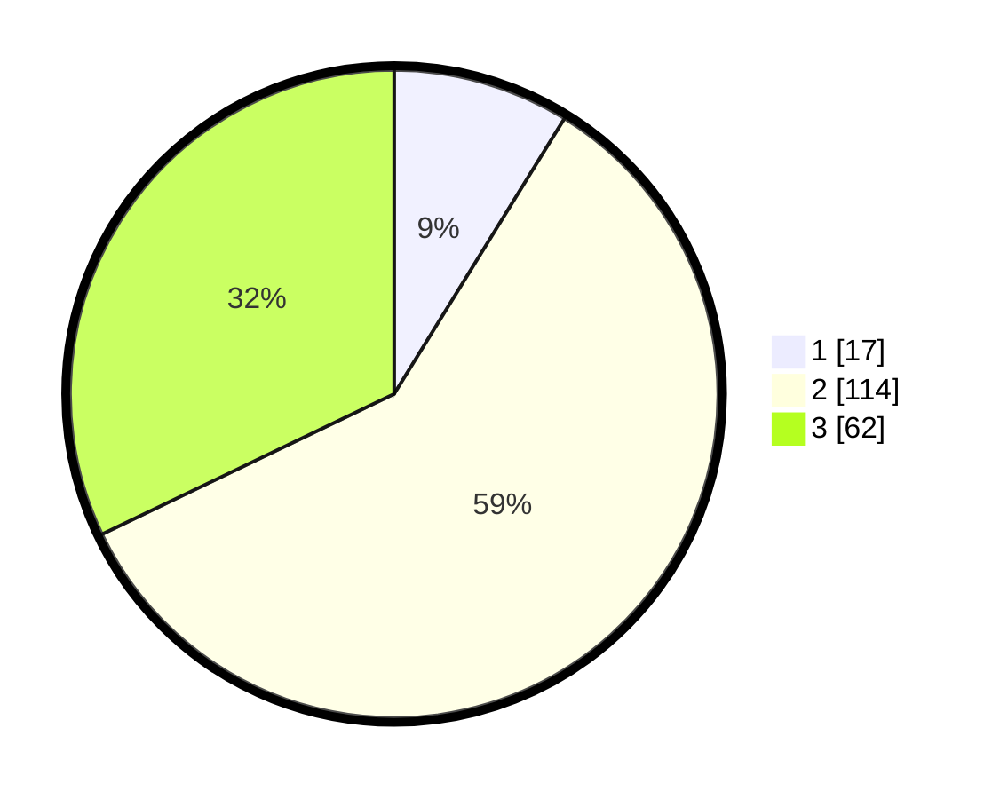

# Hasil

## Grafik

## Tabel

| No. | Nama Paslon    | Suara | Suara (raw) | Persentase |
|:--- |:-------------- | -----:| -----------:| ----------:|
| 1   | ANIES MUHAIMIN | 17    | [17][p-1]   | 8,81       |
| 2   | PRABOWO GIBRAN | 114   | [114][p-2]  | 59,07      |
| 3   | GANJAR MAHFUD  | 62    | [62][p-3]   | 32,12      |

[p-1]: https://github.com/gigit-pemilu/pemilu-2024/blob/main/pilpres/hitung-suara/sub/64-kalimantan-timur/sub/03-berau/sub/02-talisayan/sub/2002-dumaring/sub/004-tps/sub/paslon-1.txt
[p-2]: https://github.com/gigit-pemilu/pemilu-2024/blob/main/pilpres/hitung-suara/sub/64-kalimantan-timur/sub/03-berau/sub/02-talisayan/sub/2002-dumaring/sub/004-tps/sub/paslon-2.txt
[p-3]: https://github.com/gigit-pemilu/pemilu-2024/blob/main/pilpres/hitung-suara/sub/64-kalimantan-timur/sub/03-berau/sub/02-talisayan/sub/2002-dumaring/sub/004-tps/sub/paslon-3.txt

## Foto C Plano

https://sirekap-obj-formc.kpu.go.id/7be7/pemilu/ppwp/64/03/02/20/02/6403022002004-20240218-132832--ce18d664-7404-4d61-9f61-d24d13fc5dcb.jpg

https://sirekap-obj-formc.kpu.go.id/7be7/pemilu/ppwp/64/03/02/20/02/6403022002004-20240218-132849--7c4b0f27-b198-472e-9846-9bf620c36d8e.jpg

https://sirekap-obj-formc.kpu.go.id/7be7/pemilu/ppwp/64/03/02/20/02/6403022002004-20240218-132905--0540aa66-9c7c-4600-b622-ee3ac62d597e.jpg

## Metadata

| Key        | Value               |
| ---------- | ------------------- |
| Time Stamp | 2024-02-19 06:16:00 |

