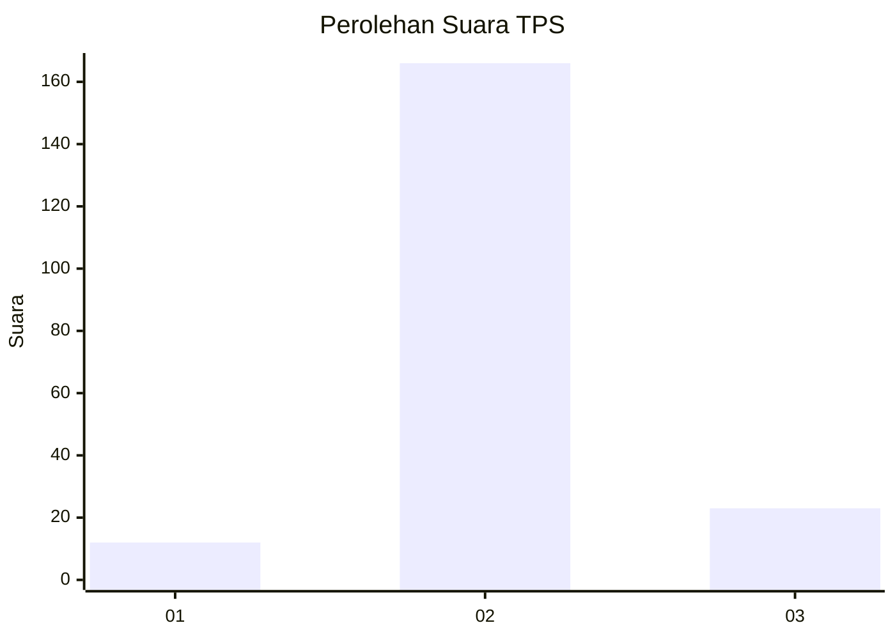
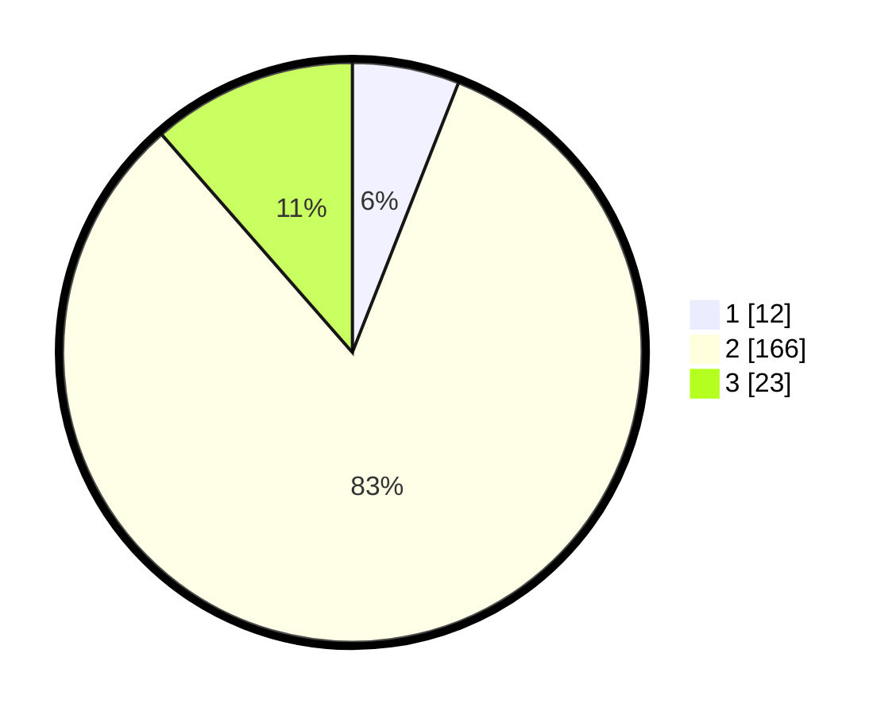

# Hasil

## Grafik

## Tabel

| No. | Nama Paslon    | Suara | Suara (raw) | Persentase |
|:--- |:-------------- | -----:| -----------:| ----------:|
| 1   | ANIES MUHAIMIN | 12    | [12][p-1]   | 5,97       |
| 2   | PRABOWO GIBRAN | 166   | [166][p-2]  | 82,59      |
| 3   | GANJAR MAHFUD  | 23    | [23][p-3]   | 11,44      |

[p-1]: https://github.com/gigit-pemilu/pemilu-2024-64-kalimantan-timur/blob/main/pilpres/hitung-suara/sub/64-kalimantan-timur/sub/03-berau/sub/02-talisayan/sub/2017-sumber-mulya/sub/001-tps/sub/paslon-1.txt
[p-2]: https://github.com/gigit-pemilu/pemilu-2024-64-kalimantan-timur/blob/main/pilpres/hitung-suara/sub/64-kalimantan-timur/sub/03-berau/sub/02-talisayan/sub/2017-sumber-mulya/sub/001-tps/sub/paslon-2.txt
[p-3]: https://github.com/gigit-pemilu/pemilu-2024-64-kalimantan-timur/blob/main/pilpres/hitung-suara/sub/64-kalimantan-timur/sub/03-berau/sub/02-talisayan/sub/2017-sumber-mulya/sub/001-tps/sub/paslon-3.txt

## Foto C Plano

https://sirekap-obj-formc.kpu.go.id/843f/pemilu/ppwp/64/03/02/20/17/6403022017001-20240218-085534--451e7428-cf22-4ba8-9320-19217470acbb.jpg

https://sirekap-obj-formc.kpu.go.id/843f/pemilu/ppwp/64/03/02/20/17/6403022017001-20240218-085810--f70a4c5e-bcc8-450e-b3ca-6adba27d4850.jpg

https://sirekap-obj-formc.kpu.go.id/843f/pemilu/ppwp/64/03/02/20/17/6403022017001-20240218-090205--a3d79a8b-5bd4-4270-8861-6fe56f449dc6.jpg

## Metadata

| Key        | Value               |
| ---------- | ------------------- |
| Time Stamp | 2024-02-19 20:00:00 |

## DATA PEMILIH TETAP

Jumlah pemilih dalam DPT: **347**.
 * L: **423**.
 * P: **238**.

## DATA PENGGUNA HAK PILIH

Jumlah pengguna hak pilih dalam DPT: **302**.
 * L: **304**.
 * P: **897**.

Jumlah pengguna hak pilih dalam DPTb: **282**.
 * L: **388**.
 * P: **484**.

Jumlah pengguna hak pilih dalam DPK: **881**.
 * L: **888**.
 * P: **489**.

Jumlah pengguna hak pilih: **353**.
 * L: **547**.
 * P: **452**.

## JUMLAH SUARA SAH DAN TIDAK SAH

JUMLAH SELURUH SUARA SAH: **201**.

JUMLAH SUARA TIDAK SAH: **1**.

JUMLAH SELURUH SUARA SAH DAN SUARA TIDAK SAH: **207**.

