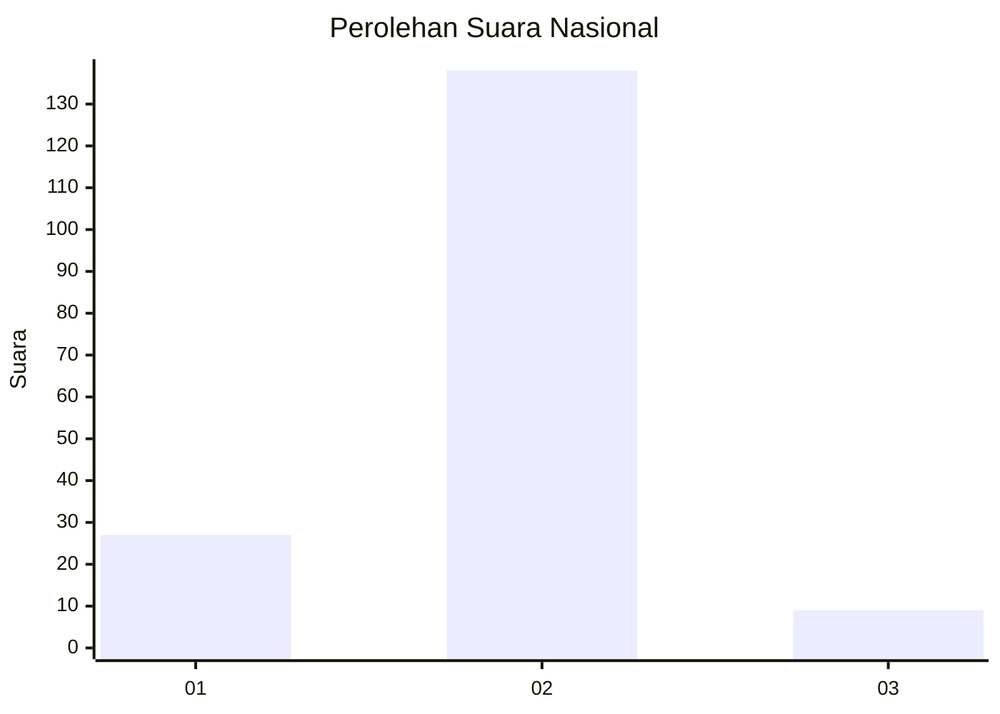
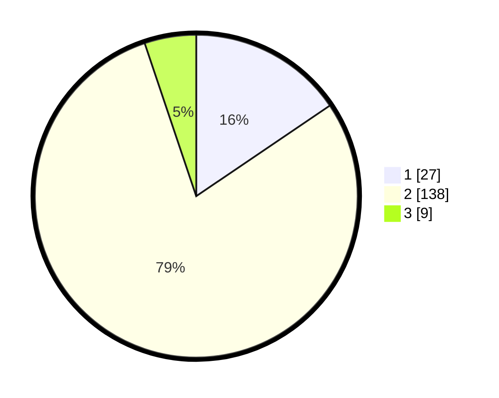

# Hasil

## Grafik

## Tabel

| No. | Nama Paslon    | Suara | Suara (raw) | Persentase |
|:--- |:-------------- | -----:| -----------:| ----------:|
| 1   | ANIES MUHAIMIN | 27    | [27][p-1]   | 15,52      |
| 2   | PRABOWO GIBRAN | 138   | [138][p-2]  | 79,31      |
| 3   | GANJAR MAHFUD  | 9     | [9][p-3]    | 5,17       |

[p-1]: https://github.com/gigit-pemilu/pemilu-2024/blob/main/pilpres/hitung-suara/sub/64-kalimantan-timur/sub/03-berau/sub/03-sambaliung/sub/1013-sambaliung/sub/005-tps/sub/paslon-1.txt
[p-2]: https://github.com/gigit-pemilu/pemilu-2024/blob/main/pilpres/hitung-suara/sub/64-kalimantan-timur/sub/03-berau/sub/03-sambaliung/sub/1013-sambaliung/sub/005-tps/sub/paslon-2.txt
[p-3]: https://github.com/gigit-pemilu/pemilu-2024/blob/main/pilpres/hitung-suara/sub/64-kalimantan-timur/sub/03-berau/sub/03-sambaliung/sub/1013-sambaliung/sub/005-tps/sub/paslon-3.txt

## Foto C Plano

https://sirekap-obj-formc.kpu.go.id/8872/pemilu/ppwp/64/03/03/10/13/6403031013005-20240223-142113--26acca3c-fadd-4c23-871a-ca95235e4208.jpg

https://sirekap-obj-formc.kpu.go.id/8872/pemilu/ppwp/64/03/03/10/13/6403031013005-20240223-141849--145d9ac0-9d3e-46e2-a66d-322b07512631.jpg

https://sirekap-obj-formc.kpu.go.id/8872/pemilu/ppwp/64/03/03/10/13/6403031013005-20240223-142151--3f215873-bf27-463c-836c-62cc91f77035.jpg

## Metadata

| Key        | Value               |
| ---------- | ------------------- |
| Time Stamp | 2024-02-25 17:00:00 |

