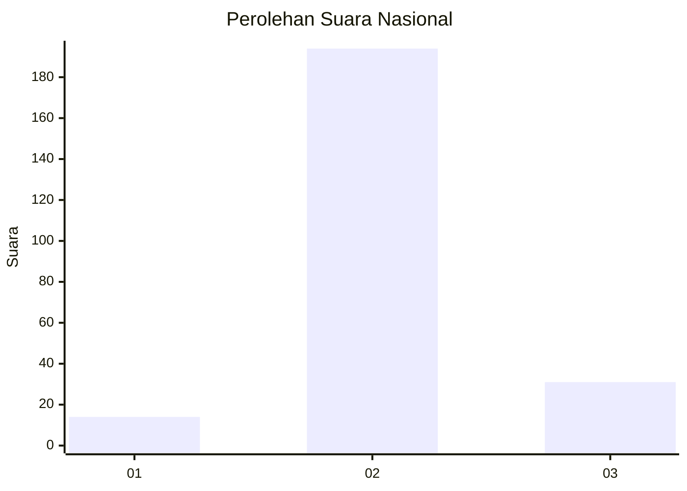
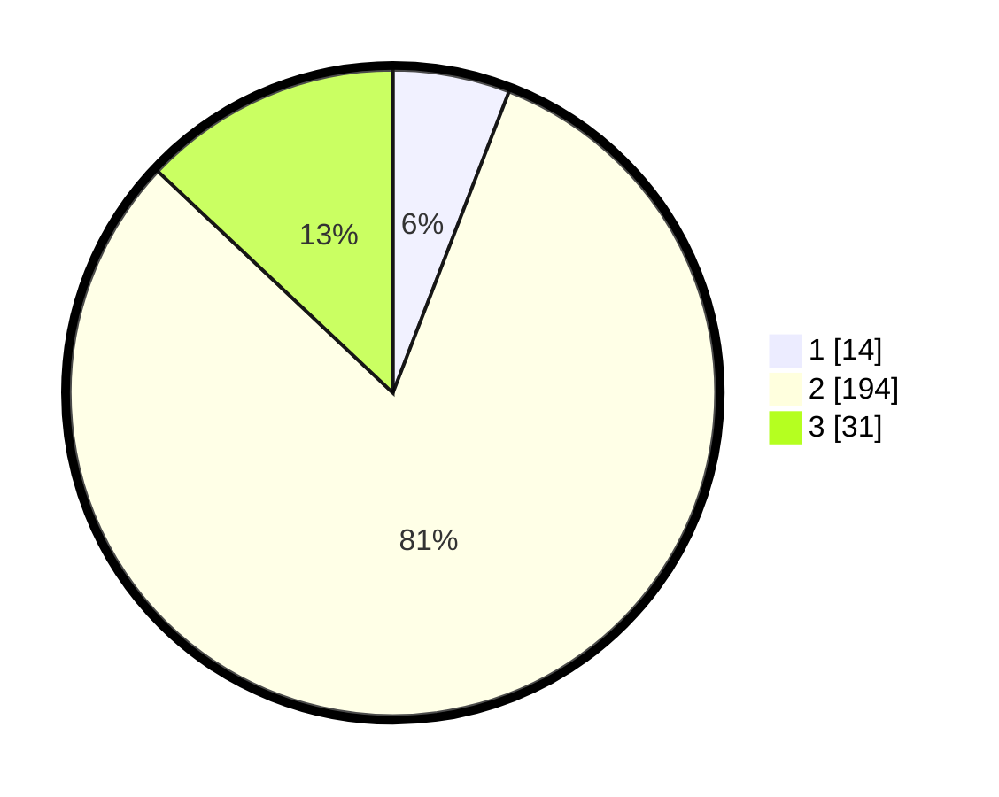

# Hasil

## Grafik

## Tabel

| No. | Nama Paslon    | Suara | Suara (raw) | Persentase |
|:--- |:-------------- | -----:| -----------:| ----------:|
| 1   | ANIES MUHAIMIN | 14    | [14][p-1]   | 5,86       |
| 2   | PRABOWO GIBRAN | 194   | [194][p-2]  | 81,17      |
| 3   | GANJAR MAHFUD  | 31    | [31][p-3]   | 12,97      |

[p-1]: https://github.com/gigit-pemilu/pemilu-2024/blob/main/pilpres/hitung-suara/sub/64-kalimantan-timur/sub/03-berau/sub/03-sambaliung/sub/2010-sei-bebanir-bangun/sub/009-tps/sub/paslon-1.txt
[p-2]: https://github.com/gigit-pemilu/pemilu-2024/blob/main/pilpres/hitung-suara/sub/64-kalimantan-timur/sub/03-berau/sub/03-sambaliung/sub/2010-sei-bebanir-bangun/sub/009-tps/sub/paslon-2.txt
[p-3]: https://github.com/gigit-pemilu/pemilu-2024/blob/main/pilpres/hitung-suara/sub/64-kalimantan-timur/sub/03-berau/sub/03-sambaliung/sub/2010-sei-bebanir-bangun/sub/009-tps/sub/paslon-3.txt

## Foto C Plano

https://sirekap-obj-formc.kpu.go.id/e530/pemilu/ppwp/64/03/03/20/10/6403032010009-20240214-235024--813ca253-fc39-4b32-9db7-3abc9b1e1d94.jpg

https://sirekap-obj-formc.kpu.go.id/e530/pemilu/ppwp/64/03/03/20/10/6403032010009-20240214-235154--31e362df-6f94-4ae2-9313-46114ab01842.jpg

https://sirekap-obj-formc.kpu.go.id/e530/pemilu/ppwp/64/03/03/20/10/6403032010009-20240214-235321--5bfb5631-e19a-4d8b-bf4d-138fa86d6350.jpg

## Metadata

| Key        | Value               |
| ---------- | ------------------- |
| Time Stamp | 2024-02-15 23:29:50 |

