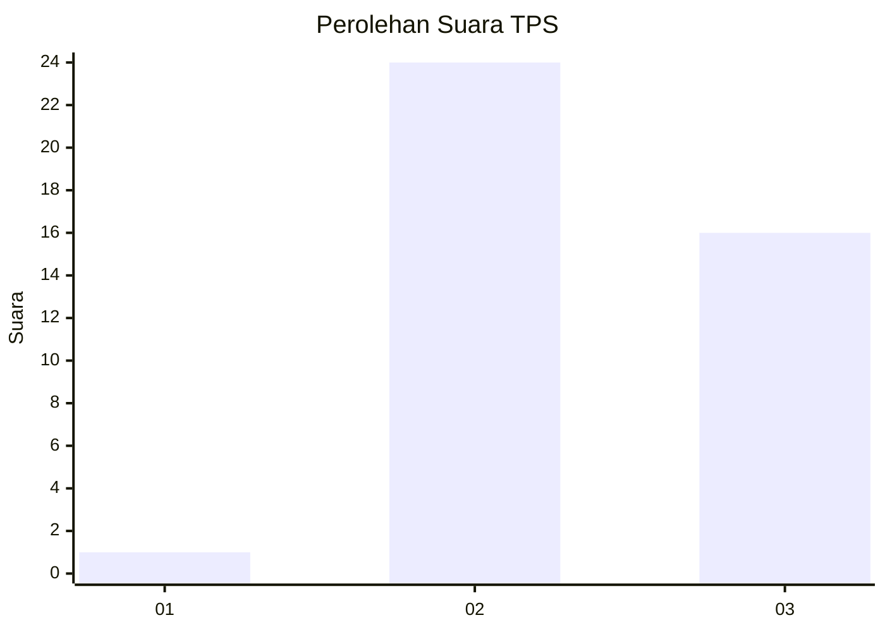
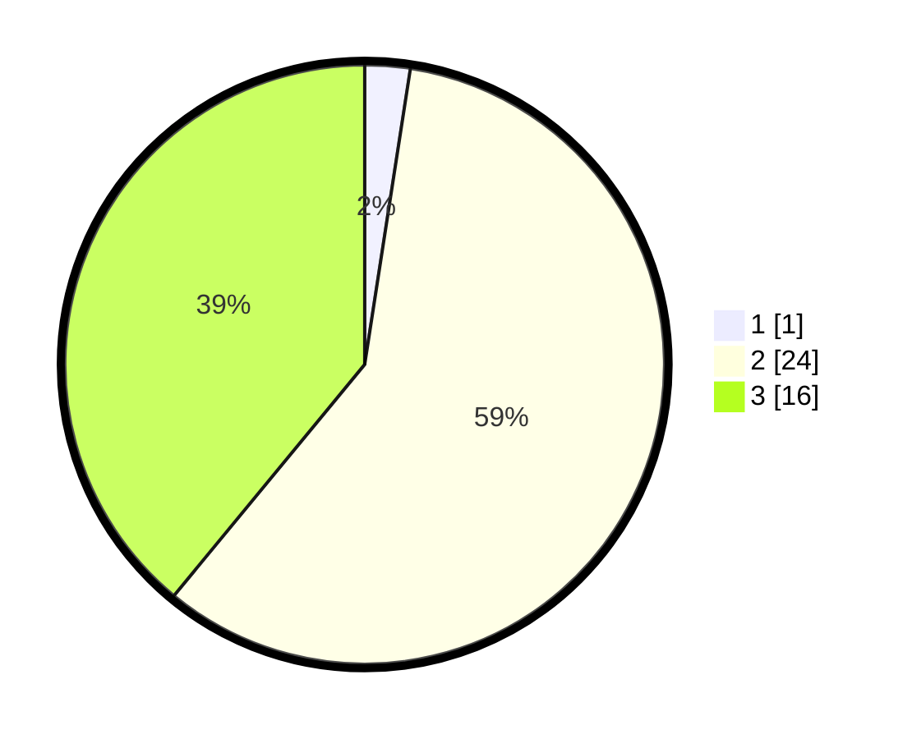

# Hasil

## Grafik

## Tabel

| No. | Nama Paslon    | Suara | Suara (raw) | Persentase |
|:--- |:-------------- | -----:| -----------:| ----------:|
| 1   | ANIES MUHAIMIN | 1     | [1][p-1]    | 2,44       |
| 2   | PRABOWO GIBRAN | 24    | [24][p-2]   | 58,54      |
| 3   | GANJAR MAHFUD  | 16    | [16][p-3]   | 39,02      |

[p-1]: https://github.com/gigit-pemilu/pemilu-2024-64-kalimantan-timur/blob/main/pilpres/hitung-suara/sub/64-kalimantan-timur/sub/03-berau/sub/04-segah/sub/2005-punan-malinau/sub/003-tps/sub/paslon-1.txt
[p-2]: https://github.com/gigit-pemilu/pemilu-2024-64-kalimantan-timur/blob/main/pilpres/hitung-suara/sub/64-kalimantan-timur/sub/03-berau/sub/04-segah/sub/2005-punan-malinau/sub/003-tps/sub/paslon-2.txt
[p-3]: https://github.com/gigit-pemilu/pemilu-2024-64-kalimantan-timur/blob/main/pilpres/hitung-suara/sub/64-kalimantan-timur/sub/03-berau/sub/04-segah/sub/2005-punan-malinau/sub/003-tps/sub/paslon-3.txt

## Foto C Plano

https://sirekap-obj-formc.kpu.go.id/a081/pemilu/ppwp/64/03/04/20/05/6403042005003-20240220-091913--bba60e9f-cfe0-4c24-b23f-f892ffb80bfc.jpg

https://sirekap-obj-formc.kpu.go.id/a081/pemilu/ppwp/64/03/04/20/05/6403042005003-20240220-092026--5809e7b3-e179-45db-80c0-4c53e45f2522.jpg

https://sirekap-obj-formc.kpu.go.id/a081/pemilu/ppwp/64/03/04/20/05/6403042005003-20240220-092109--fb0950a2-f50b-4dac-8a98-97eb332b6b14.jpg

## Metadata

| Key        | Value               |
| ---------- | ------------------- |
| Time Stamp | 2024-02-20 12:00:00 |

