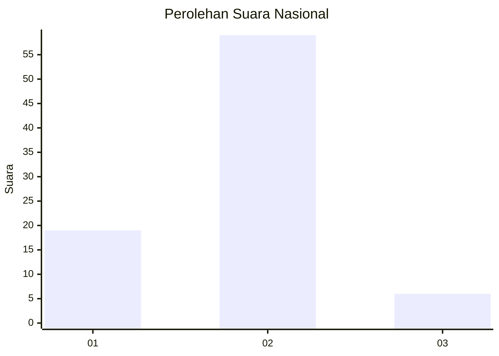
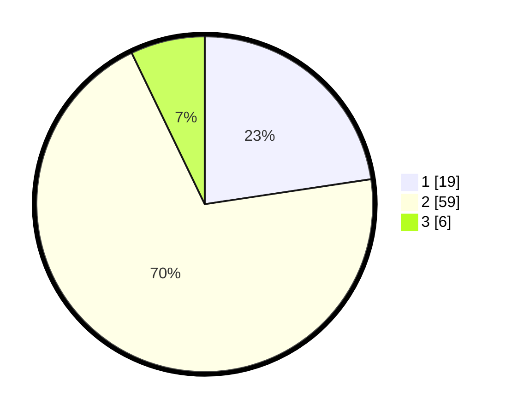

# Hasil

## Grafik

## Tabel

| No. | Nama Paslon    | Suara | Suara (raw) | Persentase |
|:--- |:-------------- | -----:| -----------:| ----------:|
| 1   | ANIES MUHAIMIN | 19    | [19][p-1]   | 22,62      |
| 2   | PRABOWO GIBRAN | 59    | [59][p-2]   | 70,24      |
| 3   | GANJAR MAHFUD  | 6     | [6][p-3]    | 7,14       |

[p-1]: https://github.com/gigit-pemilu/pemilu-2024/blob/main/pilpres/hitung-suara/sub/64-kalimantan-timur/sub/03-berau/sub/04-segah/sub/2007-gunung-sari/sub/018-tps/sub/paslon-1.txt
[p-2]: https://github.com/gigit-pemilu/pemilu-2024/blob/main/pilpres/hitung-suara/sub/64-kalimantan-timur/sub/03-berau/sub/04-segah/sub/2007-gunung-sari/sub/018-tps/sub/paslon-2.txt
[p-3]: https://github.com/gigit-pemilu/pemilu-2024/blob/main/pilpres/hitung-suara/sub/64-kalimantan-timur/sub/03-berau/sub/04-segah/sub/2007-gunung-sari/sub/018-tps/sub/paslon-3.txt

## Foto C Plano

https://sirekap-obj-formc.kpu.go.id/4e01/pemilu/ppwp/64/03/04/20/07/6403042007018-20240214-200958--539d0e45-7330-497c-80d7-f77efb37edea.jpg

https://sirekap-obj-formc.kpu.go.id/4e01/pemilu/ppwp/64/03/04/20/07/6403042007018-20240214-201045--c372d762-4fef-4981-b798-09b166c9baa3.jpg

https://sirekap-obj-formc.kpu.go.id/4e01/pemilu/ppwp/64/03/04/20/07/6403042007018-20240214-201125--6c867d95-fd95-46cc-a29c-402961d70e13.jpg

## Metadata

| Key        | Value               |
| ---------- | ------------------- |
| Time Stamp | 2024-02-24 22:31:28 |

